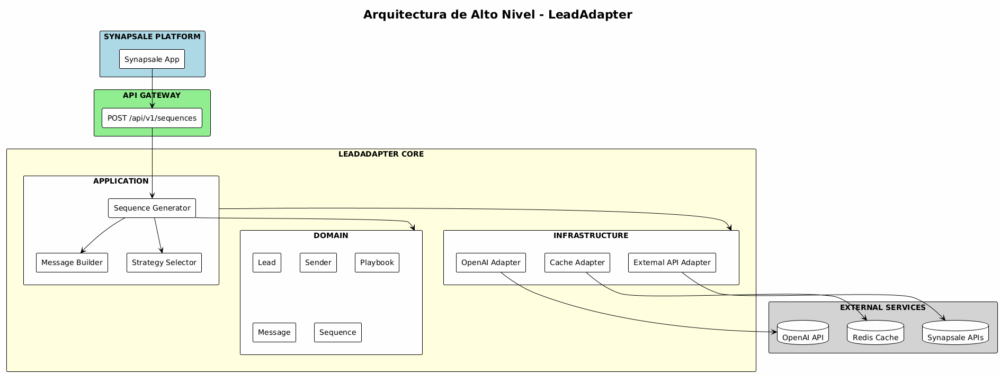

# LeadAdapter - Technical Design Document

## Sistema de Generación Inteligente de Mensajes de Prospección B2B

**Versión:** 2.0

**Fecha:** Diciembre 2025

**Autor:** [Tu Nombre]

**Estado:** Draft - Pendiente Validación

---

## Tabla de Contenidos

1. [Resumen Ejecutivo](https://www.notion.so/Personalizaci-n-avanzada-de-mensajes-y-secuencias-en-Synapsale-2d59ed66b04f803e8474cfa3267c8797?pvs=21)
2. [Arquitectura del Sistema](https://www.notion.so/Personalizaci-n-avanzada-de-mensajes-y-secuencias-en-Synapsale-2d59ed66b04f803e8474cfa3267c8797?pvs=21)
3. [Modelo de Dominio](https://www.notion.so/Personalizaci-n-avanzada-de-mensajes-y-secuencias-en-Synapsale-2d59ed66b04f803e8474cfa3267c8797?pvs=21)
4. [Diseño de la API](https://www.notion.so/Personalizaci-n-avanzada-de-mensajes-y-secuencias-en-Synapsale-2d59ed66b04f803e8474cfa3267c8797?pvs=21)
5. [Estrategia de Generación de Mensajes](https://www.notion.so/Personalizaci-n-avanzada-de-mensajes-y-secuencias-en-Synapsale-2d59ed66b04f803e8474cfa3267c8797?pvs=21)
6. [Manejo de Casos Edge](https://www.notion.so/Personalizaci-n-avanzada-de-mensajes-y-secuencias-en-Synapsale-2d59ed66b04f803e8474cfa3267c8797?pvs=21)
7. [Sistema de Feedback y Aprendizaje](https://www.notion.so/Personalizaci-n-avanzada-de-mensajes-y-secuencias-en-Synapsale-2d59ed66b04f803e8474cfa3267c8797?pvs=21)
8. [Escalabilidad y Performance](https://www.notion.so/Personalizaci-n-avanzada-de-mensajes-y-secuencias-en-Synapsale-2d59ed66b04f803e8474cfa3267c8797?pvs=21)
9. [Estructura del Proyecto](https://www.notion.so/Personalizaci-n-avanzada-de-mensajes-y-secuencias-en-Synapsale-2d59ed66b04f803e8474cfa3267c8797?pvs=21)
10. [Ideas de Evolución Futura](https://www.notion.so/Personalizaci-n-avanzada-de-mensajes-y-secuencias-en-Synapsale-2d59ed66b04f803e8474cfa3267c8797?pvs=21)
11. [Riesgos y Mitigaciones](https://www.notion.so/Personalizaci-n-avanzada-de-mensajes-y-secuencias-en-Synapsale-2d59ed66b04f803e8474cfa3267c8797?pvs=21)
12. [Stack Tecnológico](https://www.notion.so/Personalizaci-n-avanzada-de-mensajes-y-secuencias-en-Synapsale-2d59ed66b04f803e8474cfa3267c8797?pvs=21)
13. [Cronograma y Plan de Ejecución](https://www.notion.so/Personalizaci-n-avanzada-de-mensajes-y-secuencias-en-Synapsale-2d59ed66b04f803e8474cfa3267c8797?pvs=21)

## 1. Resumen Ejecutivo

### 1.1 ¿Qué vamos a construir?

Una **API REST en Python** que genera mensajes de prospección personalizados para secuencias de LinkedIn y Email. El sistema usa OpenAI para crear mensajes que no parezcan spam, adaptándose al contexto del lead, el emisor y el playbook comercial.

### 1.2 Propuesta de Valor Técnica

| Problema Actual | Nuestra Solución |
| --- | --- |
| Templates rígidos con placeholders | Generación contextual inteligente |
| Personalización superficial (solo nombre/empresa) | Personalización profunda (pains, industria, señales) |
| Mensajes genéricos y spam-like | Mensajes únicos que demuestran conocimiento del lead |

### 1.3 Métricas Objetivo

| Métrica | Objetivo |
| --- | --- |
| **Latencia** | < 3 segundos por mensaje, < 10 segundos por secuencia completa |
| **Throughput** | 10,000 mensajes/día |
| **Costo OpenAI** | Optimizado mediante prompt chaining eficiente |
| **Disponibilidad** | 99.5% |
## 2. Arquitectura del Sistema

### 2.1 Arquitectura de Alto Nivel


### 2.2 Arquitectura Hexagonal (Ports & Adapters)

Usamos **Arquitectura Hexagonal** porque:

1. **Agnóstico a infraestructura**: Podés cambiar OpenAI por Anthropic sin tocar el dominio
2. **Testeable**: El core se testea sin dependencias externas


## 3. Modelo de Dominio

### 3.1 Diagrama de Clases


### 3.2 Enums del Sistema


### 3.3 Relaciones Clave

| Relación               | Tipo        | Descripción                                               |
| ---------------------- | ----------- | --------------------------------------------------------- |
| Sequence → Lead        | Composición | Si muere la secuencia, el contexto del lead en ella muere |
| Sequence → Message     | Composición | Una secuencia tiene 1 a N mensajes                        |
| Lead → Company         | Composición | Un lead pertenece a una empresa                           |
| Lead → Signal          | Agregación  | Un lead puede tener múltiples señales                     |
| Playbook → SuccessCase | Agregación  | Un playbook referencia casos de éxito                     |
## 4. Diseño de la API

### 4.1 Endpoint Principal

```
POST /api/v1/messages/generate
```
### 4.2 Request Schema

```json
{
  "channel": "linkedin | email",
  "sequence_step": "first_contact | follow_up_1 | follow_up_2 | follow_up_3 | breakup",
  
  "lead": {
    "id": 129217,
    "lead_list_id": 1578,
    "first_name": "Mateo",
    "last_name": "Gutierrez",
    "job_title": "Programador Senior php",
    "company_name": "Tecnocom",
    "bio": "Programación PHP (Laravel, Symfony)...",
    "skills": "analis, Resolución creativa de problemas...",
    "education": "Desarrollo de Aplicaciones Web at salesianas",
    "city": "Madrid",
    "country": "Spain",
    "linkedin_url": "https://www.linkedin.com/in/mateo-gutierrez-57b828151",
    "email": "mateo98vnp@gmail.com",
    "followers": 134,
    "connections": 134,
    "is_first_degree_connection": true,
    
    "work_experience": [
      {
        "company": "Tecnocom",
        "position": "Programador Senior php",
        "location": "Madrid y alrededores, España",
        "start": "12/1/2018",
        "end": null,
        "description": null
      }
    ],
    
    "campaign_history": {
      "linkedin_message_sent": 1,
      "linkedin_replied": 1,
      "email_sent": 1,
      "email_opened": 1,
      "meeting_scheduled": 1,
      "campaign_mail_status": "email_open",
      "campaign_linkedin_status": "send_message"
    },
    
    "signals": []
  },
  
  "sender": {
    "id": 22,
    "name": "Fernando",
    "job_title": "CTO",
    "company_name": "Synapsale",
    "headline": "Full Stack developer | laravel | vue | .net | linux",
    "language": "es-co",
    "meeting_link": null,
    "profile_picture_url": "https://...",
    
    "work_experience": [
      {
        "company": "Synapsale",
        "position": "CTO",
        "description": "CTO de Synapsale, una plataforma B2B..."
      }
    ],
    
    "skills": ["Arquitectura de software", "Inteligencia Artificial aplicada a ventas"]
  },
  
  "playbook": {
    "id": 3,
    "company_name": "Synapsale",
    "sector_company": "Sales Tech",
    "company_size": "+10.000",
    "company_website": "https://synapsale.com/",
    "communication_style": "B2B directo y orientado a resultados...",
    "key_messages": "Prospección B2B con IA en un panel unificado...",
    "keywords_sector": "Ventas B2B; Prospección; IA aplicada a ventas...",
    "communication_restrictions": "test",
    "ai_language": "es-co",
    "content_preferences": {
      "emoticons": true
    },
    
    "products": [
      {
        "id": 867,
        "main_value_proposition": "Prospección B2B con IA en un panel unificado",
        "unique_benefit_compared": "Orquestación multicanal con workflows adaptativos",
        "description_products": "Centraliza LinkedIn, email y chat; secuencias IA",
        "common_use_cases": "Generar leads con Sales Navigator/Apollo, campañas outbound"
      }
    ],
    
    "icp_profiles": [
      {
        "id": 946,
        "target_industries": "Tecnología SaaS; Servicios B2B; Marketing Digital",
        "target_company_size": "{\"11-50\":true,\"51-200\":true}",
        "target_company_revenue": "1M-5M",
        "key_regions_target": "España; Latinoamérica",
        "main_problems_faced": "Dificultad para escalar prospección manualmente...",
        "specific_benefits_offers": "Automatización multicanal con IA...",
        "roles_to_contact": "Responsable de Ventas; Head de Marketing; CEO"
      }
    ],
    
    "competitors": [
      {
        "main_competitors": "",
        "differentiators_compared": null,
        "strengths_compared": "",
        "weaknesses_compared": ""
      }
    ],
    
    "success_cases": [],
    
    "resources": [
      {
        "resource_title": "",
        "resource_type": null,
        "resource_link": "",
        "offer": null,
        "discount": 11,
        "start_date": "2025-11-27",
        "expiration_date": "2025-11-30"
      }
    ]
  },
  
  "prompt": "Genera un mensaje de primer contacto enfocado en..."
}
```
### 4.3 Response Schema

```json
{
  "message_id": "msg_abc123",
  "channel": "linkedin",
  "lead_id": 129217,
  "content": "Hola Mateo...",
  
  "quality": {
    "score": 7.5,
    "breakdown": {
      "personalization": 2.5,
      "anti_spam": 2.5,
      "structure": 1.5,
      "tone_match": 1.0,
      "campaign_coherence": 1.0
    },
    "generation_attempts": 1
  },
  
  "strategy_used": "TECHNICAL_PEER",
  
  "personalization_hooks_used": [
    "job_title_context",
    "skills_match",
    "work_experience_duration"
  ],
  
  "inferred_data": {
    "seniority": "SENIOR",
    "industry": "Technology",
    "years_in_current_role": 6,
    "icp_match_score": 0.85,
    "matched_icp_profile_id": 946
  },
  
  "metadata": {
    "char_count": 298,
    "generation_time_ms": 2847,
    "tokens_used": 450,
    "estimated_cost_usd": 0.0015,
    "model_used": "gpt-4o-mini",
    "data_completeness_score": 0.75
  },
  
  "warnings": []
}
```
### 4.4 Endpoints Secundarios

| Endpoint | Método | Descripción |
| --- | --- | --- |
| `/api/v1/health` | GET | Health check |
| `/api/v1/strategies` | GET | Lista estrategias disponibles |
| `/api/v1/sequences/generate` | POST | Genera secuencia completa (múltiples mensajes) |
| `/api/v1/feedback` | POST | Registra feedback del emisor |
| `/api/v1/metrics` | GET | Métricas de uso y performance |
## 5. Estrategia de Generación de Mensajes

### 5.1 Flujo Principal de la Aplicación


### 5.2 Flujo de Generación con Quality Gate

El sistema implementa un **Quality Gate** que asegura que solo se entregan mensajes de calidad mínima aceptable:


### Criterio adicional: Coherencia con Historial

| Criterio | Peso | Qué evalúa |
|----------|------|------------|
| **Coherencia temporal** | 2 puntos | Si `campaign_history.linkedin_message_sent > 0`, ¿el mensaje hace referencia a interacción previa? Si es follow-up sin contexto previo → penaliza |

**Reglas de coherencia:**

- Si `linkedin_replied = 1` → El mensaje debe reconocer la respuesta anterior
- Si `email_opened = 1` pero `linkedin_replied = 0` → Puede hacer referencia a "vi que revisaste mi email"
- Si `meeting_scheduled = 1` → NO debería estar generando mensajes de prospección

### 5.3 Descripción de Cada Componente

### API Layer

**Request Validator**: Responsable de validar que todos los campos requeridos estén presentes, normalizar datos de entrada (trim, lowercase donde corresponda), y detectar conflictos obvios en los datos antes de procesarlos.

### Orchestration Layer

**Lead Analyzer**: Analiza el lead recibido para clasificarlo según el ICP del playbook. Identifica señales relevantes (cambio de trabajo, publicaciones recientes), calcula el fit score, y determina qué información está disponible para personalización.

**Context Builder**: Construye el contexto completo para la generación. Infiere posibles pain points basándose en el cargo, industria y señales. Selecciona los hooks de personalización más relevantes y resuelve conflictos de información si existen.

**Strategy Selector**: Selecciona la estrategia de mensaje más apropiada basándose en el contexto construido, el canal (LinkedIn vs Email), las preferencias del sender (si hay historial), y el paso de la secuencia.

### Generation Layer

**Prompt Chain Orchestrator**: Coordina la cadena de prompts optimizada para eficiencia de tokens. Ejecuta los pasos en secuencia acumulando contexto, y maneja la comunicación con OpenAI.

**Lead Classification** (Prompt Step 1 - ~100 tokens): Clasifica al lead como decision_maker, influencer, end_user o gatekeeper. Evalúa el fit con el ICP y extrae características clave.

**Pain Point Inference** (Prompt Step 2 - ~150 tokens): Infiere los dolores probables basándose en cargo, industria y señales. Identifica qué hooks de personalización usar y detecta conflictos en la información.

**Message Generation** (Prompt Step 3 - ~500 tokens): Genera el mensaje final usando la estrategia seleccionada, los hooks identificados, y respetando el tono del playbook y las restricciones del canal.

**Quality Validator**: Evalúa el mensaje generado con un score de 1-10. Si el score es menor a 6, dispara regeneración con feedback. Máximo 3 intentos antes de usar el mejor resultado con warning.

### Lead Context Enricher

**Responsabilidad:** Enriquecer los datos del lead con información inferida cuando faltan campos críticos.

**Inferencias que realiza:**

| Campo Faltante | Estrategia de Inferencia |
|----------------|-------------------------|
| `seniority` | Parsear `job_title`: "Senior" → SENIOR, "VP/Director" → EXECUTIVE, "CEO/CTO" → C_LEVEL |
| `industry` | Matchear `job_title` + `company_name` contra `playbook.keywords_sector` |
| `company_size` | Si `followers` > 10K y `connections` > 500 → probablemente empresa grande |
| `years_in_role` | Calcular desde `work_experience[0].start` hasta hoy |
| `job_change_signal` | Si `work_experience[0].start` < 6 meses → señal de cambio reciente |

**Output:** `EnrichedLeadContext` con campos originales + inferidos + confidence scores

### 5.4 Criterios de Scoring

El **MessageScorer** evalúa cada mensaje en 4 dimensiones:

| Criterio            | Peso     | Qué evalúa                                                                                                                                                 |
| ------------------- | -------- | ---------------------------------------------------------------------------------------------------------------------------------------------------------- |
| **Personalización** | 3 puntos | ¿Incluye nombre del lead? ¿Referencia a la empresa? ¿Contexto de industria? ¿Hook específico (job_change, post, etc.)?                                     |
| **Anti-spam**       | 3 puntos | Penaliza frases genéricas como "Vi tu perfil y me pareció interesante", "Espero que estés bien", "Somos líderes en...", "No sé si sos la persona indicada" |
| **Estructura**      | 2 puntos | ¿Tiene hook claro al inicio? ¿Propuesta de valor? ¿CTA suave? ¿Longitud apropiada para el canal?                                                           |
| **Match de tono**   | 2 puntos | ¿Coincide con el tono del playbook? ¿Apropiado para el seniority del lead? ¿Consistente con el estilo del sender?                                          |

**Threshold mínimo**: 6 puntos para pasar el Quality Gate.

### 5.5 Lógica de Regeneración

Cuando un mensaje no alcanza el score mínimo:

1. Se incluye en el siguiente prompt el mensaje anterior y su score
2. Se especifican los problemas detectados (ej: "falta personalización", "contiene frase genérica X")
3. Se pide explícitamente corregir esos problemas
4. Si después de 3 intentos no se alcanza el threshold, se retorna el mejor intento con un campo `warning: "quality_threshold_not_met"`

### 5.6 Pipeline de Prompt Chaining

El prompt chaining optimiza el uso de tokens dividiendo la generación en pasos especializados:


**Comparación de Eficiencia:**

| Enfoque | Tokens por Mensaje | Costo Aprox |
| --- | --- | --- |
| Un prompt gigante con todo | ~1500 tokens | $0.0045 |
| **Prompt chaining optimizado** | ~850 tokens | $0.0025 |

El contexto acumulado es un JSON compacto que se pasa al paso final, evitando repetir información en cada prompt.

## 6. Manejo de Casos Edge

### 6.1 Manejo de Datos Incompletos

**Campos REQUERIDOS (sin estos, error 400):**

- `lead.first_name`
- `lead.company_name`
- `lead.job_title`
- `sender.name`
- `sender.company_name`
- `playbook.id`
- `playbook.communication_style`
- `playbook.products[]` (al menos uno)

**Campos OPCIONALES con fallback inteligente:**

| Dato Faltante | Fallback |
|---------------|----------|
| `lead.bio` | Usar solo `job_title` + `skills` para contexto |
| `lead.skills` | Inferir de `job_title` (ej: "PHP Developer" → skills técnicas) |
| `lead.work_experience` | Usar solo empresa actual |
| `lead.campaign_history` | Asumir primer contacto |
| `sender.meeting_link` | Omitir CTA de agendar reunión, usar CTA de respuesta |
| `sender.headline` | Usar `job_title` |
| `playbook.success_cases` | Omitir social proof específico, usar `products[].common_use_cases` |
| `playbook.resources` | Omitir ofertas de contenido |
| `playbook.competitors` | No hacer comparativas directas |

### 6.2 Conflictos de Información

**ConflictResolver**: Detecta y resuelve inconsistencias en los datos del lead.

**Tipos de conflictos manejados:**

| Conflicto | Ejemplo | Resolución |
| --- | --- | --- |
| Industria declarada vs Bio | Dice "Technology" pero bio menciona "15 años en banca" | Priorizar dato estructurado (industria declarada) |
| Seniority vs Job Title | Seniority: "Manager" pero título: "VP of Sales" | Priorizar Job Title (más preciso) |
| Idioma del sender vs idioma del bio | Sender en español, bio en inglés | Generar en idioma del sender, adaptar referencias |

Los conflictos detectados se registran en el response para transparencia.

### 6.3 Idiomas Mixtos

**LanguageHandler**: Maneja casos donde los datos vienen en diferentes idiomas.

**Comportamiento:**

1. Detecta el idioma del bio/señales si difiere del idioma target
2. Traduce internamente para el análisis (usando el mismo LLM)
3. Preserva términos técnicos, nombres de empresas y proper nouns
4. Genera el mensaje final en el idioma especificado por el sender

## 6.4 Inferencia de Seniority desde Job Title

El campo `seniority` no viene de Synapsale, se infiere del `job_title`:

| Patrón en Job Title | Seniority Inferido |
|--------------------|-------------------|
| CEO, CTO, CFO, COO, Founder, Owner | `C_LEVEL` |
| VP, Vice President, Director | `EXECUTIVE` |
| Head of, Lead, Principal, Senior Manager | `SENIOR_MANAGER` |
| Manager, Team Lead | `MANAGER` |
| Senior, Sr., Lead (sin Manager) | `SENIOR` |
| Junior, Jr., Trainee, Intern | `JUNIOR` |
| (default) | `MID_LEVEL` |

## 6.5 Matching con ICP Profiles

El playbook puede tener múltiples icp_profiles. El sistema debe:

1. Parsear `target_company_size` (viene como JSON string)
2. Matchear `lead.job_title` contra `roles_to_contact`
3. Calcular `icp_match_score` (0.0 - 1.0)
4. Seleccionar `icp_profile` con mejor match
5. Usar `main_problems_faced` y `specific_benefits_offers` de ese perfil

Si ningún ICP matchea (score < 0.3):

- Usar el primer `icp_profile` como fallback
- Agregar warning: `low_icp_match`

## 7. Sistema de Feedback y Aprendizaje

### 7.1 Modelo de Feedback

El sistema captura feedback del emisor para mejorar futuras generaciones:

**Feedback explícito:**

- `was_used`: ¿Usó el mensaje tal cual?
- `was_edited`: ¿Lo editó antes de enviar?
- `edit_percentage`: Porcentaje de cambios si editó
- `style_feedback`: "too_formal", "too_casual", "perfect"
- `length_feedback`: "too_long", "too_short", "perfect"

**Feedback implícito** (si Synapsale lo provee):

- `lead_responded`: ¿El lead respondió?
- `response_sentiment`: positive, neutral, negative

### 7.2 Endpoint de Feedback

```
POST /api/v1/feedback

```

```json
{
  "message_id": "msg_xyz",
  "sender_id": "sender_456",
  "was_used": true,
  "was_edited": true,
  "edit_percentage": 15.5,
  "style_feedback": "slightly_too_formal",
  "custom_notes": "Prefiero un tono más directo en el primer mensaje"
}

```

### 7.3 Uso del Feedback

**SenderPreferenceLearner**: Servicio que aprende preferencias del emisor basándose en feedback histórico.

**Funcionamiento:**

1. Requiere mínimo 5 feedbacks para empezar a personalizar
2. Analiza patrones: qué tono prefiere, qué longitud, qué estrategias funcionaron mejor
3. Identifica patrones negativos (frases que siempre edita, estructuras que no le gustan)
4. Ajusta el prompt de generación agregando una sección de "Preferencias del Sender"

**Datos que aprende:**

- Tono preferido (más formal/casual que el playbook)
- Longitud preferida (más corto/largo que el default)
- Estrategias exitosas (cuáles tuvieron mejor respuesta)
- Patrones a evitar (frases que siempre elimina)

---

## 8. Escalabilidad y Performance

### 8.1 Arquitectura para 10K mensajes/día


### 8.2 Estrategia de Caching

| Qué se cachea | TTL | Razón |
| --- | --- | --- |
| Playbooks | 1 hora | Cambian poco, se reusan mucho |
| Clasificación de lead | 5 minutos | Si el mismo lead se procesa varias veces seguidas |
| Preferencias del sender | 30 minutos | Cambian solo cuando hay nuevo feedback |
| **Mensajes generados** | **NO se cachean** | Siempre deben ser únicos |

**Invalidación:**

- Playbook: cuando se detecta actualización
- Clasificación de lead: cuando cambian datos del lead
- Preferencias: cuando se recibe nuevo feedback

### 8.3 Rate Limiting hacia OpenAI

**OpenAIRateLimiter**: Maneja los límites de OpenAI de forma inteligente.

**Estrategia:**

- Semáforo para limitar requests concurrentes (50 max)
- Backoff exponencial en caso de rate limit (2^attempt + jitter)
- Máximo 3 reintentos antes de fallar
- Monitoreo de tokens por minuto para no exceder límites

### 8.4 Cálculos de Capacidad

```
Asumiendo:
- 1 mensaje = ~850 tokens (con prompt chaining)
- OpenAI gpt-4o-mini: ~30K TPM en Tier 1

Capacidad por minuto:
30,000 tokens / 850 tokens = ~35 mensajes/minuto

Capacidad por día:
35 mensajes × 60 minutos × 24 horas = 50,400 mensajes/día

✅ 5x por encima de los 10K mensajes/día requeridos

```

---

## 9. Estructura del Proyecto

```markdown
leadadapter/
├── src/
│   ├── __init__.py
│   ├── main.py                      # Entry point FastAPI
│   │
│   ├── domain/                      # CORE - Sin dependencias externas
│   │   ├── __init__.py
│   │   ├── entities/
│   │   │   ├── lead.py              # Lead entity
│   │   │   ├── sender.py            # Sender entity
│   │   │   ├── playbook.py          # Playbook entity
│   │   │   ├── sequence.py          # Sequence aggregate root
│   │   │   └── message.py           # Message value object
│   │   │
│   │   ├── value_objects/
│   │   │   ├── company.py
│   │   │   ├── signal.py
│   │   │   ├── success_case.py
│   │   │   ├── icp.py
│   │   │   ├── work_experience.py           
│   │   │   ├── campaign_history.py          
│   │   │   ├── icp_profile.py               
│   │   │   ├── product.py                   
│   │   │   └── content_preferences.py       
│   │   │
│   │   ├── enums/
│   │   │   ├── channel.py
│   │   │   ├── sequence_step.py
│   │   │   ├── message_strategy.py
│   │   │   └── tone.py
│   │   │
│   │   ├── services/
│   │   │   ├── strategy_selector.py
│   │   │   ├── message_personalizer.py
│   │   │   ├── conflict_resolver.py
│   │   │   ├── data_completeness_checker.py
│   │   │   ├── seniority_inferrer.py        
│   │   │   ├── icp_matcher.py               
│   │   │   └── lead_context_enricher.py     
│   │   │
│   │   └── exceptions/
│   │       └── domain_exceptions.py
│   │
│   ├── application/                 # USE CASES - Orquestación
│   │   ├── __init__.py
│   │   ├── ports/                   # Interfaces (contratos)
│   │   │   ├── llm_port.py          # Interface para LLM
│   │   │   ├── cache_port.py        # Interface para cache
│   │   │   └── external_data_port.py # Interface para APIs externas
│   │   │
│   │   ├── use_cases/
│   │   │   ├── generate_message.py  # Use case principal
│   │   │   ├── generate_sequence.py
│   │   │   └── process_feedback.py
│   │   │
│   │   ├── dtos/
│   │   │   ├── requests.py          # Input DTOs
│   │   │   └── responses.py         # Output DTOs
│   │   │
│   │   └── services/
│   │       ├── prompt_chain_orchestrator.py
│   │       ├── message_scorer.py
│   │       └── quality_gate.py
│   │
│   ├── infrastructure/              # ADAPTERS - Implementaciones
│   │   ├── __init__.py
│   │   ├── adapters/
│   │   │   ├── openai_adapter.py    # Implementa LLMPort
│   │   │   ├── redis_cache_adapter.py # Implementa CachePort
│   │   │   ├── memory_cache_adapter.py # Cache en memoria (dev)
│   │   │   └── synapsale_api_adapter.py # Implementa ExternalDataPort
│   │   │
│   │   ├── prompts/
│   │   │   ├── classify_lead.py
│   │   │   ├── analyze_context.py
│   │   │   ├── select_strategy.py
│   │   │   └── generate_message.py
│   │   │
│   │   └── config/
│   │       └── settings.py          # Pydantic Settings
│   │
│   └── api/                         # HTTP Layer
│       ├── __init__.py
│       ├── routers/
│       │   ├── messages.py          # /api/v1/messages/*
│       │   ├── sequences.py         # /api/v1/sequences/*
│       │   ├── feedback.py          # /api/v1/feedback/*
│       │   └── health.py            # /api/v1/health
│       │
│       ├── dependencies/
│       │   └── container.py         # Dependency injection
│       │
│       └── middleware/
│           └── error_handler.py
│
├── tests/
│   ├── unit/
│   │   ├── domain/
│   │   └── application/
│   ├── integration/
│   │   └── adapters/
│   └── e2e/
│       └── api/
│
├── docs/
│   ├── requirements/
│   ├── design/
│   ├── api/
│   └── guides/
|   └── templates/                       # Templates de referencia
|       ├── JSON - Mensajes Email.json
│       └── JSON - Mensajes Linkedin.json
│
├── 
│
├── pyproject.toml
├── requirements.txt
├── Dockerfile
├── docker-compose.yml
└── README.md

```

---

## 10. Ideas de Evolución Futura

> "Qué añadiría a este desarrollo si pudiera trabajarlo de forma continua"

### 10.1 Corto Plazo (1-3 meses)

| Feature | Impacto | Complejidad |
| --- | --- | --- |
| **Lead Scoring previo a generación** | Alto | Media |
| **A/B Testing de estrategias** | Alto | Media |
| **Templates dinámicos por industria** | Medio | Baja |
| **Dashboard de métricas de calidad** | Medio | Baja |

### 10.2 Mediano Plazo (3-6 meses)

| Feature | Impacto | Complejidad |
| --- | --- | --- |
| **Análisis de respuestas para ajustar tono** | Alto | Alta |
| **Integración con CRM para contexto histórico** | Alto | Media |
| **Secuencias adaptativas** (cambia según respuesta) | Muy Alto | Alta |
| **Multi-idioma automático** | Medio | Media |

### 10.3 Largo Plazo (6-12 meses)

| Feature | Impacto | Complejidad |
| --- | --- | --- |
| **Fine-tuning de modelo propio** | Muy Alto | Muy Alta |
| **Predicción de mejor horario de envío** | Alto | Alta |
| **Generación de secuencias completas de campaña** | Muy Alto | Muy Alta |
| **Agent autónomo que optimiza campañas** | Transformacional | Muy Alta |

### 10.4 Arquitectura Preparada para el Futuro

El diseño actual ya contempla:

1. **Ports & Adapters** → Fácil cambiar OpenAI por modelo propio
2. **Strategy Pattern** → Agregar nuevas estrategias sin tocar core
3. **Event-driven ready** → Base para feedback loops complejos
4. **Cache layer** → Listo para escalar horizontalmente

## 11. Riesgos y Mitigaciones

| Riesgo | Probabilidad | Impacto | Mitigación |
| --- | --- | --- | --- |
| **Rate limits de OpenAI** | Media | Alto | Backoff exponencial + queue + monitoreo |
| **Latencia alta en picos** | Media | Medio | Cache agresivo + horizontal scaling |
| **Mensajes de baja calidad** | Baja | Alto | Quality Gate con regeneración + feedback loop |
| **Costos de OpenAI descontrolados** | Media | Medio | Prompt chaining optimizado + alertas de costo |
| **Datos del lead incompletos** | Alta | Medio | Fallbacks definidos + estrategias alternativas |
| **Conflictos de datos** | Media | Bajo | ConflictResolver con reglas claras y logging |
| **Dependencia de OpenAI** | Baja | Alto | Arquitectura hexagonal permite cambiar provider |

## 12. Stack Tecnológico

| Componente | Tecnología | Justificación |
| --- | --- | --- |
| **Framework** | FastAPI | Async nativo, validación automática, OpenAPI incluido |
| **Validación** | Pydantic v2 | Type safety, serialización, settings management |
| **LLM** | OpenAI gpt-4o-mini | Requerimiento del cliente, buen balance costo/calidad |
| **Cache** | Redis | Performance, escalabilidad, TTL nativo |
| **Testing** | pytest + pytest-asyncio | Standard de la industria, soporte async |
| **Containerización** | Docker + docker-compose | Portabilidad, consistencia entre ambientes |
| **CI/CD** | GitHub Actions | Integración nativa con repositorio |

## 13. Cronograma y Plan de Ejecución

### 13.1 Resumen Ejecutivo

| Ítem | Valor |
| --- | --- |
| **Duración total estimada** | 4 semanas |
| **Horas totales** | ~114 horas |
| **Dedicación** | 6 horas/día, 5 días/semana |
| **Fecha estimada de entrega** | 4 semanas desde inicio |

### 13.2 Fases del Proyecto


### 13.3 Detalle por Fase

### F1: Setup & Scaffolding (1 día - 6 horas)

**Objetivo:** Tener el proyecto listo para desarrollar

**Entregables:**

- Estructura de carpetas según arquitectura hexagonal
- `pyproject.toml` con dependencias
- Docker y docker-compose configurados
- Pre-commit hooks (black, ruff, mypy)
- CI básico en GitHub Actions

### F2: Domain Layer (3 días - 18 horas)

**Objetivo:** Implementar el core del negocio sin dependencias externas

**Entregables:**

- Entities: Lead, Sender, Playbook, Sequence, Message
- Value Objects: Company, Signal, SuccessCase, ICP
- Enums: Channel, SequenceStep, MessageStrategy, Tone, Seniority
- Domain Services: StrategySelector, ConflictResolver, DataCompletenessChecker
- Domain Exceptions

**Criterio de éxito:** Tests unitarios del dominio pasando sin ninguna dependencia externa

### F3: Application Layer (3 días - 18 horas)

**Objetivo:** Implementar los casos de uso y orquestación

**Entregables:**

- Ports (interfaces): LLMPort, CachePort, ExternalDataPort
- Use Cases: GenerateMessage, GenerateSequence, ProcessFeedback
- DTOs: Request y Response schemas
- Application Services: PromptChainOrchestrator, MessageScorer

**Criterio de éxito:** Use cases testeables con mocks de los ports

### F4: Infrastructure - OpenAI (2 días - 12 horas)

**Objetivo:** Implementar la integración con OpenAI

**Entregables:**

- OpenAIAdapter implementando LLMPort
- Templates de prompts para cada paso del chain
- Rate limiter con backoff exponencial
- Manejo de errores y reintentos

**Criterio de éxito:** Poder generar un mensaje real llamando a OpenAI

### F5: Infrastructure - Redis Cache (2 días - 12 horas)

**Objetivo:** Implementar caching para optimizar performance

**Entregables:**

- RedisCacheAdapter implementando CachePort
- MemoryCacheAdapter para desarrollo local
- Estrategia de TTLs configurada
- Lógica de invalidación

**Criterio de éxito:** Playbooks cacheados correctamente, segundo request es instantáneo

### F6: API Layer (2 días - 12 horas)

**Objetivo:** Exponer los endpoints HTTP

**Entregables:**

- Router `/api/v1/messages/generate`
- Router `/api/v1/sequences/generate`
- Router `/api/v1/feedback`
- Router `/api/v1/health`
- Middleware de error handling
- Dependency injection container

**Criterio de éxito:** Poder llamar al endpoint y recibir un mensaje generado

### F7: Quality Gate (2 días - 12 horas)

**Objetivo:** Implementar el sistema de validación de calidad

**Entregables:**

- MessageScorer con los 4 criterios (personalización, anti-spam, estructura, tono)
- Loop de regeneración con feedback
- Lógica de "mejor intento" cuando no se alcanza threshold
- Warning en response cuando calidad es subóptima

**Criterio de éxito:** Mensajes con frases genéricas son rechazados y regenerados

### F8: Testing (3 días - 18 horas)

**Objetivo:** Cobertura de tests adecuada

**Entregables:**

- Tests unitarios del Domain (ya parcialmente hechos en F2)
- Tests unitarios del Application
- Tests de integración de los Adapters
- Tests E2E del API
- Coverage report > 80%

**Criterio de éxito:** CI pasa, coverage > 80%, casos edge cubiertos

### F9: Documentación & Deploy (1 día - 6 horas)

**Objetivo:** Proyecto listo para producción

**Entregables:**

- README actualizado con instrucciones de uso
- OpenAPI spec exportada
- Docker compose para producción
- Variables de entorno documentadas
- Guía de deployment

**Criterio de éxito:** Alguien puede clonar el repo y levantarlo en 10 minutos

### 13.4 Milestones y Entregables

| Semana | Milestone | Entregable Demostrable |
| --- | --- | --- |
| **Semana 1** | Core Completo | Domain + Application funcionando con tests |
| **Semana 2** | MVP Funcional | API funcionando, genera mensajes reales |
| **Semana 3** | Calidad Garantizada | Quality Gate + Caching funcionando |
| **Semana 4** | Producción Ready | Tests completos + Documentación + Deploy |

### 13.5 Asunciones

1. **Acceso a OpenAI:** Se asume API key disponible desde el día 1
2. **Requisitos estables:** No hay cambios significativos en el BRD durante el desarrollo
3. **Sin integraciones externas bloqueantes:** No se depende de APIs de Synapsale para el MVP
4. **Ambiente de desarrollo:** Máquina local con Docker disponible

### 13.6 Riesgos del Cronograma

| Riesgo | Probabilidad | Impacto | Mitigación |
| --- | --- | --- | --- |
| **Arquitectura Hexagonal nueva** | Alta | +3-5 días | Documentación de referencia preparada, no sobre-ingenierar |
| **Redis desde cero** | Media | +1-2 días | Empezar con MemoryCache, Redis puede venir después |
| **Prompt engineering iterativo** | Media | +2-3 días | Definir criterios de éxito claros antes de iterar |
| **Testing más extenso de lo planeado** | Baja | +2 días | Priorizar tests de casos críticos primero |

### 13.7 Plan de Contingencia

Si el proyecto se atrasa:

1. **Prioridad 1 (no negociable):** F1, F2, F3, F4, F6 → MVP que genera mensajes
2. **Prioridad 2 (importante):** F7 → Quality Gate
3. **Prioridad 3 (deseable):** F5, F8 → Cache y Testing completo
4. **Prioridad 4 (nice to have):** F9 → Documentación pulida

Con las prioridades 1 y 2, se puede entregar un sistema funcional en **~2.5 semanas** si es necesario.

## Apéndice A: Glosario

| Término | Definición |
| --- | --- |
| **Lead** | Persona prospecto a quien se envían mensajes |
| **Sender** | Usuario de Synapsale que envía mensajes |
| **Playbook** | Configuración comercial (propuesta de valor, ICP, casos de éxito) |
| **Sequence** | Serie de mensajes para un lead específico |
| **Signal** | Información de actividad del lead (cambio de puesto, publicaciones) |
| **ICP** | Ideal Customer Profile - Perfil de cliente ideal |
| **Hook** | Elemento de personalización en el mensaje |
| **Quality Gate** | Validación de calidad antes de entregar el mensaje |

## Apéndice B: Referencias

- [OpenAI API Documentation](https://platform.openai.com/docs)
- [FastAPI Documentation](https://fastapi.tiangolo.com/)
- [Hexagonal Architecture - Alistair Cockburn](https://alistair.cockburn.us/hexagonal-architecture/)
- [Pydantic V2 Documentation](https://docs.pydantic.dev/latest/)
- [Redis Documentation](https://redis.io/docs/)
