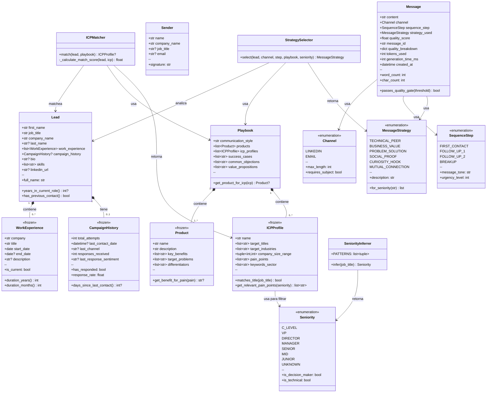
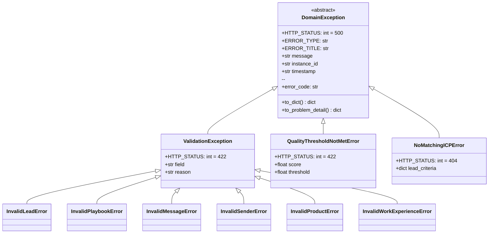
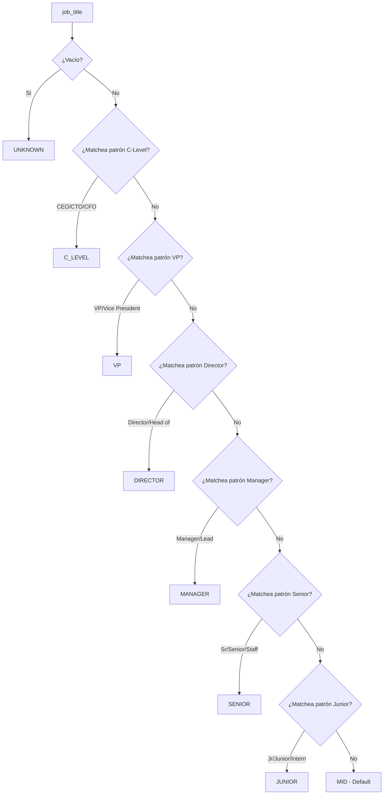
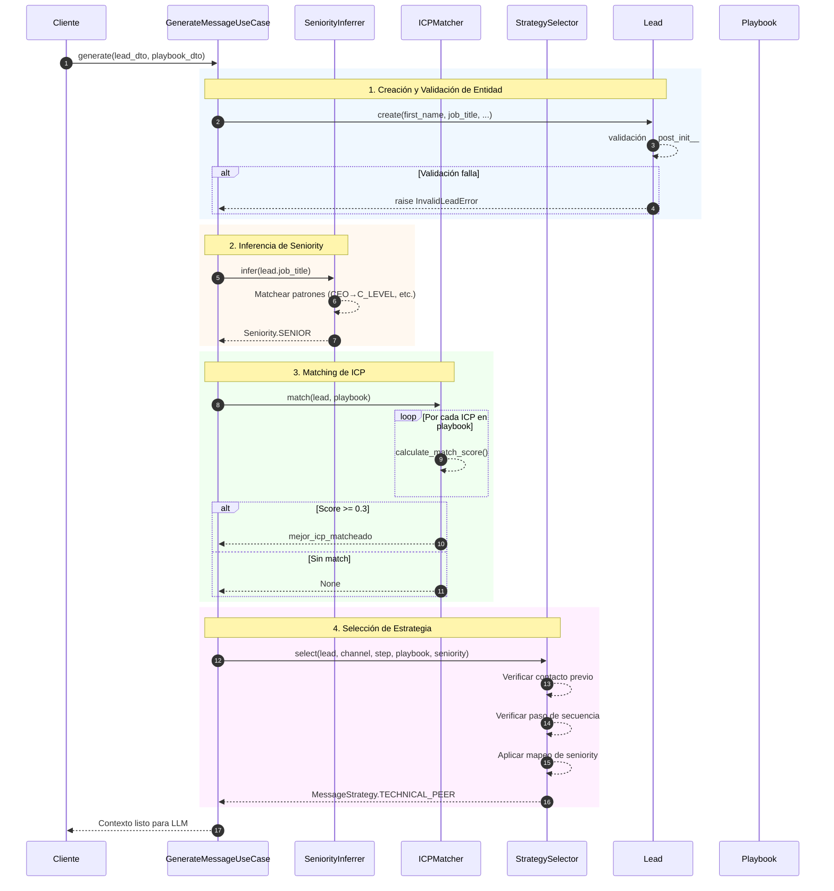
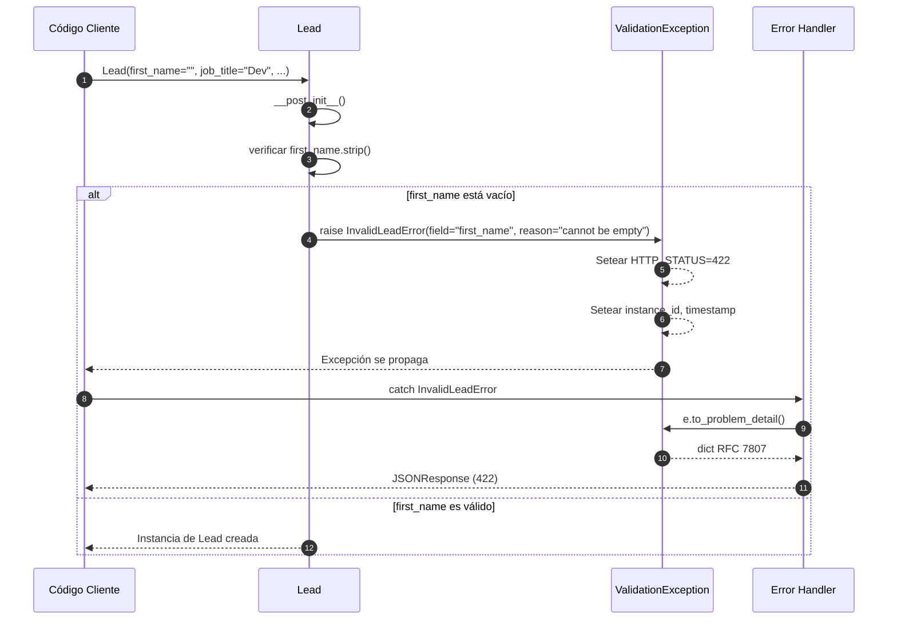
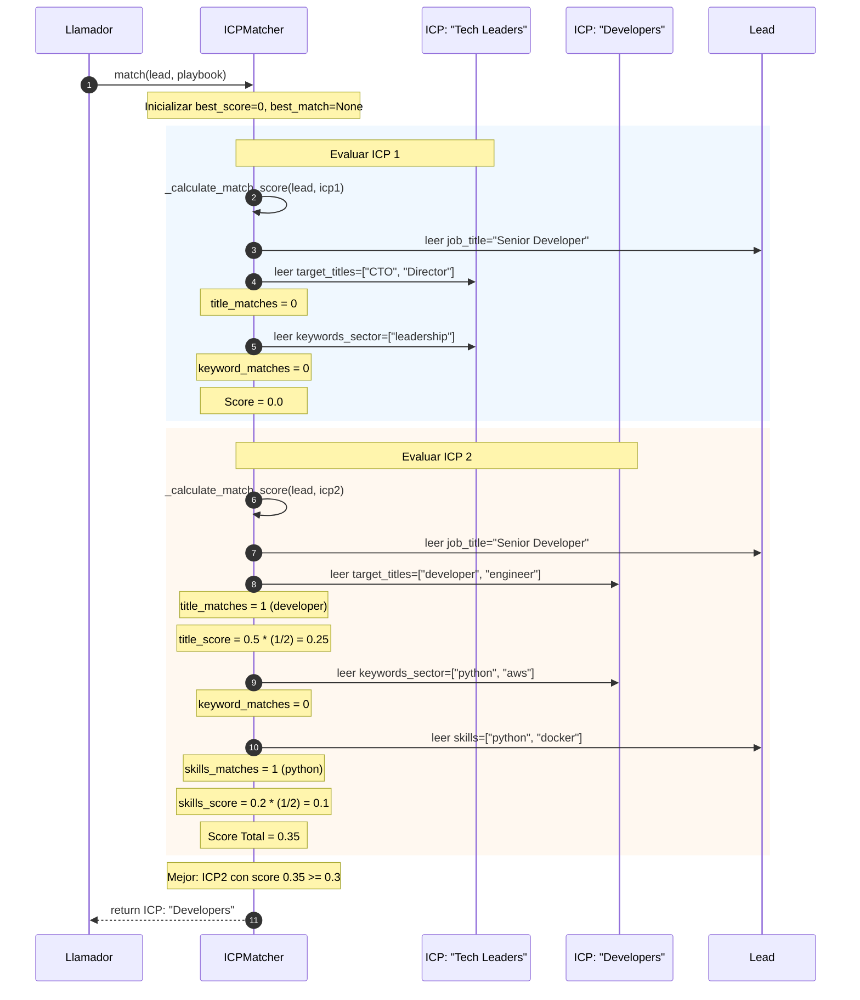

# Análisis de la Capa de Dominio - LeadAdapter

> **Propósito**: Este documento proporciona un análisis exhaustivo de la capa `src/domain/`, incluyendo diagramas de clases, diagramas de secuencia e insights arquitectónicos.

---

## Tabla de Contenidos

1. [Resumen General](#1-resumen-general)
2. [Arquitectura](#2-arquitectura)
3. [Diagrama de Clases](#3-diagrama-de-clases)
4. [Entidades](#4-entidades)
5. [Value Objects](#5-value-objects)
6. [Enums](#6-enums)
7. [Servicios de Dominio](#7-servicios-de-dominio)
8. [Excepciones](#8-excepciones)
9. [Diagramas de Secuencia](#9-diagramas-de-secuencia)
10. [Patrones de Diseño](#10-patrones-de-diseño)

---

## 1. Resumen General

La capa de dominio representa la **lógica de negocio central** de LeadAdapter, un sistema para generar mensajes personalizados de outreach para leads de ventas. Esta capa es:

- **Agnóstica de frameworks**: Sin dependencias de FastAPI, bases de datos o servicios externos
- **Python puro**: Usa solo biblioteca estándar + dataclasses
- **Alineada con DDD**: Sigue los principios de Domain-Driven Design

### Estructura de Directorios

```
src/domain/
├── entities/           # Objetos de negocio mutables con identidad
│   ├── lead.py         # Core: La persona a contactar
│   ├── message.py      # Output: Mensaje generado
│   ├── playbook.py     # Config: Playbook de ventas
│   └── sender.py       # Contexto: Quién envía el mensaje
│
├── value_objects/      # Objetos inmutables sin identidad
│   ├── campaign_history.py   # Historial de contacto del lead
│   ├── icp_profile.py        # Perfil de Cliente Ideal
│   ├── product.py            # Producto que se vende
│   └── work_experience.py    # Historial laboral del lead
│
├── enums/              # Constantes type-safe
│   ├── channel.py          # LINKEDIN | EMAIL
│   ├── message_strategy.py # TECHNICAL_PEER | BUSINESS_VALUE | ...
│   ├── seniority.py        # C_LEVEL | VP | DIRECTOR | ...
│   └── sequence_step.py    # FIRST_CONTACT | FOLLOW_UP_1 | ...
│
├── services/           # Servicios de dominio (lógica stateless)
│   ├── icp_matcher.py       # Matchea leads con ICPs
│   ├── seniority_inferrer.py # Infiere seniority desde job title
│   └── strategy_selector.py  # Selecciona estrategia de mensaje
│
└── exceptions/         # Errores específicos del dominio
    └── domain_exceptions.py  # Jerarquía de excepciones estructuradas
```

---

## 2. Arquitectura

### Flujo de Dependencias

```
┌─────────────────────────────────────────────────────────────┐
│                        Capa API                              │
│              (Routers FastAPI, middleware)                   │
└─────────────────────────────────────────────────────────────┘
                              │
                              ▼
┌─────────────────────────────────────────────────────────────┐
│                    Capa de Aplicación                        │
│        (Casos de Uso, DTOs, Ports, Servicios de App)         │
└─────────────────────────────────────────────────────────────┘
                              │
                              ▼
┌─────────────────────────────────────────────────────────────┐
│                      CAPA DE DOMINIO                         │
│                                                              │
│  ┌─────────────┐  ┌──────────────┐  ┌─────────────────────┐ │
│  │  Entidades  │  │ Value Objects│  │ Servicios de Dominio│ │
│  │  - Lead     │  │ - Product    │  │   - ICPMatcher      │ │
│  │  - Message  │  │ - ICPProfile │  │   - SeniorityInferrer│
│  │  - Playbook │  │ - WorkExp    │  │   - StrategySelector│ │
│  │  - Sender   │  │ - Campaign   │  └─────────────────────┘ │
│  └─────────────┘  └──────────────┘                          │
│                                                              │
│  ┌─────────────┐  ┌──────────────────────────────────────┐  │
│  │    Enums    │  │          Excepciones                 │  │
│  │ - Channel   │  │  - DomainException                   │  │
│  │ - Seniority │  │  - ValidationException               │  │
│  │ - Strategy  │  │  - QualityThresholdNotMetError       │  │
│  └─────────────┘  └──────────────────────────────────────┘  │
└─────────────────────────────────────────────────────────────┘
                              │
                              ▼
┌─────────────────────────────────────────────────────────────┐
│                   Capa de Infraestructura                    │
│          (Adapters, APIs Externas, Bases de Datos)           │
└─────────────────────────────────────────────────────────────┘
```

### Principios Clave

| Principio | Implementación |
|-----------|----------------|
| **Las entidades tienen identidad** | `Lead`, `Message` son mutables, tienen significado más allá de sus atributos |
| **Los Value Objects son inmutables** | `Product`, `WorkExperience` usan `@dataclass(frozen=True)` |
| **Los servicios son stateless** | `ICPMatcher`, `SeniorityInferrer` no tienen estado de instancia |
| **Validación en creación** | Todas las entidades validan en `__post_init__` |
| **Excepciones de dominio ricas** | Excepciones estructuradas con `field`, `reason`, soporte RFC 7807 |

---

## 3. Diagrama de Clases

### Modelo de Dominio Completo



### Jerarquía de Excepciones



---

## 4. Entidades

### Lead (Entidad Central)

El `Lead` representa la persona a quien se enviarán los mensajes.

| Campo | Tipo | Requerido | Descripción |
|-------|------|-----------|-------------|
| `first_name` | `str` | ✅ | Nombre del contacto |
| `job_title` | `str` | ✅ | Posición actual (usado para inferir seniority) |
| `company_name` | `str` | ✅ | Empleador actual |
| `last_name` | `str?` | ❌ | Apellido del contacto |
| `work_experience` | `list[WorkExperience]` | ❌ | Historial laboral |
| `campaign_history` | `CampaignHistory?` | ❌ | Intentos de contacto previos |
| `bio` | `str?` | ❌ | Bio de LinkedIn o resumen |
| `skills` | `list[str]` | ❌ | Skills para matching de ICP |
| `linkedin_url` | `str?` | ❌ | URL del perfil |

**Métodos Clave:**
- `full_name` → Combina nombre/apellido
- `years_in_current_role()` → Extrae de work experience
- `has_previous_contact()` → Verifica historial de campaña

### Message (Entidad de Salida)

El `Message` es la salida generada del sistema.

| Campo | Tipo | Requerido | Descripción |
|-------|------|-----------|-------------|
| `content` | `str` | ✅ | El texto del mensaje |
| `channel` | `Channel` | ✅ | LINKEDIN o EMAIL |
| `sequence_step` | `SequenceStep` | ✅ | Posición en la secuencia |
| `strategy_used` | `MessageStrategy` | ✅ | Estrategia aplicada |
| `quality_score` | `float` | ✅ | Score 0-10 |

### Playbook (Entidad de Configuración)

El `Playbook` contiene la configuración de ventas para generar mensajes.

| Campo | Tipo | Requerido | Descripción |
|-------|------|-----------|-------------|
| `communication_style` | `str` | ✅ | Guías de tono/estilo |
| `products` | `list[Product]` | ✅ | Productos que se venden |
| `icp_profiles` | `list[ICPProfile]` | ❌ | Perfiles de cliente objetivo |
| `success_cases` | `list[str]` | ❌ | Ejemplos de prueba social |
| `common_objections` | `list[str]` | ❌ | Manejo de objeciones |
| `value_propositions` | `list[str]` | ❌ | Propuestas de valor |

---

## 5. Value Objects

Todos los value objects son **inmutables** (`frozen=True`) y representan conceptos sin identidad.

| Value Object | Propósito | Campos Clave |
|--------------|-----------|--------------|
| `WorkExperience` | Entrada de historial laboral | company, title, dates |
| `CampaignHistory` | Seguimiento de intentos de contacto | attempts, responses, sentiment |
| `Product` | Producto que se vende | name, benefits, problems solved |
| `ICPProfile` | Perfil de Cliente Ideal | target_titles, pain_points, keywords |

### Detalle de ICPProfile

El `ICPProfile` es el value object más complejo, usado para **calificación de leads**:

```python
ICPProfile(
    name="Decision Makers Tech",
    target_titles=["CTO", "VP Engineering", "Director"],
    target_industries=["SaaS", "Fintech"],
    pain_points=["Escalar equipo de ingeniería", "Deuda técnica"],
    keywords_sector=["cloud", "devops", "microservices"]
)
```

**Métodos Clave:**
- `matches_title(job_title)` → Check rápido de elegibilidad
- `get_relevant_pain_points(seniority)` → Filtra pain points por tipo de rol


## 7. Servicios de Dominio

### SeniorityInferrer

**Propósito**: Infiere nivel de seniority desde el job title usando patrones regex.



### ICPMatcher

**Propósito**: Matchea un lead con el mejor ICP usando scoring ponderado.

**Fórmula de Scoring:**
```
score = (title_score × 0.5) + (keyword_score × 0.3) + (skills_score × 0.2)
```

| Componente | Peso | Cálculo |
|------------|------|---------|
| Match de título | 50% | % de target_titles encontrados en job_title |
| Match de keywords | 30% | % de keywords_sector encontrados en job_title |
| Match de skills | 20% | % de skills que matchean keywords_sector |

**Umbral mínimo**: 0.3 (30%)

### StrategySelector

**Propósito**: Selecciona la estrategia óptima de mensaje basada en múltiples factores.

**Factores de decisión (orden de prioridad):**
1. **Contacto previo** → Usar PROBLEM_SOLUTION (prospecto conocido)
2. **Paso breakup** → Usar CURIOSITY_HOOK (último intento)
3. **Primer contacto + LinkedIn** → Usar MUTUAL_CONNECTION
4. **Basado en seniority** → Usar mapeo de `MessageStrategy.for_seniority()`

---

## 9. Diagramas de Secuencia

### Secuencia 1: Flujo de Procesamiento de Lead

Este diagrama muestra cómo se procesa un lead desde datos crudos hasta ICP matcheado:



### Secuencia 2: Flujo de Validación de Entidad



### Secuencia 3: Algoritmo de Matching de ICP



---

## 10. Patrones de Diseño

### Patrones Utilizados

| Patrón | Dónde | Por Qué |
|--------|-------|---------|
| **Value Object** | `Product`, `WorkExperience`, `ICPProfile` | Inmutabilidad, sin identidad |
| **Entity** | `Lead`, `Message`, `Playbook` | Identidad + estado mutable |
| **Domain Service** | `ICPMatcher`, `SeniorityInferrer`, `StrategySelector` | Lógica stateless cross-entity |
| **Self-Validation** | Todas las entidades en `__post_init__` | Fail-fast, objetos siempre válidos |
| **Template Method** | `DomainException.to_problem_detail()` | Comportamiento base + personalización |
| **Strategy** | Enum `MessageStrategy` | Enfoques de mensaje intercambiables |
| **Factory Method** | `MessageStrategy.for_seniority()` | Crear lista de estrategias por seniority |

### Cumplimiento SOLID

| Principio | Implementación |
|-----------|----------------|
| **SRP** | Cada clase tiene una sola razón para cambiar (Lead para datos de lead, ICPMatcher para lógica de matching) |
| **OCP** | Nuevas estrategias pueden agregarse al enum sin modificar código existente |
| **LSP** | Todas las subclases de `ValidationException` funcionan con handlers que esperan `ValidationException` |
| **ISP** | Las entidades exponen solo interfaces relevantes (Lead no conoce a Message) |
| **DIP** | Los servicios de dominio dependen de entidades/VOs, no de infraestructura |

---

## Resumen

La capa `src/domain/` es una **implementación DDD bien estructurada** con:

- **4 Entidades**: Lead, Message, Playbook, Sender
- **4 Value Objects**: WorkExperience, CampaignHistory, Product, ICPProfile
- **4 Enums**: Channel, Seniority, MessageStrategy, SequenceStep
- **3 Servicios de Dominio**: ICPMatcher, SeniorityInferrer, StrategySelector
- **10 Excepciones**: Jerárquicas, compatibles con RFC 7807

El dominio está **completamente aislado** de concerns de infraestructura, haciéndolo testeable, mantenible y agnóstico de frameworks.
