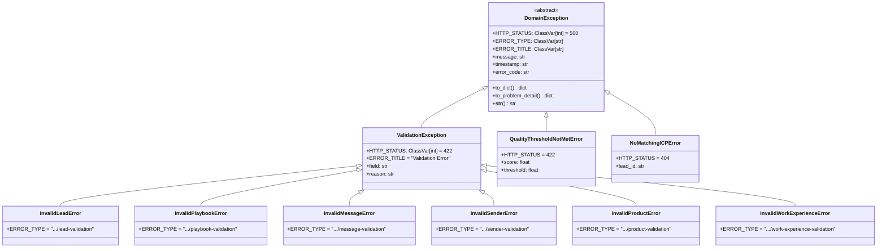

# Plan: Refactorización de Excepciones con Contexto Estructurado

## Metadata

- **Tipo:** 🔄 Refactor
- **Complejidad:** Medium - Múltiples archivos, backward compatibility requerida
- **Estimación:** 6-8 horas (1 día)
- **Archivos:** 10 archivos (8 modificar + 2 implementar)
- **Riesgo:** Medio - Cambios en API interna de excepciones

---

## 1. Contexto

**Problema:** Las excepciones de dominio actuales solo aceptan un string como mensaje, lo que impide:
- Acceso programático a campos específicos (e.g., `e.field`, `e.reason`)
- Serialización estructurada para APIs REST
- Logging enriquecido con contexto

**Estado actual:** 
- 8 excepciones definidas, solo `QualityThresholdNotMetError` tiene atributos estructurados
- Excepciones se levantan con strings: `raise InvalidLeadError("first_name cannot be empty")`
- `NoMatchingICPError` definida pero nunca usada
- `error_handler.py` está vacío - excepciones explotan como 500

**Estado deseado:**
- Todas las excepciones de validación tienen `field` y `reason` como atributos
- Base `DomainException` soporta `to_dict()` y `to_problem_detail()` (RFC 7807)
- Handler global transforma excepciones en respuestas HTTP estructuradas

**Criterios de éxito:**
1. ✅ `e.field` y `e.reason` accesibles en todas las excepciones de validación
2. ✅ `e.to_dict()` retorna dict serializable
3. ✅ Backward compatible - `str(e)` sigue funcionando
4. ✅ Tests existentes siguen pasando
5. ✅ Nuevos tests para atributos estructurados

---

## 2. Archivos Afectados

### Modificar (8 archivos)

| Archivo | Acción | Razón |
|---------|--------|-------|
| `src/domain/exceptions/domain_exceptions.py` | Modificar | Core: agregar atributos y métodos |
| `src/domain/exceptions/__init__.py` | Modificar | Actualizar exports si es necesario |
| `src/domain/entities/lead.py` | Modificar | Actualizar `raise` statements |
| `src/domain/entities/playbook.py` | Modificar | Actualizar `raise` statements |
| `src/domain/entities/message.py` | Modificar | Actualizar `raise` statements |
| `src/domain/entities/sender.py` | Modificar | Actualizar `raise` statements |
| `src/domain/value_objects/product.py` | Modificar | Actualizar `raise` statements |
| `src/domain/value_objects/work_experience.py` | Modificar | Actualizar `raise` statements |

### Implementar (2 archivos)

| Archivo | Acción | Razón |
|---------|--------|-------|
| `src/api/middleware/error_handler.py` | Implementar | Handler global de excepciones |
| `tests/unit/domain/test_exceptions.py` | Crear | Tests para nuevas funcionalidades |

### Eliminar/Limpiar (1 item)

| Item | Acción | Razón |
|------|--------|-------|
| `NoMatchingICPError` | Evaluar | Código muerto - decidir si eliminar o usar |

---

## 3. Riesgos

| Riesgo | Probabilidad | Impacto | Mitigación |
|--------|--------------|---------|------------|
| Romper código que usa `str(e)` | Media | Alto | Mantener `__str__` compatible |
| Tests existentes fallan | Baja | Medio | Correr tests después de cada paso |
| Inconsistencia entre excepciones | Baja | Medio | Usar clase base común `ValidationException` |
| Performance por atributos extra | Muy Baja | Bajo | Usar `__slots__` |

---

## 4. Diseño

### 4.1 Diagrama de Clases



### 4.2 Decisiones de Diseño

| Decisión | Alternativas | Razón |
|----------|--------------|-------|
| Usar `dataclass(frozen=True)` | Plain class con `__init__` | Inmutabilidad garantizada, menos boilerplate, compatible con slots |
| Crear `ValidationException` intermedia | Atributos en cada clase | DRY - todas las validaciones comparten `field`/`reason` |
| `to_problem_detail()` en base | Solo en API layer | Encapsulación - excepción sabe representarse, API no necesita conocer internals |
| Mantener `NoMatchingICPError` | Eliminarla | Será útil cuando se implemente matching de ICPs |
| Usar `ClassVar` para HTTP_STATUS | Instance attribute | Es igual para todas las instancias de la misma clase |

---

## 5. Implementación

### Paso 1: Refactorizar `DomainException` base

**Objetivo:** Crear base con atributos comunes y métodos de serialización

**Archivo:** `src/domain/exceptions/domain_exceptions.py`

**Cambios:**

- [ ] Agregar imports: `dataclass`, `field`, `ClassVar`, `Any`, `datetime`, `uuid`
- [ ] Convertir `DomainException` a dataclass con:
  - `message: str`
  - `timestamp: str` (auto-generado)
  - `HTTP_STATUS: ClassVar[int] = 500`
  - `ERROR_TYPE: ClassVar[str]`
  - `ERROR_TITLE: ClassVar[str]`
- [ ] Implementar `to_dict() -> dict[str, Any]`
- [ ] Implementar `to_problem_detail() -> dict[str, Any]` (RFC 7807)
- [ ] Implementar `error_code` property (derivado del nombre de clase)
- [ ] Mantener `__str__()` para backward compatibility

**Verificación:** 
```python
e = DomainException("test")
assert str(e) == "test"
assert e.to_dict()["message"] == "test"
```

---

### Paso 2: Crear `ValidationException` intermedia

**Objetivo:** Clase base para todas las excepciones de validación con `field` y `reason`

**Archivo:** `src/domain/exceptions/domain_exceptions.py`

**Cambios:**

- [ ] Crear `ValidationException(DomainException)` con:
  - `field: str`
  - `reason: str`
  - `HTTP_STATUS = 422`
  - `ERROR_TITLE = "Validation Error"`
- [ ] Override `to_problem_detail()` para incluir `invalid-params` (RFC 7807)
- [ ] Override `__str__()` para formato `"{field}: {reason}"`

**Verificación:**
```python
e = ValidationException(field="email", reason="invalid format")
assert e.field == "email"
assert str(e) == "email: invalid format"
```

---

### Paso 3: Refactorizar excepciones de validación

**Objetivo:** Hacer que todas hereden de `ValidationException`

**Archivo:** `src/domain/exceptions/domain_exceptions.py`

**Cambios:**

- [ ] `InvalidLeadError(ValidationException)` - solo define `ERROR_TYPE`
- [ ] `InvalidPlaybookError(ValidationException)` - solo define `ERROR_TYPE`
- [ ] `InvalidMessageError(ValidationException)` - solo define `ERROR_TYPE`
- [ ] `InvalidSenderError(ValidationException)` - solo define `ERROR_TYPE`
- [ ] `InvalidProductError(ValidationException)` - solo define `ERROR_TYPE`
- [ ] `InvalidWorkExperienceError(ValidationException)` - solo define `ERROR_TYPE`

**Verificación:**
```python
e = InvalidLeadError(field="first_name", reason="cannot be empty")
assert isinstance(e, ValidationException)
assert e.HTTP_STATUS == 422
```

---

### Paso 4: Mantener `QualityThresholdNotMetError`

**Objetivo:** Ya está bien implementada, solo agregar métodos base

**Archivo:** `src/domain/exceptions/domain_exceptions.py`

**Cambios:**

- [ ] Asegurar que hereda de `DomainException` (no de `ValidationException`)
- [ ] Agregar `HTTP_STATUS = 422`
- [ ] Override `to_dict()` para incluir `score` y `threshold`

**Verificación:**
```python
e = QualityThresholdNotMetError(score=5.0, threshold=7.0)
assert e.to_dict()["score"] == 5.0
```

---

### Paso 5: Actualizar `NoMatchingICPError`

**Objetivo:** Convertir de marker exception a excepción estructurada

**Archivo:** `src/domain/exceptions/domain_exceptions.py`

**Cambios:**

- [ ] Agregar atributos: `lead_criteria: dict[str, Any]`
- [ ] Agregar `HTTP_STATUS = 404`
- [ ] Agregar `ERROR_TITLE = "No Matching ICP"`

**Verificación:**
```python
e = NoMatchingICPError(lead_criteria={"industry": "Tech"})
assert e.HTTP_STATUS == 404
```

---

### Paso 6: Actualizar entidades - Lead

**Objetivo:** Usar nueva API de excepciones

**Archivo:** `src/domain/entities/lead.py`

**Cambios:**

- [ ] Cambiar `raise InvalidLeadError("first_name cannot be empty")` a:
  ```python
  raise InvalidLeadError(field="first_name", reason="cannot be empty")
  ```
- [ ] Aplicar a todas las validaciones (3 lugares)

**Verificación:** Correr tests existentes de Lead

---

### Paso 7: Actualizar entidades - Playbook

**Objetivo:** Usar nueva API de excepciones

**Archivo:** `src/domain/entities/playbook.py`

**Cambios:**

- [ ] Cambiar `raise InvalidPlaybookError("playbook communication style cannot be empty")` a:
  ```python
  raise InvalidPlaybookError(field="communication_style", reason="cannot be empty")
  ```
- [ ] Aplicar a todas las validaciones (2 lugares)

**Verificación:** Correr tests existentes de Playbook

---

### Paso 8: Actualizar entidades - Message

**Objetivo:** Usar nueva API de excepciones

**Archivo:** `src/domain/entities/message.py`

**Cambios:**

- [ ] Cambiar `raise InvalidMessageError("message content cannot be empty")` a:
  ```python
  raise InvalidMessageError(field="content", reason="cannot be empty")
  ```
- [ ] Cambiar `raise InvalidMessageError("quality_score must be between 0 and 10")` a:
  ```python
  raise InvalidMessageError(field="quality_score", reason="must be between 0 and 10")
  ```

**Verificación:** Correr tests existentes de Message

---

### Paso 9: Actualizar entidades - Sender

**Objetivo:** Usar nueva API de excepciones

**Archivo:** `src/domain/entities/sender.py`

**Cambios:**

- [ ] Cambiar `raise InvalidSenderError("sender name cannot be empty")` a:
  ```python
  raise InvalidSenderError(field="name", reason="cannot be empty")
  ```
- [ ] Aplicar a todas las validaciones (2 lugares)

**Verificación:** Correr tests existentes de Sender

---

### Paso 10: Actualizar Value Objects - Product

**Objetivo:** Usar nueva API de excepciones

**Archivo:** `src/domain/value_objects/product.py`

**Cambios:**

- [ ] Cambiar `raise InvalidProductError("product name cannot be empty")` a:
  ```python
  raise InvalidProductError(field="name", reason="cannot be empty")
  ```

**Verificación:** Correr tests existentes de Product

---

### Paso 11: Actualizar Value Objects - WorkExperience

**Objetivo:** Usar nueva API de excepciones

**Archivo:** `src/domain/value_objects/work_experience.py`

**Cambios:**

- [ ] Cambiar `raise InvalidWorkExperienceError("company cannot be empty")` a:
  ```python
  raise InvalidWorkExperienceError(field="company", reason="cannot be empty")
  ```
- [ ] Aplicar a todas las validaciones (2 lugares)

**Verificación:** Correr tests existentes de WorkExperience

---

### Paso 12: Implementar Error Handler

**Objetivo:** Handler global para FastAPI

**Archivo:** `src/api/middleware/error_handler.py`

**Cambios:**

- [ ] Crear `domain_exception_handler(request, exc) -> JSONResponse`
- [ ] Retornar RFC 7807 Problem Details
- [ ] Usar media type `application/problem+json`
- [ ] Logging con contexto interno

**Verificación:** Test de integración con FastAPI

---

### Paso 13: Crear Tests

**Objetivo:** Cobertura completa de nuevas funcionalidades

**Archivo:** `tests/unit/domain/test_exceptions.py`

**Cambios:**

- [ ] Test `DomainException.to_dict()`
- [ ] Test `DomainException.to_problem_detail()`
- [ ] Test `ValidationException` con field/reason
- [ ] Test herencia correcta
- [ ] Test backward compatibility de `str(e)`
- [ ] Test cada excepción específica

**Verificación:** `pytest tests/unit/domain/test_exceptions.py -v`

---

## 6. Tests

### Tests Unitarios

| Función | Caso | Input | Expected |
|---------|------|-------|----------|
| `DomainException.__str__` | Basic | `DomainException("error")` | `"error"` |
| `DomainException.to_dict` | Complete | any instance | dict con `message`, `timestamp`, `error_code` |
| `ValidationException.__init__` | With field/reason | `field="x", reason="y"` | `e.field == "x"` |
| `ValidationException.__str__` | Format | `field="x", reason="y"` | `"x: y"` |
| `InvalidLeadError` | Inheritance | instance | `isinstance(e, ValidationException)` |
| `QualityThresholdNotMetError` | Attributes | `score=5, threshold=7` | `e.score == 5` |

### Tests de Integración

- [ ] FastAPI handler retorna 422 para `ValidationException`
- [ ] FastAPI handler retorna 404 para `NoMatchingICPError`
- [ ] Response tiene header `Content-Type: application/problem+json`
- [ ] Body tiene estructura RFC 7807

---

## 7. Checklist Final

### Implementación
- [ ] Paso 1: `DomainException` base refactorizada
- [ ] Paso 2: `ValidationException` creada
- [ ] Paso 3: Excepciones de validación heredan correctamente
- [ ] Paso 4: `QualityThresholdNotMetError` con métodos base
- [ ] Paso 5: `NoMatchingICPError` estructurada
- [ ] Paso 6-11: Todas las entidades actualizadas
- [ ] Paso 12: Error handler implementado
- [ ] Paso 13: Tests creados

### Calidad
- [ ] Tests unitarios pasan
- [ ] Tests integración pasan
- [ ] `ruff check .` sin errores
- [ ] `mypy` sin errores
- [ ] Documentación actualizada (docstrings)
- [ ] PR creado con descripción clara

### Backward Compatibility
- [ ] `str(e)` sigue funcionando igual
- [ ] Código existente que usa excepciones no rompe
- [ ] Tests existentes siguen pasando

---

## 8. Agent Synthesis

### Explore Agent 1 Findings (Exception Files)

**18 archivos** identificados relacionados con excepciones:

- **Core:** `domain_exceptions.py` + `__init__.py`
- **Entities usando excepciones:** `lead.py`, `playbook.py`, `message.py`, `sender.py`
- **Value Objects:** `product.py`, `work_experience.py`
- **Services:** `quality_gate.py`
- **API (vacíos):** `error_handler.py`, `messages.py`, `health.py`
- **Hallazgo crítico:** `NoMatchingICPError` definida pero nunca usada
- **Hallazgo crítico:** Ninguna excepción es capturada en código real

### Explore Agent 2 Findings (Patterns/Conventions)

**Arquitectura:** Hexagonal (Ports & Adapters)

**Convenciones a seguir:**
- `@dataclass(frozen=True)` para Value Objects
- `__post_init__` para validación
- Type hints modernas (`list[T]`, `T | None`)
- Google-style docstrings
- Tests con AAA pattern y `pytest.raises(match=...)`

**Patrón de excepción a seguir (QualityThresholdNotMetError):**
```python
def __init__(self, score: float, threshold: float, message: str = "") -> None:
    self.score = score
    self.threshold = threshold
    super().__init__(f"Quality score {score} below threshold {threshold}. {message}")
```

### General Agent Recommendations (Best Practices)

**Patrones GoF recomendados:**
1. **Template Method** para `__init__` de base exception
2. **Chain of Responsibility** para exception handling
3. **Protocol (ISP)** para interfaces de serialización

**SOLID aplicado:**
- **SRP:** Error codes como Value Objects separados
- **OCP:** Extensión via herencia y mixins
- **LSP:** Mantener contrato de `to_dict()` y `to_problem_detail()`
- **ISP:** Protocols para `JSONSerializable` y `ProblemDetailSerializable`
- **DIP:** API layer depende de interfaces, no implementaciones

**Seguridad:**
- Separar mensaje interno vs externo
- Sanitizar datos sensibles
- Nunca exponer stack traces

**RFC 7807 Problem Details:**
```json
{
  "type": "https://api.example.com/errors/validation",
  "title": "Validation Error",
  "status": 422,
  "detail": "first_name: cannot be empty",
  "instance": "/errors/abc123",
  "invalid-params": [{"name": "first_name", "reason": "cannot be empty"}]
}
```

---

## Notas Adicionales

### Orden de Ejecución Recomendado

1. **Primero:** Pasos 1-5 (refactorizar excepciones) - sin romper nada
2. **Segundo:** Paso 13 (tests) - validar que funciona
3. **Tercero:** Pasos 6-11 (actualizar usages) - aplicar nueva API
4. **Cuarto:** Paso 12 (error handler) - integración completa

### Backward Compatibility Strategy

Para cada excepción, mantener un constructor alternativo:

```python
@dataclass(frozen=True)
class InvalidLeadError(ValidationException):
    # Si se instancia solo con string (legacy), parsear
    def __new__(cls, *args, **kwargs):
        if len(args) == 1 and isinstance(args[0], str) and not kwargs:
            # Legacy: InvalidLeadError("field cannot be empty")
            return super().__new__(cls)
        return super().__new__(cls)
```

**Decisión:** No implementar backward compatibility compleja. Mejor actualizar todos los usages de una vez (son solo 13 lugares).
