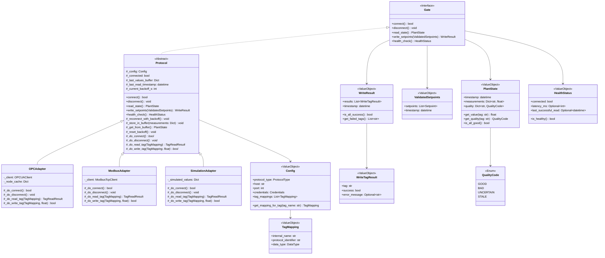
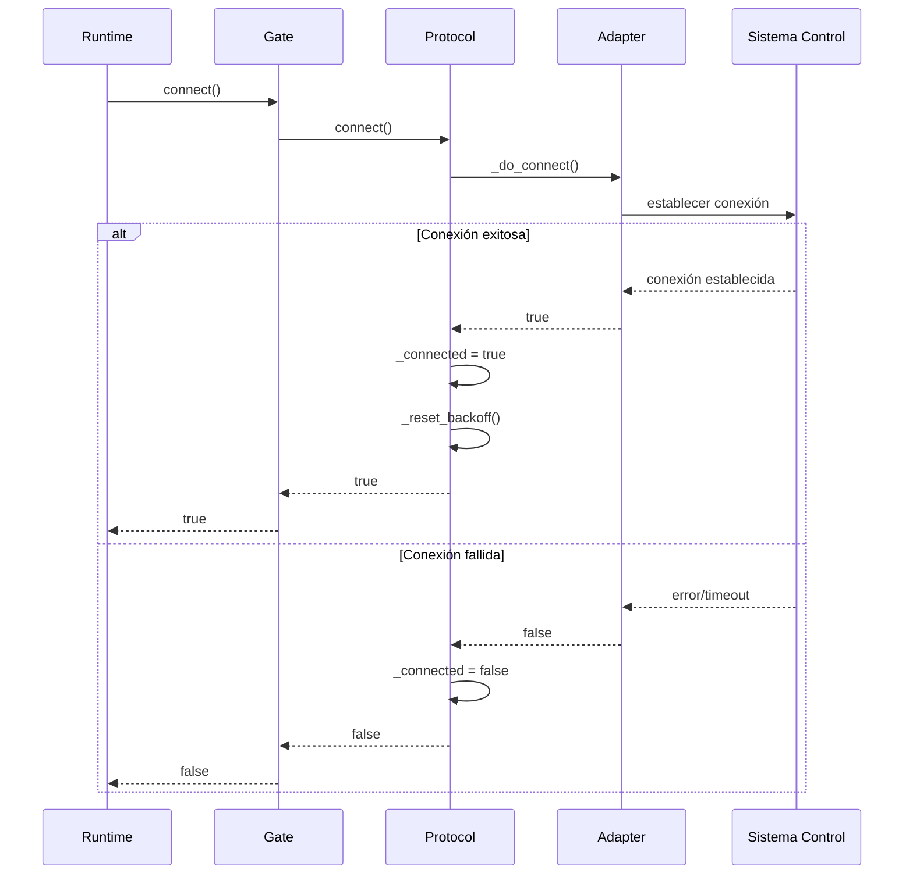
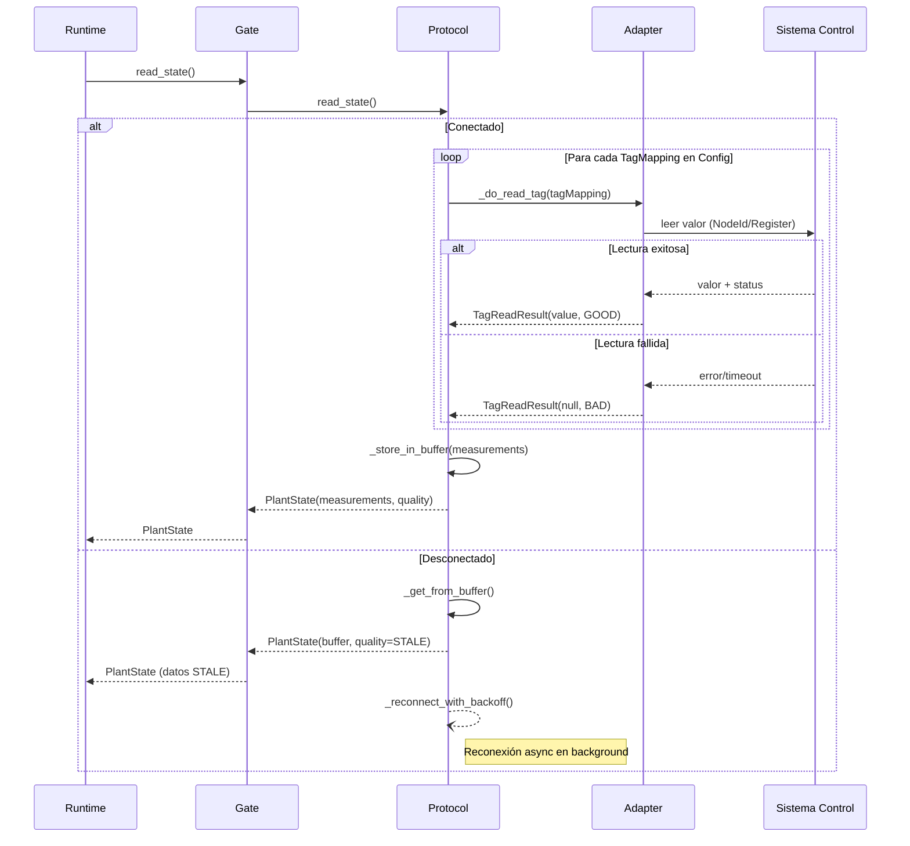
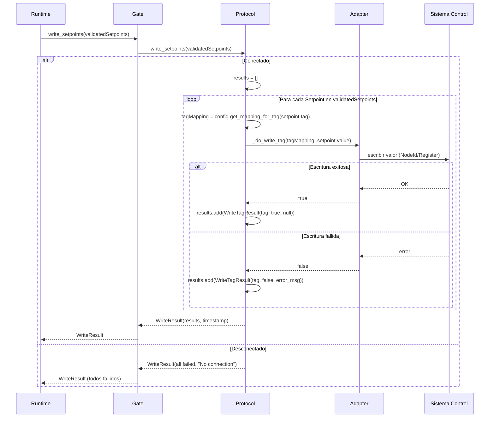
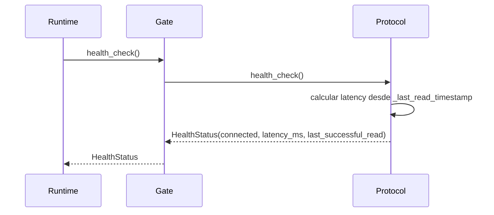
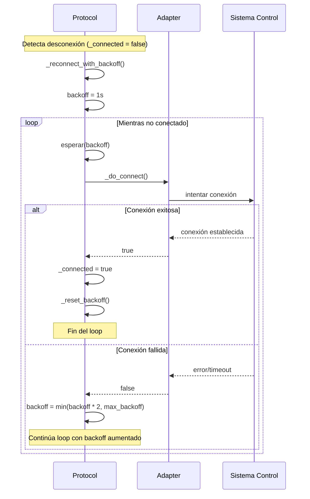

Diagrama de clases


---

## Interfaces

### GatewayInterface (implementada por cada adaptador)

```
GatewayInterface
├── connect()            → Establece conexión con sistema de control
├── disconnect()         → Cierra conexión limpiamente
├── read_state()         → Retorna PlantState con mediciones y calidades
├── write_setpoints(validated_setpoints) → Escribe setpoints, retorna resultado por tag
└── health_check()       → Retorna estado de conexión y latencia
```

### Tipos de Datos

```
PlantState
├── timestamp            → Momento de la lectura
├── measurements         → Diccionario {tag: valor}
└── quality              → Diccionario {tag: código_calidad}

ValidatedSetpoints
├── setpoints            → Lista de Setpoint validados
├── timestamp            → Momento de validación
└── constraint_report    → Reporte de validación

WriteResult
├── results              → Lista de WriteTagResult
└── timestamp            → Momento de escritura

WriteTagResult
├── tag                  → Tag que se intentó escribir
├── success              → Boolean
└── error_message        → Mensaje si falló (opcional)

HealthStatus
├── connected            → Boolean
├── latency_ms           → Latencia en milisegundos (None si desconectado)
└── last_successful_read → Timestamp de última lectura exitosa

QualityCode (enum)
├── GOOD                 → Lectura exitosa, valor confiable
├── BAD                  → Lectura falló
├── UNCERTAIN            → Valor leído pero calidad dudosa
└── STALE                → Valor antiguo (de buffer)
```

---

## Historias de Usuario

### US-G01: Conectar con servidor OPC-UA

**Como** ingeniero de control  
**Quiero** configurar conexión a un servidor OPC-UA especificando endpoint y credenciales  
**Para** leer y escribir tags del sistema de control

**Criterios de aceptación:**
- [ ] Puedo especificar URL del endpoint OPC-UA
- [ ] Puedo especificar usuario y contraseña si se requiere
- [ ] El sistema intenta conectar y reporta éxito o error específico
- [ ] La conexión se mantiene activa mientras el Gateway esté corriendo

---

### US-G02: Mapear tags internos a identificadores de protocolo

**Como** ingeniero de control  
**Quiero** definir un mapeo entre nombres de tags de SimPlant y los identificadores del sistema de control  
**Para** que el Gateway sepa qué leer y escribir

**Criterios de aceptación:**
- [ ] Puedo definir mapeo en archivo de configuración
- [ ] Para OPC-UA: mapeo a NodeIds
- [ ] Para Modbus: mapeo a direcciones de registros
- [ ] El sistema valida que todos los tags requeridos tengan mapeo

---

### US-G03: Leer estado de planta

**Como** Runtime  
**Quiero** invocar una operación que retorne todas las mediciones configuradas con sus calidades  
**Para** tener el estado actual del proceso

**Criterios de aceptación:**
- [ ] Una sola llamada retorna todas las mediciones
- [ ] Cada medición incluye valor y código de calidad
- [ ] Si una lectura falla, las demás continúan
- [ ] El resultado indica claramente qué tags fallaron

---

### US-G04: Escribir setpoints validados

**Como** Runtime  
**Quiero** invocar una operación que escriba los setpoints en el sistema de control  
**Para** aplicar las decisiones del modelo

**Criterios de aceptación:**
- [ ] Recibo setpoints validados y los escribo a los tags correspondientes
- [ ] Retorno resultado de cada escritura (éxito/fallo)
- [ ] No modifico los valores recibidos bajo ninguna circunstancia
- [ ] Los errores de escritura no abortan las demás escrituras

---

### US-G05: Reconectar automáticamente

**Como** Gateway  
**Quiero** reconectar automáticamente cuando se pierde conexión  
**Para** minimizar el tiempo fuera de línea

**Criterios de aceptación:**
- [ ] Detecto pérdida de conexión (timeout, excepción)
- [ ] Intento reconectar con backoff exponencial (1s, 2s, 4s, 8s, max 60s)
- [ ] Durante desconexión, reporto estado al Runtime en cada health_check
- [ ] Al reconectar, notifico al Runtime que la conexión está disponible

---

### US-G06: Operar con adaptador de simulación

**Como** desarrollador  
**Quiero** usar un adaptador que genere datos sintéticos sin conectar a hardware real  
**Para** desarrollar y probar sin acceso a planta

**Criterios de aceptación:**
- [ ] El adaptador implementa la misma interfaz que OPC-UA/Modbus
- [ ] Genera valores que varían realísticamente en el tiempo
- [ ] Puedo configurar rangos y comportamiento de las variables simuladas
- [ ] Las escrituras se "aceptan" y afectan las lecturas siguientes

---

# Documentos relacionados

## Módulo Gateway
Este documento describe el diseño conceptual del módulo Gateway.

## Documentos del módulo
- [[Gateway]] - Documento principal (requerimientos e historias de usuario)
- [[Tecnico]] - Especificación técnica y diagramas de secuencia

---

## Diagramas de Secuencia del Sistema (DSS)

### DSS 1: Conectar



---

### DSS 2: Leer estado de planta



---

### DSS 3: Escribir setpoints



---

### DSS 4: Health check



---

### DSS 5: Reconexión con backoff exponencial




