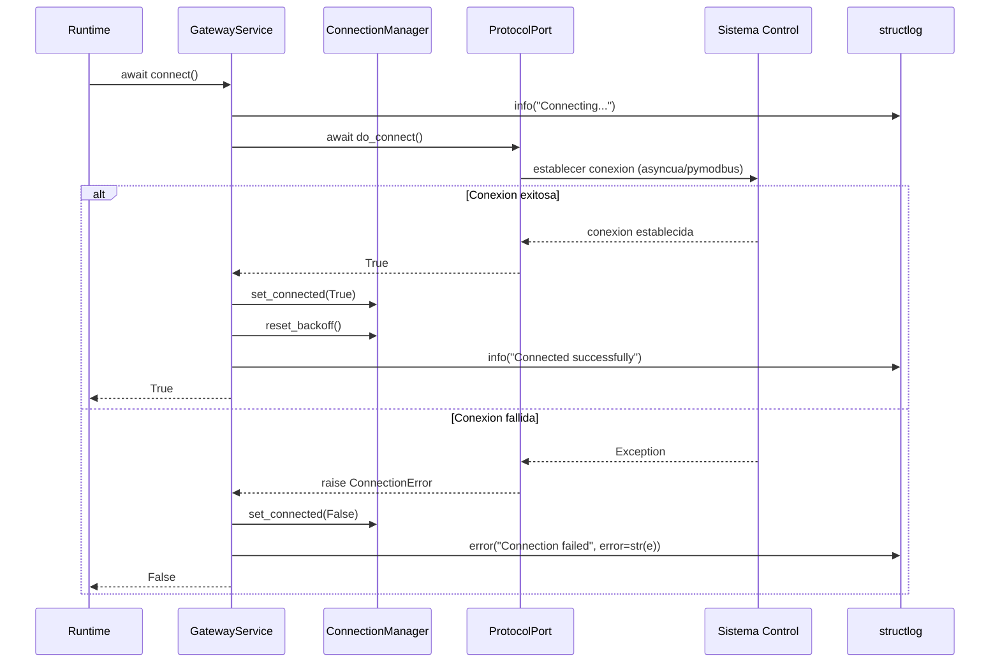
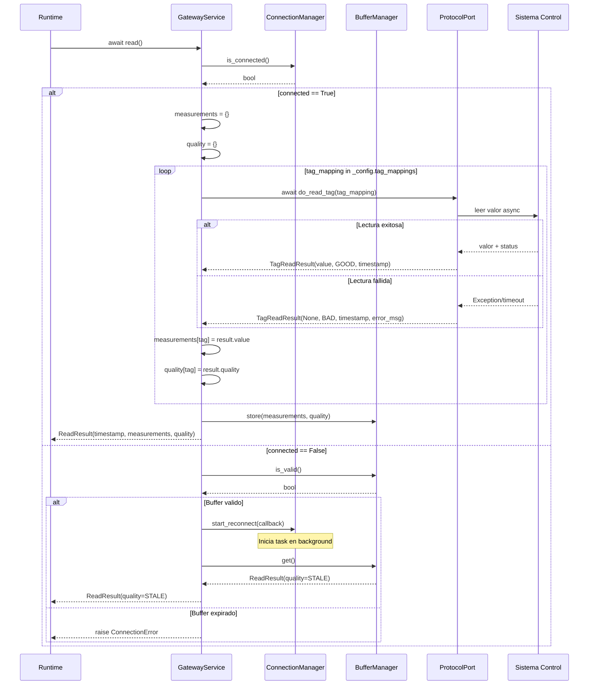
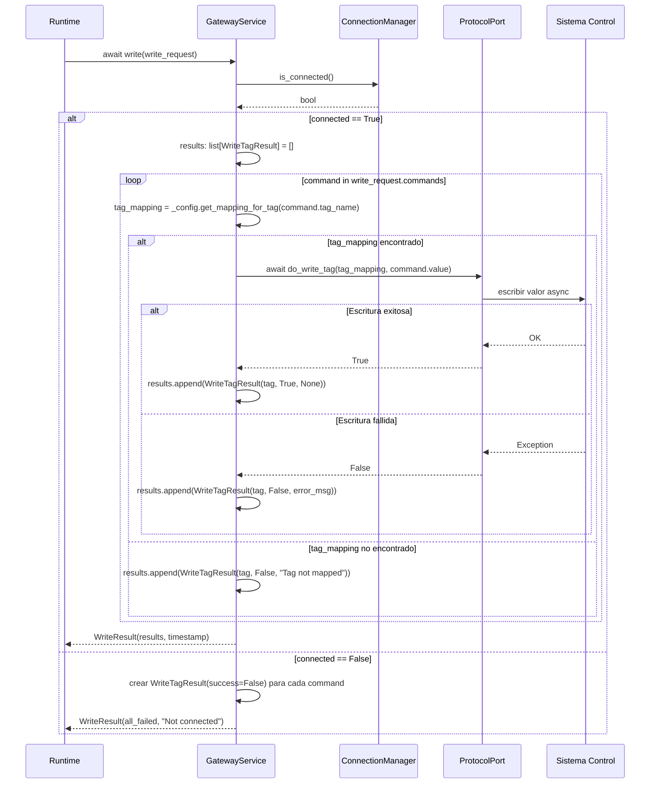
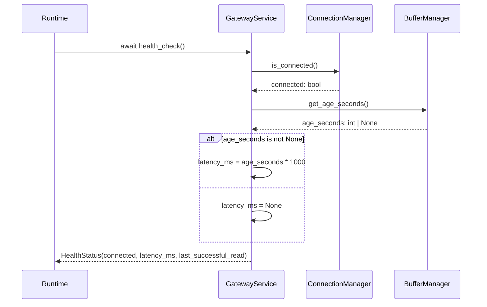
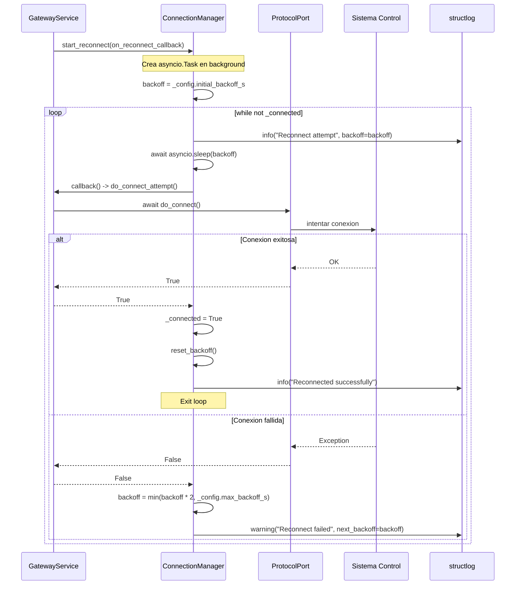
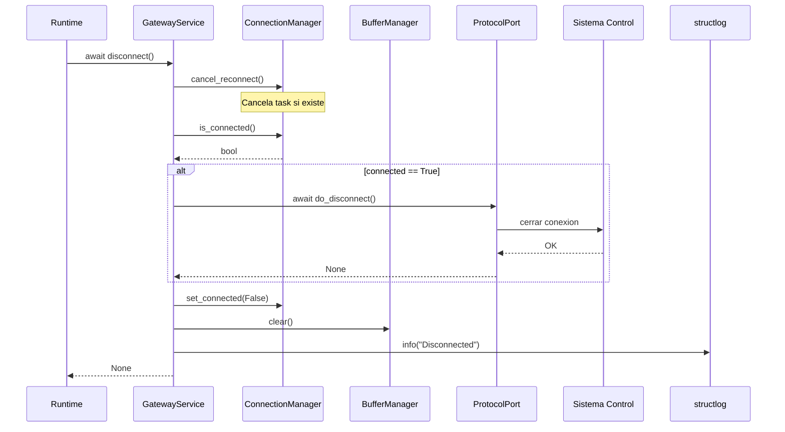
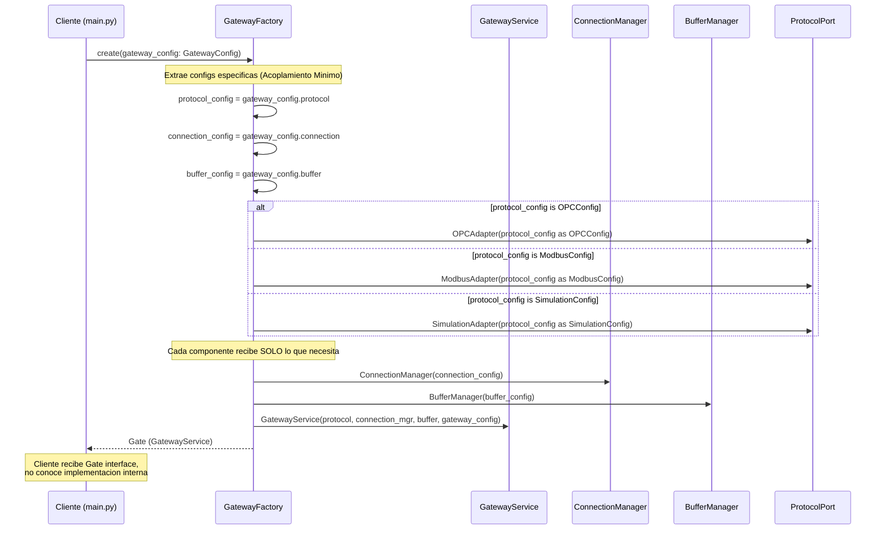

# Gateway - Especificación Técnica

## Tech Stack

### Dependencias de producción

| Librería | Versión | Propósito |
|----------|---------|-----------|
| `asyncua` | ^1.0.0 | Cliente OPC-UA async |
| `pymodbus` | ^3.6.0 | Cliente Modbus TCP/RTU con soporte async |
| `aiomqtt` | ^2.0.0 | Cliente MQTT async |
| `pydantic` | ^2.0.0 | Value Objects, Config, validación |
| `tenacity` | ^8.0.0 | Retry con backoff exponencial |
| `structlog` | ^24.0.0 | Logging estructurado |

### Dependencias de desarrollo

| Librería | Versión | Propósito |
|----------|---------|-----------|
| `pytest` | ^8.0.0 | Testing framework |
| `pytest-asyncio` | ^0.23.0 | Soporte para tests async |
| `pytest-mock` | ^3.12.0 | Mocking |

---

## Diagrama de Clases

```mermaid
classDiagram
    direction TB

    %% ========== INTERFACES ESTABLES (Protected Variations) ==========

    class Gate {
        <<Protocol>>
        +connect()* async bool
        +disconnect()* async None
        +read()* async ReadResult
        +write(WriteRequest)* async WriteResult
        +health_check()* async HealthStatus
    }

    class ProtocolPort {
        <<Protocol>>
        +do_connect()* async bool
        +do_disconnect()* async None
        +do_read_tag(TagMapping)* async TagReadResult
        +do_write_tag(TagMapping, float)* async bool
    }

    %% ========== FACADE (Orquestador) ==========

    class GatewayService {
        <<Facade>>
        -_protocol: ProtocolPort
        -_connection_mgr: ConnectionManager
        -_buffer: BufferManager
        -_config: GatewayConfig
        -_logger: BoundLogger
        +__init__(protocol, connection_mgr, buffer, config)
        +connect() async bool
        +disconnect() async None
        +read() async ReadResult
        +write(WriteRequest) async WriteResult
        +health_check() async HealthStatus
    }

    %% ========== INFORMATION EXPERTS ==========

    class ConnectionManager {
        <<Information Expert>>
        -_connected: bool
        -_current_backoff_s: int
        -_reconnect_task: Task | None
        -_config: ConnectionConfig
        -_logger: BoundLogger
        +is_connected() bool
        +set_connected(bool) None
        +start_reconnect(callback) None
        +cancel_reconnect() None
        +reset_backoff() None
        +get_current_backoff() int
    }

    class BufferManager {
        <<Information Expert>>
        -_values: dict~str, float~
        -_quality: dict~str, QualityCode~
        -_last_timestamp: datetime | None
        -_config: BufferConfig
        +store(values, quality) None
        +get() ReadResult
        +is_valid() bool
        +clear() None
        +get_age_seconds() int | None
    }

    %% ========== PROTOCOL ADAPTERS ==========

    class OPCAdapter {
        -_client: Client
        -_node_cache: dict~str, Node~
        -_config: OPCConfig
        +do_connect() async bool
        +do_disconnect() async None
        +do_read_tag(TagMapping) async TagReadResult
        +do_write_tag(TagMapping, float) async bool
    }

    class ModbusAdapter {
        -_client: AsyncModbusTcpClient
        -_config: ModbusConfig
        +do_connect() async bool
        +do_disconnect() async None
        +do_read_tag(TagMapping) async TagReadResult
        +do_write_tag(TagMapping, float) async bool
    }

    class SimulationAdapter {
        -_simulated_values: dict~str, float~
        -_random: Random
        -_config: SimulationConfig
        +do_connect() async bool
        +do_disconnect() async None
        +do_read_tag(TagMapping) async TagReadResult
        +do_write_tag(TagMapping, float) async bool
    }

    %% ========== FACTORY ==========

    class GatewayFactory {
        <<Pure Fabrication>>
        +create(config: GatewayConfig) Gate
        -_create_protocol(config: ProtocolConfig) ProtocolPort
        -_create_connection_manager(config: ConnectionConfig) ConnectionManager
        -_create_buffer_manager(config: BufferConfig) BufferManager
    }

    %% ========== CONFIGURATION (Acoplamiento Minimo) ==========

    class GatewayConfig {
        <<BaseModel>>
        +connection: ConnectionConfig
        +buffer: BufferConfig
        +protocol: ProtocolConfig
        +tag_mappings: list~TagMapping~
    }

    class ConnectionConfig {
        <<BaseModel>>
        +timeout_ms: int
        +retry_count: int
        +initial_backoff_s: int
        +max_backoff_s: int
    }

    class BufferConfig {
        <<BaseModel>>
        +max_age_s: int
        +enabled: bool
    }

    class ProtocolConfig {
        <<BaseModel - Union>>
        +protocol_type: ProtocolType
    }

    class OPCConfig {
        <<BaseModel>>
        +endpoint: str
        +security_policy: SecurityPolicy
        +credentials: Credentials | None
        +namespace_index: int
    }

    class ModbusConfig {
        <<BaseModel>>
        +host: str
        +port: int
        +unit_id: int
        +byte_order: ByteOrder
    }

    class SimulationConfig {
        <<BaseModel>>
        +noise_factor: float
        +drift_rate: float
        +initial_values: dict~str, float~
    }

    %% ========== VALUE OBJECTS ==========

    class TagMapping {
        <<BaseModel>>
        +internal_name: str
        +protocol_address: str
        +data_type: DataType
        +description: str | None
    }

    class Credentials {
        <<BaseModel>>
        +username: str
        +password: SecretStr
    }

    class TagReadResult {
        <<BaseModel>>
        +value: float | None
        +quality: QualityCode
        +timestamp: datetime
        +error: str | None
    }

    class ReadResult {
        <<BaseModel>>
        +timestamp: datetime
        +measurements: dict~str, float~
        +quality: dict~str, QualityCode~
        +is_all_good() bool
        +get_bad_tags() list~str~
    }

    class WriteCommand {
        <<BaseModel>>
        +tag_name: str
        +value: float
    }

    class WriteRequest {
        <<BaseModel>>
        +commands: list~WriteCommand~
    }

    class WriteTagResult {
        <<BaseModel>>
        +tag: str
        +success: bool
        +error_message: str | None
    }

    class WriteResult {
        <<BaseModel>>
        +results: list~WriteTagResult~
        +timestamp: datetime
        +is_all_success() bool
        +get_failed_tags() list~str~
    }

    class HealthStatus {
        <<BaseModel>>
        +connected: bool
        +latency_ms: int | None
        +last_successful_read: datetime | None
        +is_healthy() bool
    }

    %% ========== ENUMS ==========

    class ProtocolType {
        <<Enum>>
        OPC_UA
        MODBUS_TCP
        MODBUS_RTU
        MQTT
        SIMULATOR
    }

    class QualityCode {
        <<Enum>>
        GOOD
        BAD
        UNCERTAIN
        STALE
    }

    class DataType {
        <<Enum>>
        FLOAT
        INT
        BOOL
    }

    class SecurityPolicy {
        <<Enum>>
        NONE
        BASIC256
        BASIC256SHA256
    }

    class ByteOrder {
        <<Enum>>
        BIG_ENDIAN
        LITTLE_ENDIAN
    }

    %% ========== RELACIONES: Implementacion ==========

    Gate <|.. GatewayService : implements
    ProtocolPort <|.. OPCAdapter : implements
    ProtocolPort <|.. ModbusAdapter : implements
    ProtocolPort <|.. SimulationAdapter : implements

    %% ========== RELACIONES: Configuracion (Herencia) ==========

    ProtocolConfig <|-- OPCConfig : extends
    ProtocolConfig <|-- ModbusConfig : extends
    ProtocolConfig <|-- SimulationConfig : extends

    %% ========== RELACIONES: Composicion de Config ==========

    GatewayConfig *-- ConnectionConfig
    GatewayConfig *-- BufferConfig
    GatewayConfig *-- ProtocolConfig
    GatewayConfig *-- TagMapping

    %% ========== RELACIONES: Uso (Acoplamiento Minimo) ==========

    GatewayService --> GatewayConfig : uses
    ConnectionManager --> ConnectionConfig : uses
    BufferManager --> BufferConfig : uses
    OPCAdapter --> OPCConfig : uses
    ModbusAdapter --> ModbusConfig : uses
    SimulationAdapter --> SimulationConfig : uses
    OPCConfig --> Credentials : optional

    %% ========== RELACIONES: Factory ==========

    GatewayFactory ..> GatewayService : creates
    GatewayFactory ..> OPCAdapter : creates
    GatewayFactory ..> ModbusAdapter : creates
    GatewayFactory ..> SimulationAdapter : creates
    GatewayFactory ..> ConnectionManager : creates
    GatewayFactory ..> BufferManager : creates

    %% ========== RELACIONES: Orquestacion ==========

    GatewayService --> ProtocolPort : uses
    GatewayService --> ConnectionManager : uses
    GatewayService --> BufferManager : uses

    %% ========== RELACIONES: Retornos ==========

    Gate ..> ReadResult : returns
    Gate ..> WriteRequest : receives
    Gate ..> WriteResult : returns
    Gate ..> HealthStatus : returns
    ProtocolPort ..> TagReadResult : returns
    ReadResult --> QualityCode
    TagReadResult --> QualityCode
    WriteRequest *-- WriteCommand
    WriteResult *-- WriteTagResult
```



---

# Arquitectura de directorios

```
SimPlant-Gateway/
├── 📄 README.md           # Documentación del proyecto
├── 📄 pyproject.toml      # Configuración Python moderna
├── 📄 .gitignore         # Exclusiones de Git
├── 📄 .python-version    # Versión especificada: 3.12
├── 📁 .git/              # Repositorio Git
├── 📁 src/               # Código fuente
|    └── 📁 simplant_gateway/
|        ├── 📄 __init__.py    # Entry point (función hello())
|        └── 📄 py.typed       # Soporte de type hints
|
├── 📁 docs/
└── 📁 tests/
```

---
## Diagramas de Secuencia Técnicos

### DSS 1: connect()



---

### DSS 2: read()



---

### DSS 3: write()



---

### DSS 4: health_check()



---

### DSS 5: ConnectionManager.start_reconnect() - Backoff exponencial



---

### DSS 6: disconnect()



---

### DSS 7: GatewayFactory.create() - Creacion del Gateway



---

## Justificación de Diseño: Configuración Especializada

### Problema Resuelto

Antes, todos los Adapters recibían `Config` completa:

```python
# ANTES: Acoplamiento excesivo
class OPCAdapter:
    def __init__(self, config: Config):  # Recibe TODO
        self._endpoint = config.host      # Solo usa esto
        self._policy = config.security    # Y esto
        # Pero tiene acceso a config.modbus_unit_id (¿para qué?)
```

### Solución Implementada

Cada componente recibe SOLO la configuración que necesita:

```python
# DESPUÉS: Acoplamiento mínimo
class OPCAdapter:
    def __init__(self, config: OPCConfig):  # Recibe SOLO lo suyo
        self._endpoint = config.endpoint
        self._policy = config.security_policy
        # No tiene acceso a configuración de Modbus
```

### Beneficios (Alineados con la Filosofía)

| Principio | Cómo se cumple |
|-----------|----------------|
| **Ley de Localidad** | Configuración de OPC vive en `OPCConfig`, no dispersa |
| **Pilar III: Acoplamiento Mínimo** | Cada Adapter conoce SOLO su config |
| **Cohesión por Razón de Cambio** | Cambiar config de Modbus no afecta a OPCAdapter |
| **Protected Variations** | `ProtocolConfig` es interfaz estable, implementaciones varían |

---

## Diseño de Algoritmos

### Algoritmo: read_state() - OPC-UA

```
PRECONDICIONES:
- cliente OPC-UA conectado
- tag_mapping configurado con mapeo {tag_interno: node_id}

POSTCONDICIONES:
- retorna PlantState con todas las mediciones disponibles
- tags que fallaron tienen quality=BAD

PSEUDOCÓDIGO:
función read_state():
    measurements = diccionario vacío
    quality = diccionario vacío
    
    para cada (tag_interno, node_id) en tag_mapping:
        intentar:
            node = client.get_node(node_id)
            data_value = await node.read_data_value()
            
            measurements[tag_interno] = convertir_a_float(data_value.Value.Value)
            quality[tag_interno] = mapear_status_code(data_value.StatusCode)
            
        excepto TimeoutError:
            measurements[tag_interno] = None
            quality[tag_interno] = QualityCode.BAD
            loguear warning "Timeout leyendo {tag_interno}"
            
        excepto Exception como e:
            measurements[tag_interno] = None
            quality[tag_interno] = QualityCode.BAD
            loguear error "Error leyendo {tag_interno}: {e}"
    
    retornar PlantState(
        timestamp = ahora(),
        measurements = measurements,
        quality = quality
    )

función mapear_status_code(status_code):
    si status_code.is_good():
        retornar QualityCode.GOOD
    sino si status_code.is_uncertain():
        retornar QualityCode.UNCERTAIN
    sino:
        retornar QualityCode.BAD

CASOS DE PRUEBA:
- Todos los tags se leen OK → quality GOOD para todos
- Un tag timeout → ese tag BAD, los demás continúan
- Servidor desconectado → todos BAD (o excepción de conexión)
- Valor no numérico → intenta convertir, BAD si falla
```

---

### Algoritmo: write_setpoints() - OPC-UA

```
PRECONDICIONES:
- cliente OPC-UA conectado
- validated_setpoints es ValidatedSetpoints (ya pasó constraint engine)
- tag_mapping tiene mapeo para cada tag en setpoints

POSTCONDICIONES:
- cada setpoint intentó escribirse
- retorna WriteResult con éxito/fallo por tag
- NO modifica valores recibidos

PSEUDOCÓDIGO:
función write_setpoints(validated_setpoints):
    results = lista vacía
    
    para cada sp en validated_setpoints.setpoints:
        node_id = tag_mapping.get(sp.tag)
        
        si node_id es None:
            results.agregar(WriteTagResult(
                tag = sp.tag,
                success = False,
                error_message = "Tag no encontrado en mapeo"
            ))
            continuar
        
        intentar:
            node = client.get_node(node_id)
            variant = ua.Variant(sp.value, ua.VariantType.Double)
            status = await node.write_value(variant)
            
            results.agregar(WriteTagResult(
                tag = sp.tag,
                success = status.is_good(),
                error_message = None si status.is_good() sino str(status)
            ))
            
        excepto TimeoutError:
            results.agregar(WriteTagResult(
                tag = sp.tag,
                success = False,
                error_message = "Timeout escribiendo"
            ))
            
        excepto Exception como e:
            results.agregar(WriteTagResult(
                tag = sp.tag,
                success = False,
                error_message = str(e)
            ))
    
    retornar WriteResult(
        results = results,
        timestamp = ahora()
    )

CASOS DE PRUEBA:
- Todos escriben OK → todos success=True
- Un tag falla → ese tag success=False, los demás continúan
- Tag sin mapeo → error claro, no crashea
- Servidor desconectado → todos fallan con mensaje apropiado
- Valor recibido = valor escrito (sin modificación)
```

---

### Algoritmo: reconnect_with_backoff()

```
PRECONDICIONES:
- conexión perdida detectada
- max_backoff y initial_backoff configurados

POSTCONDICIONES:
- conexión reestablecida, O
- intentos continúan en background hasta éxito

PSEUDOCÓDIGO:
función reconnect_with_backoff():
    backoff = initial_backoff  // ej: 1 segundo
    intentos = 0
    
    mientras no conectado:
        intentos += 1
        loguear info "Intento de reconexión #{intentos}, esperando {backoff}s"
        
        esperar(backoff segundos)
        
        intentar:
            await connect()
            loguear info "Reconexión exitosa después de {intentos} intentos"
            _connected = True
            retornar
            
        excepto Exception como e:
            loguear warning "Reconexión fallida: {e}"
            
            // Backoff exponencial con límite
            backoff = min(backoff * 2, max_backoff)
    
CASOS DE PRUEBA:
- Servidor vuelve en primer intento → conecta en ~1s
- Servidor vuelve en tercer intento → conecta con backoff 1s, 2s, 4s
- Servidor nunca vuelve → backoff llega a max (60s) y se mantiene
- Servidor vuelve después de mucho tiempo → conecta eventualmente
```

---

### Algoritmo: SimulatorGateway.read_state()

```
PRECONDICIONES:
- simulator_config define tags con rangos y comportamiento

POSTCONDICIONES:
- retorna PlantState con valores simulados realistas

PSEUDOCÓDIGO:
función read_state():
    measurements = diccionario vacío
    quality = diccionario vacío
    
    para cada tag_config en simulator_config.tags:
        tag = tag_config.name
        
        // Obtener valor base (último setpoint escrito o valor inicial)
        valor_base = _written_setpoints.get(tag, tag_config.initial_value)
        
        // Agregar ruido realista
        ruido = random.gauss(0, tag_config.noise_stddev)
        valor = valor_base + ruido
        
        // Simular drift lento si configurado
        si tag_config.drift_rate != 0:
            tiempo_desde_inicio = ahora() - _start_time
            drift = tag_config.drift_rate * tiempo_desde_inicio.seconds
            valor += drift
        
        // Clampear a rangos físicos
        valor = clamp(valor, tag_config.physical_min, tag_config.physical_max)
        
        measurements[tag] = valor
        quality[tag] = QualityCode.GOOD
    
    retornar PlantState(
        timestamp = ahora(),
        measurements = measurements,
        quality = quality
    )

función write_setpoints(validated_setpoints):
    // Guardar setpoints para afectar lecturas futuras
    para cada sp en validated_setpoints.setpoints:
        _written_setpoints[sp.tag] = sp.value
    
    // Simular que todas las escrituras son exitosas
    results = [WriteTagResult(tag=sp.tag, success=True) para sp en validated_setpoints.setpoints]
    
    retornar WriteResult(results=results, timestamp=ahora())

CASOS DE PRUEBA:
- Lectura sin escritura previa → usa initial_value + ruido
- Escritura + lectura → lectura refleja valor escrito + ruido
- Valores se mantienen en rangos físicos
- Ruido es gaussiano con stddev configurado
- Drift aumenta con el tiempo si configurado
```

---

## Notas de Implementación

- **Framework**: asyncio + asyncua para OPC-UA, pymodbus para Modbus
- **Dependencias**: asyncua, pymodbus, pydantic
- **Patrón**: Adapter pattern - cada protocolo implementa GatewayInterface
- **Testing**: SimulatorGateway permite tests sin hardware real

---

# Documentos relacionados

## Módulo Gateway
Este documento describe la especificación técnica del módulo Gateway.

## Documentos del módulo
- [[Gateway]] - Documento principal (requerimientos e historias de usuario)
- [[Conceptual]] - Diseño conceptual (diagramas de clases y flujos)
