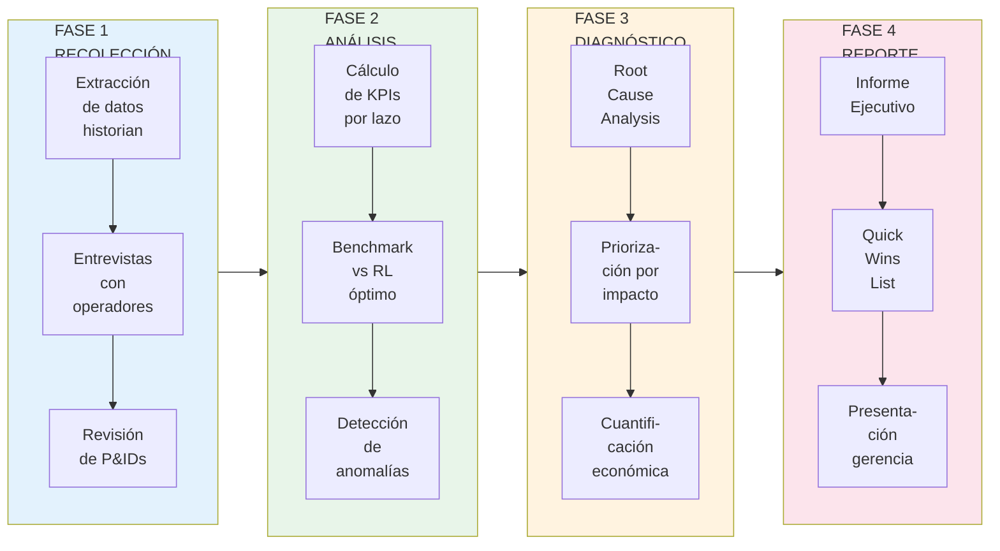
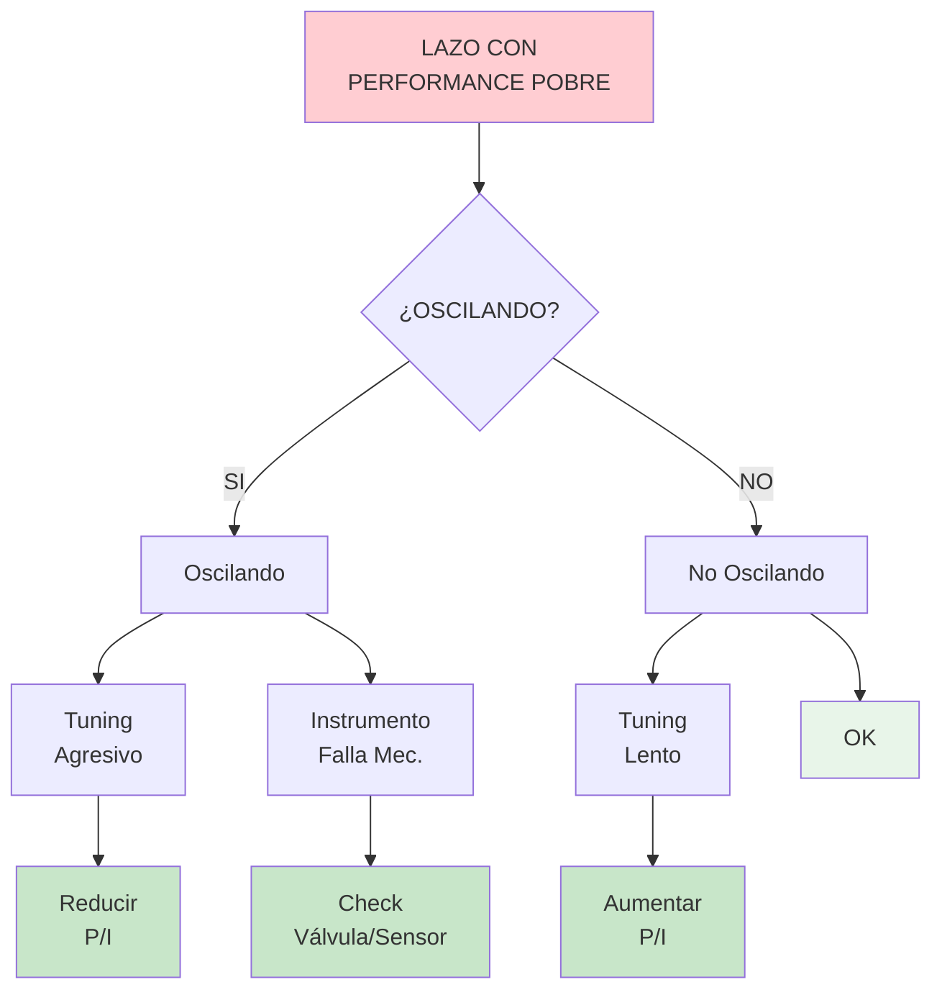
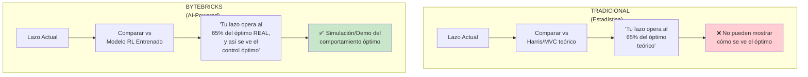
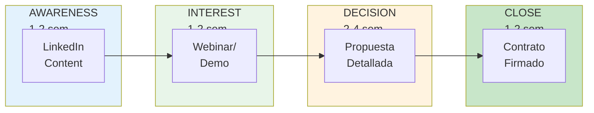
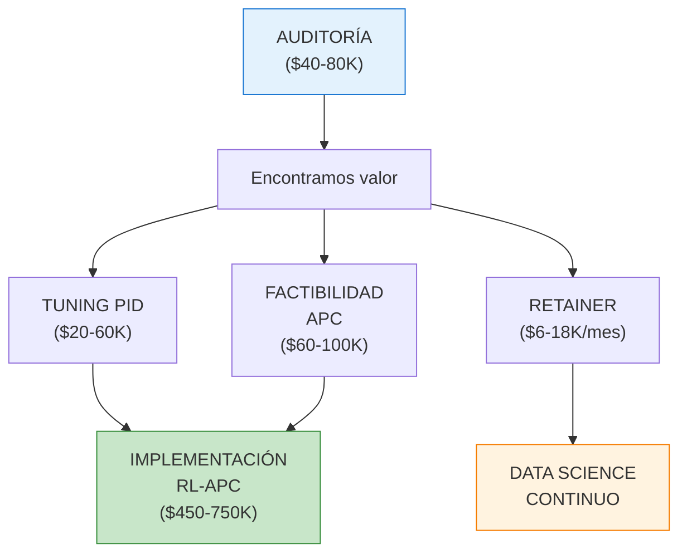

# Auditoria de Performance de Control - Estudio Profundo

**Documento:** SRV-AUD-001  
**Version:** 1.0  
**Fecha:** 20 de Enero de 2026  
**Clasificacion:** Interno - ByteBricks AI

---

## Tabla de Contenidos

1. [Validacion de Mercado](#1-validacion-de-mercado)
2. [Casos de Estudio de la Industria](#2-casos-de-estudio-de-la-industria)
3. [Metodologia Tecnica Detallada](#3-metodologia-tecnica-detallada)
4. [KPIs y Metricas](#4-kpis-y-metricas)
5. [Diferenciador ByteBricks: Benchmark RL](#5-diferenciador-bytebricks-benchmark-rl)
6. [Estructura del Servicio](#6-estructura-del-servicio)
7. [Template de Propuesta](#7-template-de-propuesta)
8. [Pricing y Justificacion de Valor](#8-pricing-y-justificacion-de-valor)
9. [Proceso de Venta](#9-proceso-de-venta)
10. [Entregables Detallados](#10-entregables-detallados)
11. [Herramientas Requeridas](#11-herramientas-requeridas)
12. [Expansion de Cuenta](#12-expansion-de-cuenta)

---

## 1. Validacion de Mercado

### 1.1 El Problema es REAL y CUANTIFICABLE

| Estadistica | Fuente | Implicacion |
|-------------|--------|-------------|
| **20-30% de lazos en manual** | ABB, Valmet | Oportunidad de optimizacion desperdiciada |
| **85% de lazos con settings suboptimos** | Valmet PlantTriage | Casi TODOS los lazos necesitan atencion |
| **20-40% de lazos oscilando** | ABB Research | Desperdicio de energia, variabilidad |
| **Vida media del tuning: 6 meses** | ABB | Necesidad de re-evaluacion periodica |

### 1.2 Citas Textuales de la Industria

> "A typical process plant is losing millions annually from poorly-performing control systems." - **Valmet**

> "The manufacturers lose millions of dollars each year due to poor control performance, many times without realizing it." - **Emerson**

> "With so many issues, it can be hard to monitor, prioritize, and resolve process problems." - **Valmet PlantTriage**

### 1.3 Tamano del Mercado

| Segmento | Plantas en LATAM | Oportunidad por Planta | TAM Regional |
|----------|------------------|------------------------|--------------|
| Refinerias grandes (>100k bpd) | ~30 | $50-80K | $1.5-2.4M |
| Refinerias medianas (50-100k) | ~50 | $25-50K | $1.25-2.5M |
| Petroquimicas grandes | ~100 | $40-70K | $4-7M |
| Quimicas medianas | ~200 | $15-30K | $3-6M |
| **TAM Total Regional** | | | **$10-18M** |

---

## 2. Casos de Estudio de la Industria

### 2.1 Caso Tupras (Turquia) - MathWorks

**Contexto:**
- 4 refinerias
- ~6,000 lazos de control monitoreados
- Desarrollaron sistema propio con MATLAB

**Resultados:**
| Metrica | Valor |
|---------|-------|
| **Ahorro anual** | **Hasta $20 millones USD** |
| **Esfuerzo manual eliminado** | 250 dias-ingeniero/ano |
| **Tiempo de desarrollo** | Interno con MATLAB |

**Quote:**
> "MATLAB saved us a significant amount of time and expense by enabling us to develop our own software in-house. It also enabled us to save millions of dollars in costs that would have resulted from poor controller performance." - Mehmet Yagci, Tupras

**Implicacion para ByteBricks:** 
- Valida el valor del servicio (millones/ano)
- Nosotros ofrecemos el resultado SIN que el cliente desarrolle internamente

---

### 2.2 Caso SARAS/Sarlux (Italia) - Honeywell

**Contexto:**
- Refineria Sarlux
- Partnership de 25+ anos con Honeywell
- Implementacion de APC

**Resultados:**
| Metrica | Valor |
|---------|-------|
| **Ahorro de vapor** | 10% reduccion |
| **Reduccion CO2** | 6,200 toneladas/ano |
| **ROI** | **Menos de 6 meses** |

**Quote:**
> "We believe in advanced process control." - Sonia Sulis, Advanced Control Supervisor

**Implicacion para ByteBricks:**
- ROI rapido (6 meses) facilita decision de compra
- Beneficios ambientales son selling point adicional

---

### 2.3 Caso ENI Livorno (Italia) - Universidad de Pisa

**Contexto:**
- Refineria de Livorno
- 1,200+ lazos de control monitoreados
- Sistema academico de evaluacion

**Hallazgos:**
- Gran discrepancia entre verdicts del sistema y percepcion de operadores
- Necesidad de calibracion de parametros de evaluacion
- Importancia de validacion con operadores expertos

**Implicacion para ByteBricks:**
- Incluir validacion con operadores en metodologia
- No confiar solo en metricas automaticas

---

### 2.4 Caso Solomon Associates - Refineria SE Asia

**Contexto:**
- Refineria de gran escala
- Programa de Performance Excellence

**Resultados:**
| Metrica | Valor |
|---------|-------|
| **Ahorro potencial identificado** | **$60 millones USD/ano** |
| **Areas de mejora** | Energia, rendimiento, confiabilidad |

**Implicacion para ByteBricks:**
- El valor esta ahi - solo hay que encontrarlo y cuantificarlo
- Auditorias de control son parte de programas mas amplios

---

## 3. Metodologia Tecnica Detallada

### 3.1 Flujo de Trabajo General



### 3.2 Fase 1: Recoleccion de Datos (Semana 1-2)

#### 3.2.1 Datos Requeridos del Historian

| Dato | Periodo | Frecuencia | Formato |
|------|---------|------------|---------|
| PV (Process Variable) | 3-6 meses | 1 segundo (minimo 1 min) | CSV/OPC |
| SP (Setpoint) | 3-6 meses | 1 segundo | CSV/OPC |
| OP (Output) | 3-6 meses | 1 segundo | CSV/OPC |
| Mode (Auto/Manual/Cascade) | 3-6 meses | Por evento | CSV/OPC |
| Alarmas | 3-6 meses | Por evento | CSV |

#### 3.2.2 Documentacion Requerida

| Documento | Uso |
|-----------|-----|
| P&ID de la unidad | Entender estructura de lazos |
| Lista de tags con descripcion | Mapeo de variables |
| Limites operativos | Definir constraints |
| Especificaciones de producto | Entender targets |
| Narrativas de control | Entender logica |

#### 3.2.3 Entrevistas

| Rol | Duracion | Objetivo |
|-----|----------|----------|
| Supervisor de turno | 1-2 horas | Problemas cotidianos, lazos problematicos |
| Operadores (2-3) | 30 min c/u | Interacciones manuales, frustraciones |
| Ingeniero de control | 1-2 horas | Historial de cambios, intentos previos |
| Ingeniero de proceso | 1 hora | Restricciones de proceso, prioridades |

### 3.3 Fase 2: Analisis de KPIs (Semana 3-4)

#### 3.3.1 KPIs Calculados por Lazo

```python
# Pseudocodigo de calculo de KPIs

def calcular_kpis_lazo(pv, sp, op, modo):
    kpis = {}
    
    # 1. Error de tracking
    error = pv - sp
    kpis['MAE'] = mean(abs(error))
    kpis['RMSE'] = sqrt(mean(error**2))
    kpis['IAE'] = integral(abs(error))
    
    # 2. Variabilidad
    kpis['StdDev_PV'] = std(pv)
    kpis['StdDev_OP'] = std(op)
    
    # 3. Indice de oscilacion (metodo Hagglund)
    cruces_cero = contar_cruces_cero(error)
    kpis['Oscillation_Index'] = calcular_indice_oscilacion(cruces_cero, periodo)
    
    # 4. Factor de servicio
    tiempo_auto = sum(modo == 'AUTO')
    tiempo_total = len(modo)
    kpis['Service_Factor'] = tiempo_auto / tiempo_total
    
    # 5. Tiempo en manual
    kpis['Manual_Time_%'] = sum(modo == 'MANUAL') / tiempo_total * 100
    
    # 6. Saturacion del output
    kpis['Saturation_%'] = (sum(op >= 95) + sum(op <= 5)) / len(op) * 100
    
    # 7. Harris Index (benchmark MVC)
    kpis['Harris_Index'] = calcular_harris_index(pv, sp)
    
    return kpis
```

#### 3.3.2 Clasificacion de Lazos

| Categoria | Criterio | Color | Accion |
|-----------|----------|-------|--------|
| **Excelente** | Harris > 0.9, Sin oscilacion, Service Factor > 95% | Verde | Monitorear |
| **Bueno** | Harris 0.7-0.9, Oscilacion leve, SF > 85% | Amarillo | Optimizar si hay ROI |
| **Pobre** | Harris 0.5-0.7, Oscilacion moderada, SF 70-85% | Naranja | Priorizar tuning |
| **Critico** | Harris < 0.5, Oscilacion severa, SF < 70% | Rojo | Accion inmediata |

### 3.4 Fase 3: Diagnostico y Root Cause (Semana 5)

#### 3.4.1 Arbol de Diagnostico



#### 3.4.2 Causas Raiz Tipicas

| Sintoma | Causa Probable | Diagnostico | Solucion |
|---------|----------------|-------------|----------|
| Oscilacion regular | Tuning agresivo | Periodo = 4x tiempo muerto | Reducir ganancia |
| Oscilacion irregular | Stiction de valvula | Patron de "palo de hockey" | Mantenimiento mecanico |
| Deriva lenta | Tuning conservador | Tiempo de respuesta largo | Aumentar ganancia/reducir Ti |
| Respuesta lenta | Tiempo integral muy largo | PV no alcanza SP | Reducir Ti |
| Overshoot excesivo | Muy poca accion derivativa | Picos al cambiar SP | Agregar/aumentar Td |
| Saturacion | Capacidad insuficiente | OP en limite constantemente | Revisar sizing |
| Interaccion | Multiples lazos acoplados | Oscilaciones correlacionadas | Desacoplar o MPC |

### 3.5 Fase 4: Cuantificacion Economica y Reporte (Semana 6)

#### 3.5.1 Modelo de Cuantificacion de Valor

```
VALOR PERDIDO POR LAZO = f(Variabilidad, Criticidad, Precio)

Para lazos de temperatura:
  Valor = (Variabilidad_actual - Variabilidad_optima) * Impacto_por_grado * Produccion
  
Para lazos de flujo:
  Valor = (Variabilidad_actual - Variabilidad_optima) * Impacto_por_% * Produccion

Para lazos de nivel:
  Valor = Tiempo_en_manual * Costo_hora_operador * Factor_riesgo
```

#### 3.5.2 Ejemplo de Calculo

| Lazo | Variabilidad Actual | Variabilidad Optima | Gap | Impacto Unitario | Valor Anual |
|------|---------------------|---------------------|-----|------------------|-------------|
| TIC-101 T Reactor | 8°C | 3°C | 5°C | $50K/°C | $250,000 |
| FIC-201 Flujo feed | 5% | 2% | 3% | $30K/% | $90,000 |
| LIC-301 Nivel drum | 15% | 5% | 10% | $10K/% | $100,000 |
| **TOTAL 3 LAZOS** | | | | | **$440,000** |

---

## 4. KPIs y Metricas

### 4.1 KPIs Primarios (Obligatorios)

| KPI | Formula | Benchmark Bueno | Benchmark Excelente |
|-----|---------|-----------------|---------------------|
| **Harris Index** | Varianza MVC / Varianza actual | > 0.7 | > 0.9 |
| **Oscillation Index** | Cruces cero normalizados | < 0.3 | < 0.1 |
| **Service Factor** | Tiempo en AUTO / Total | > 85% | > 95% |
| **IAE Normalizado** | IAE / (Rango PV * Tiempo) | < 0.1 | < 0.05 |

### 4.2 KPIs Secundarios (Diagnostico)

| KPI | Uso | Calculo |
|-----|-----|---------|
| **Stiction Index** | Detectar problemas de valvula | Algoritmo de Choudhury |
| **Settling Time** | Evaluar respuesta a cambios | Tiempo hasta 2% del SP |
| **Overshoot %** | Evaluar agresividad | (PV_max - SP) / SP * 100 |
| **Rise Time** | Evaluar velocidad | Tiempo 10% a 90% |
| **Output Travel** | Desgaste de valvula | Distancia total recorrida |

### 4.3 KPIs Agregados (Nivel Planta)

| KPI | Formula | Uso |
|-----|---------|-----|
| **% Lazos Excelentes** | Excelentes / Total * 100 | Benchmark de planta |
| **% Lazos en Manual** | Manual / Total * 100 | Indicador de problemas |
| **Indice de Salud Global** | Promedio ponderado de Harris | KPI ejecutivo |
| **Valor en Riesgo** | Suma de gaps economicos | Justificacion de inversion |

---

## 5. Diferenciador ByteBricks: Benchmark RL

### 5.1 Concepto del Diferenciador



### 5.2 Como Funciona

1. **Entrenamos modelo RL** en simulacion del proceso del cliente
2. **El modelo aprende** la estrategia de control optima
3. **Comparamos** el comportamiento real vs el modelo RL
4. **Mostramos** visualmente como se veria el control optimo

### 5.3 Valor del Diferenciador

| Aspecto | Competencia | ByteBricks |
|---------|-------------|------------|
| Benchmark | Harris Index (teorico) | Modelo RL (practico) |
| Visualizacion | Numeros y graficos | Simulacion interactiva |
| Credibilidad | "La teoria dice..." | "Asi se veria tu proceso..." |
| Upsell | Recomendar tuning | Demostrar potencial de RL-APC |

### 5.4 Script de Venta del Diferenciador

> "Otros consultores te dicen que tu lazo opera al 65% del optimo basado en formulas teoricas. Nosotros te MOSTRAMOS como se veria tu proceso operando al 95% del optimo, usando un modelo de IA entrenado especificamente para TU proceso. No es teoria - es una simulacion de lo que es posible."

---

## 6. Estructura del Servicio

### 6.1 Opciones de Alcance

| Opcion | Lazos | Duracion | Precio | Ideal Para |
|--------|-------|----------|--------|------------|
| **Piloto** | 20-50 | 3 semanas | $15,000-25,000 | Primera vez, validar valor |
| **Unidad Chica** | 50-100 | 4 semanas | $25,000-40,000 | Unidades auxiliares |
| **Unidad Grande** | 100-300 | 6 semanas | $50,000-80,000 | FCC, CDU, HDS |
| **Multi-Unidad** | 300-500 | 8 semanas | $100,000-150,000 | Varias unidades |

### 6.2 Cronograma Detallado (Unidad Grande)

| Semana | Actividad | Entregable | Horas |
|--------|-----------|------------|-------|
| 1 | Kickoff, extraccion de datos | Plan de trabajo, datos crudos | 24 |
| 2 | Entrevistas, revision P&ID | Notas, lista de lazos | 24 |
| 3 | Procesamiento, calculo KPIs | Dataset procesado | 32 |
| 4 | Benchmark RL, deteccion anomalias | Modelo entrenado, resultados | 40 |
| 5 | Root cause, cuantificacion | Diagnostico por lazo | 32 |
| 6 | Reporte, presentacion | Informe final, slides | 24 |
| **TOTAL** | | | **176 horas** |

### 6.3 Equipo Requerido

| Rol | Dedicacion | Responsabilidad |
|-----|------------|-----------------|
| Ingeniero de Control Sr. | 60% | Analisis, diagnostico, presentacion |
| Ingeniero de Control Jr. | 80% | Procesamiento de datos, KPIs |
| Data Scientist | 30% | Modelo RL, benchmark |
| Project Manager | 20% | Coordinacion, cliente |

---

## 7. Template de Propuesta

### 7.1 Estructura de Propuesta

```markdown
# PROPUESTA DE SERVICIOS
## Auditoria de Performance de Control
## [NOMBRE CLIENTE] - [UNIDAD]

---

### 1. Resumen Ejecutivo
[2 parrafos: problema + solucion + valor]

### 2. Contexto del Proyecto
- Descripcion de la unidad
- Numero de lazos estimados
- Objetivos del cliente

### 3. Alcance del Servicio
- Actividades incluidas
- Exclusiones explicitas
- Supuestos

### 4. Metodologia ByteBricks
- Las 4 fases
- Diferenciador: Benchmark RL
- KPIs a calcular

### 5. Entregables
- Lista detallada de entregables
- Formatos (PDF, Excel, etc.)

### 6. Cronograma
- Timeline semana por semana
- Hitos clave
- Reuniones de avance

### 7. Equipo Propuesto
- CVs resumidos
- Roles y responsabilidades

### 8. Inversion
- Precio total
- Condiciones de pago
- Validez de la propuesta

### 9. Proximos Pasos
- Firma de propuesta
- Kickoff meeting
- Acceso a datos

### Anexos
- A: CVs detallados
- B: Casos de referencia
- C: Terminos y condiciones
```

### 7.2 Texto Sugerido - Resumen Ejecutivo

> Las plantas de proceso tipicamente pierden entre $2-10 millones anuales debido a sistemas de control que operan de forma suboptima. Estudios de la industria indican que hasta el 85% de los lazos de control tienen configuraciones inadecuadas, 20-30% operan en modo manual, y 20-40% presentan oscilaciones que incrementan la variabilidad del proceso y el consumo de energia.
>
> ByteBricks AI propone realizar una Auditoria de Performance de Control para [UNIDAD] en [PLANTA], evaluando sistematicamente [XXX] lazos de control para identificar oportunidades de mejora, cuantificar el impacto economico, y priorizar acciones correctivas. A diferencia de auditorias tradicionales, nuestra metodologia utiliza modelos de Inteligencia Artificial (Reinforcement Learning) para establecer un benchmark de "control optimo" especifico para su proceso, permitiendo visualizar no solo los gaps actuales sino tambien el potencial de mejora real.
>
> El proyecto tendra una duracion de [X] semanas y una inversion de USD $[XX,XXX], con un retorno esperado superior a 10x basado en benchmarks de la industria.

---

## 8. Pricing y Justificacion de Valor

### 8.1 Estructura de Costos Internos

| Recurso | Horas | Costo/Hora | Total |
|---------|-------|------------|-------|
| Ing. Control Sr. | 106 | $80 | $8,480 |
| Ing. Control Jr. | 141 | $40 | $5,640 |
| Data Scientist | 53 | $70 | $3,710 |
| Project Manager | 35 | $60 | $2,100 |
| **Costo Directo** | **335** | | **$19,930** |
| Overhead (20%) | | | $3,986 |
| **Costo Total** | | | **$23,916** |

### 8.2 Pricing al Cliente

| Costo Total | Margen Target | Precio Sugerido |
|-------------|---------------|-----------------|
| $23,916 | 60% | **$60,000** |
| $23,916 | 50% | **$48,000** |
| $23,916 | 40% | **$40,000** |

**Recomendacion:** Precio base $50,000 para unidad grande (200 lazos), con margen de negociacion hasta $40,000.

### 8.3 Justificacion de Valor para el Cliente

```
INVERSION CLIENTE:           $50,000
VALOR IDENTIFICADO TIPICO:   $500,000 - $2,000,000/ano
ROI DE LA AUDITORIA:         10x - 40x

Aunque el cliente NO implemente NADA, la auditoria le da:
- Visibilidad de problemas que no sabia que tenia
- Cuantificacion para justificar presupuesto de mejoras
- Priorizacion para enfocar recursos limitados
- Baseline para medir mejoras futuras
```

### 8.4 Comparacion con Competencia

| Proveedor | Precio Tipico | Que Incluye | Debilidad |
|-----------|---------------|-------------|-----------|
| Emerson | $80,000-150,000 | Software + Consulting | Requiere DeltaV |
| Honeywell | $100,000-200,000 | Full service | Ciclo de venta largo |
| PiControl | $60,000-100,000 | Consulting | Sin benchmark AI |
| Control Station | $40,000-80,000 | Software-first | Menos consulting |
| **ByteBricks** | **$40,000-80,000** | **Consulting + AI Benchmark** | **Unico con RL** |

---

## 9. Proceso de Venta

### 9.1 Funnel de Ventas



**TOTAL CICLO: 6-10 semanas**

### 9.2 Objeciones Comunes y Respuestas

| Objecion | Respuesta |
|----------|-----------|
| "Ya tenemos PlantTriage/APROMON" | "Excelente - nosotros analizamos los datos con metodologia diferente y agregamos benchmark RL. Complementamos, no reemplazamos." |
| "Nuestros ingenieros pueden hacerlo" | "Seguro, pero estan ocupados en operacion diaria. Nosotros traemos metodologia sistematica y benchmark externo que da credibilidad interna." |
| "Es muy caro" | "Entiendo. Para referencia, Tupras ahorra $20M/ano con este tipo de analisis. Si identificamos solo el 1% de ese valor, el ROI es 4x." |
| "No tenemos presupuesto" | "Podemos empezar con un piloto de 20 lazos por $15K. Si no encontramos valor, no hay compromiso de continuar." |
| "Que pasa si no encontramos nada?" | "En 20+ anos de industria, NUNCA una auditoria dejo de encontrar valor. Si somos los primeros, no cobramos." |

### 9.3 Calificacion de Leads (BANT)

| Criterio | Preguntas de Calificacion | Score |
|----------|---------------------------|-------|
| **Budget** | "Tienen presupuesto asignado para mejoras de control?" | 0-25 |
| **Authority** | "Quien aprueba proyectos de esta escala?" | 0-25 |
| **Need** | "Cuales son sus principales dolor de cabeza de control?" | 0-25 |
| **Timeline** | "Para cuando necesitarian los resultados?" | 0-25 |

**Score > 70:** Propuesta formal
**Score 50-70:** Nurturing, mas informacion
**Score < 50:** Descalificar o postponer

---

## 10. Entregables Detallados

### 10.1 Reporte de Performance (PDF, 30-50 paginas)

**Estructura:**
1. Resumen Ejecutivo (2 pag)
2. Metodologia (3 pag)
3. Inventario de Lazos (2 pag)
4. Resultados Agregados (5 pag)
5. Analisis por Categoria (10 pag)
6. Top 20 Lazos Criticos (10 pag)
7. Cuantificacion Economica (3 pag)
8. Recomendaciones Priorizadas (5 pag)
9. Proximos Pasos (2 pag)
10. Anexos

### 10.2 Base de Datos de Lazos (Excel)

| Columna | Descripcion |
|---------|-------------|
| Tag | Identificador del lazo |
| Descripcion | Descripcion funcional |
| Tipo | Flow/Level/Temp/Pressure |
| Unidad | Ubicacion en planta |
| Harris_Index | 0-1 |
| Oscillation_Index | 0-1 |
| Service_Factor | 0-100% |
| Manual_Time | % tiempo en manual |
| Categoria | Excelente/Bueno/Pobre/Critico |
| Root_Cause | Causa probable |
| Valor_en_Riesgo | USD/ano |
| Prioridad | 1-5 |
| Recomendacion | Accion sugerida |

### 10.3 Presentacion Ejecutiva (PowerPoint, 15-20 slides)

1. Portada
2. Agenda
3. Resumen de hallazgos (1 slide)
4. Metodologia (2 slides)
5. Estado actual de la planta (3 slides)
6. Principales problemas (3 slides)
7. Impacto economico (2 slides)
8. Recomendaciones (3 slides)
9. Roadmap de mejoras (1 slide)
10. Proximos pasos (1 slide)
11. Q&A

### 10.4 Quick Wins List (1-pager)

| # | Tag | Problema | Solucion | Valor | Esfuerzo | ROI |
|---|-----|----------|----------|-------|----------|-----|
| 1 | TIC-101 | Oscilacion | Reducir P 30% | $250K | 2 hrs | Alto |
| 2 | FIC-201 | Lento | Aumentar I | $90K | 1 hr | Alto |
| ... | ... | ... | ... | ... | ... | ... |

---

## 11. Herramientas Requeridas

### 11.1 Software de Analisis

| Herramienta | Uso | Costo |
|-------------|-----|-------|
| Python + pandas/numpy | Procesamiento de datos | Gratis |
| SimPlant (interno) | Benchmark RL | Interno |
| Matplotlib/Plotly | Visualizaciones | Gratis |
| Excel/Google Sheets | Entregables | ~$0 |
| PowerPoint/Google Slides | Presentacion | ~$0 |

### 11.2 Conexion con Historian

| Opcion | Cuando Usar |
|--------|-------------|
| Export CSV manual | Cliente prefiere no dar acceso directo |
| OPC UA read-only | Acceso directo disponible |
| API del historian (PI, IP.21) | Sistemas modernos |

### 11.3 Scripts a Desarrollar

| Script | Funcion | Status |
|--------|---------|--------|
| `extract_historian.py` | Conectar y extraer datos | Por desarrollar |
| `calculate_kpis.py` | Calcular todos los KPIs | Por desarrollar |
| `detect_oscillations.py` | Detectar lazos oscilando | Por desarrollar |
| `benchmark_rl.py` | Comparar vs modelo RL | Existe (adaptar) |
| `generate_report.py` | Generar reporte automatico | Por desarrollar |
| `quantify_value.py` | Calcular valor economico | Por desarrollar |

---

## 12. Expansion de Cuenta

### 12.1 Path Natural de Upsell



### 12.2 Timing de Upsell

| Momento | Oportunidad de Upsell |
|---------|----------------------|
| Entrega de auditoria | Proponer tuning de Quick Wins |
| 1 mes post-auditoria | Follow-up, proponer retainer |
| 3 meses post-tuning | Proponer factibilidad APC |
| Post-factibilidad | Proponer implementacion RL-APC |

### 12.3 Metricas de Cuenta

| KPI | Target | Como Medir |
|-----|--------|------------|
| Conversion Auditoria -> Tuning | > 60% | Proyectos cerrados / Auditorias entregadas |
| Valor de Cuenta Ano 1 | > $100K | Revenue total por cliente |
| Retencion de Retainers | > 80% | Renovaciones / Total |
| NPS | > 50 | Encuesta post-proyecto |

---

## Anexo A: Checklist de Kickoff

- [ ] Contrato firmado
- [ ] Orden de compra recibida
- [ ] Adelanto recibido (50%)
- [ ] Contactos tecnicos identificados
- [ ] Acceso a historian coordinado
- [ ] P&IDs recibidos
- [ ] Lista de tags recibida
- [ ] Fecha de kickoff confirmada
- [ ] Equipo ByteBricks asignado
- [ ] Carpeta de proyecto creada

---

## Anexo B: Checklist de Entrega

- [ ] Reporte PDF finalizado
- [ ] Base de datos Excel completa
- [ ] Presentacion lista
- [ ] Quick Wins list preparada
- [ ] Revision interna completada
- [ ] Fecha de presentacion confirmada
- [ ] Factura final preparada
- [ ] Encuesta de satisfaccion lista
- [ ] Propuesta de follow-up preparada

---

*Documento generado: 20 de Enero de 2026*
*Ultima actualizacion: [Fecha]*
