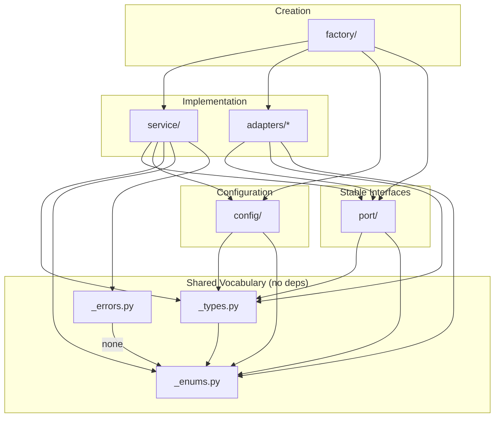

# Plan: Gateway — Estructura de directorios y scaffold completo

## Metadata
- **Type:** Architecture
- **Complexity:** Medium — muchos archivos pero contenido mayormente declarativo; la complejidad real está en que las interfaces, tipos y configuraciones deben ser correctos y consistentes entre sí
- **Estimation:** 3-4 días (9 sub-fases)
- **Files:** 49 files (46 new, 3 modified, 0 deleted)
- **Risk:** Low — no existe código previo, proyecto es greenfield con especificación técnica completa
- **Target Path:** `D:\Mis_Docs\Enprendimiento\Proyectos\SimPlant\SimPlant-v2\SimPlant-Gateway`

## 1. Context

**Problem:** El proyecto SimPlant-Gateway existe como un scaffold mínimo generado por `uv init` — solo tiene `pyproject.toml` (con errores de configuración), un `__init__.py` placeholder, y `py.typed`. La especificación técnica completa (`Tecnico.md`) define todas las clases, interfaces, enums, value objects, diagramas de secuencia, y la arquitectura de directorios. Se necesita materializar esa especificación en código real.

**Current State:**
- Proyecto en `D:\Mis_Docs\Enprendimiento\Proyectos\SimPlant\SimPlant-v2\SimPlant-Gateway`
- Git inicializado, `.venv` creado con `uv`, `uv.lock` generado
- `pyproject.toml` tiene errores: `packages = ["src/gateway"]` (debería ser `["src/simplant_gateway"]`), `mypy.packages = ["gateway"]` (debería ser `["simplant_gateway"]`)
- Todas las dependencias de protocolo (`asyncua`, `pymodbus`, `aiomqtt`) están como core dependencies — deberían ser opcionales
- `__init__.py` contiene solo una función `hello()` placeholder
- No existe `tests/`, ni `docs/`, ni ninguna estructura de módulos
- No existe `docs/plans/` local (se usa el de `SimPlant/docs/plans/` global)

**Desired State:**
- Estructura de directorios completa según la especificación técnica
- Todos los archivos `.py` creados con su contenido correcto
- `pyproject.toml` corregido con optional dependencies por protocolo
- Tests unitarios e integración con estructura completa
- Grafo de dependencias acíclico verificable
- Paquete instalable con `pip install simplant-gateway` (core) o `pip install simplant-gateway[opcua]` (con OPC UA)

**Success Criteria:**
- [ ] Todos los 49 archivos del scaffold existen con contenido correcto
- [ ] `pyproject.toml` corregido: `packages = ["src/simplant_gateway"]`, mypy apunta a `simplant_gateway`
- [ ] Dependencies opcionales: `pip install simplant-gateway[opcua,modbus,mqtt]` funciona
- [ ] `pip install -e .` instala el paquete correctamente
- [ ] `python -c "from simplant_gateway import Gate, GatewayFactory"` funciona
- [ ] `pytest` corre sin errores (tests pueden ser stubs inicialmente)
- [ ] `ruff check src/` pasa sin errores
- [ ] `mypy src/` pasa sin errores
- [ ] No hay imports circulares (verificable con script o análisis manual)
- [ ] Cada `__init__.py` exporta exactamente lo especificado en la arquitectura

## 2. Affected Files

### Archivos existentes a modificar

| File                               | Action     | Reason                                                                                       |
| ---------------------------------- | ---------- | -------------------------------------------------------------------------------------------- |
| `pyproject.toml`                   | **Modify** | Corregir `packages`, agregar optional deps por protocolo, agregar configuración de ruff/mypy |
| `src/simplant_gateway/__init__.py` | **Modify** | Reemplazar placeholder con public API re-exports                                             |
| `.gitignore`                       | **Modify** | Agregar patrones adicionales (.mypy_cache, .pytest_cache, .ruff_cache, coverage)             |

### Archivos nuevos — Root

| File | Action | Reason |
|------|--------|--------|
| `README.md` | **Create** (rewrite — actualmente vacío) | Documentación del paquete: instalación, uso básico, arquitectura |

### Archivos nuevos — Source: Core

| File | Action | Reason |
|------|--------|--------|
| `src/simplant_gateway/_types.py` | **Create** | Value objects compartidos: `TagMapping`, `ReadResult`, `WriteResult`, `WriteRequest`, `WriteCommand`, `TagReadResult`, `WriteTagResult`, `HealthStatus` |
| `src/simplant_gateway/_enums.py` | **Create** | Enums compartidos: `ProtocolType`, `QualityCode`, `DataType`, `SecurityPolicy`, `ByteOrder` |
| `src/simplant_gateway/_errors.py` | **Create** | Excepciones de dominio: `GatewayError`, `ConnectionError`, `TagNotFoundError`, `ProtocolError`, `ConfigurationError` |

### Archivos nuevos — Source: port/

| File | Action | Reason |
|------|--------|--------|
| `src/simplant_gateway/port/__init__.py` | **Create** | Exports: `Gate`, `ProtocolPort` |
| `src/simplant_gateway/port/_gate.py` | **Create** | `Gate` Protocol — contrato público del Gateway |
| `src/simplant_gateway/port/_protocol_port.py` | **Create** | `ProtocolPort` Protocol — contrato interno para adapters |

### Archivos nuevos — Source: service/

| File | Action | Reason |
|------|--------|--------|
| `src/simplant_gateway/service/__init__.py` | **Create** | Exports: `GatewayService` |
| `src/simplant_gateway/service/_gateway_service.py` | **Create** | Facade que orquesta connection + buffer + protocol |
| `src/simplant_gateway/service/_connection.py` | **Create** | `ConnectionManager` — estado de conexión, backoff, reconexión |
| `src/simplant_gateway/service/_buffer.py` | **Create** | `BufferManager` — cache de lecturas, calidad, staleness |

### Archivos nuevos — Source: config/

| File | Action | Reason |
|------|--------|--------|
| `src/simplant_gateway/config/__init__.py` | **Create** | Exports: `GatewayConfig`, `ConnectionConfig`, `BufferConfig`, `ProtocolConfig`, `Credentials` |
| `src/simplant_gateway/config/_models.py` | **Create** | Pydantic BaseModels para configuración compartida |

### Archivos nuevos — Source: adapters/

| File | Action | Reason |
|------|--------|--------|
| `src/simplant_gateway/adapters/__init__.py` | **Create** | Package marker (NO exporta adapters concretos) |
| `src/simplant_gateway/adapters/opcua/__init__.py` | **Create** | Exports: `OPCAdapter`, `OPCConfig` |
| `src/simplant_gateway/adapters/opcua/_adapter.py` | **Create** | `OPCAdapter` implementa `ProtocolPort` via `asyncua` |
| `src/simplant_gateway/adapters/opcua/_config.py` | **Create** | `OPCConfig(ProtocolConfig)` — config específica de OPC UA |
| `src/simplant_gateway/adapters/modbus/__init__.py` | **Create** | Exports: `ModbusAdapter`, `ModbusConfig` |
| `src/simplant_gateway/adapters/modbus/_adapter.py` | **Create** | `ModbusAdapter` implementa `ProtocolPort` via `pymodbus` |
| `src/simplant_gateway/adapters/modbus/_config.py` | **Create** | `ModbusConfig(ProtocolConfig)` — config de Modbus |
| `src/simplant_gateway/adapters/mqtt/__init__.py` | **Create** | Exports: `MQTTAdapter`, `MQTTConfig` |
| `src/simplant_gateway/adapters/mqtt/_adapter.py` | **Create** | `MQTTAdapter` implementa `ProtocolPort` via `aiomqtt` |
| `src/simplant_gateway/adapters/mqtt/_config.py` | **Create** | `MQTTConfig(ProtocolConfig)` — config de MQTT |
| `src/simplant_gateway/adapters/simulation/__init__.py` | **Create** | Exports: `SimulationAdapter`, `SimulationConfig` |
| `src/simplant_gateway/adapters/simulation/_adapter.py` | **Create** | `SimulationAdapter` — adapter sin hardware para testing |
| `src/simplant_gateway/adapters/simulation/_config.py` | **Create** | `SimulationConfig(ProtocolConfig)` |

### Archivos nuevos — Source: factory/

| File | Action | Reason |
|------|--------|--------|
| `src/simplant_gateway/factory/__init__.py` | **Create** | Exports: `GatewayFactory` |
| `src/simplant_gateway/factory/_factory.py` | **Create** | `GatewayFactory` — Pure Fabrication, crea el objeto compuesto |

### Archivos nuevos — Tests

| File | Action | Reason |
|------|--------|--------|
| `tests/__init__.py` | **Create** | Package marker |
| `tests/conftest.py` | **Create** | Shared fixtures: configs, mocks, factories |
| `tests/unit/__init__.py` | **Create** | Package marker |
| `tests/unit/test_types.py` | **Create** | Tests de value objects |
| `tests/unit/test_enums.py` | **Create** | Tests de enums |
| `tests/unit/test_config.py` | **Create** | Tests de configuraciones Pydantic |
| `tests/unit/test_connection.py` | **Create** | Tests de ConnectionManager |
| `tests/unit/test_buffer.py` | **Create** | Tests de BufferManager |
| `tests/unit/test_gateway_service.py` | **Create** | Tests del GatewayService (facade) |
| `tests/unit/test_factory.py` | **Create** | Tests del GatewayFactory |
| `tests/unit/adapters/__init__.py` | **Create** | Package marker |
| `tests/unit/adapters/test_simulation.py` | **Create** | Tests del SimulationAdapter |
| `tests/unit/adapters/test_opcua.py` | **Create** | Tests del OPCAdapter (con mocks) |
| `tests/unit/adapters/test_modbus.py` | **Create** | Tests del ModbusAdapter (con mocks) |
| `tests/integration/__init__.py` | **Create** | Package marker |
| `tests/integration/test_opcua_server.py` | **Create** | Integration test stub — OPC UA real server |
| `tests/integration/test_modbus_server.py` | **Create** | Integration test stub — Modbus real server |

## 3. Risks

| Risk | Probability | Impact | Mitigation |
|------|-------------|--------|------------|
| `_config.get_mapping_for_tag()` no definido en `GatewayConfig` | **High** | Medium | DSS 3 lo usa pero el diagrama de clases no lo define. Resolver en Config Phase: agregar método helper a `GatewayConfig` o usar dict comprehension en `GatewayService.write()`. Ver sección "Pending Issue" en Design. |
| Optional dependencies mal configuradas causan ImportError en runtime | Medium | High | Usar `try/except ImportError` en cada adapter `__init__.py` con mensaje claro. Tests deben verificar graceful failure. |
| Import circulares entre módulos | Low | High | Grafo de dependencias acíclico definido explícitamente. Verificar con `python -c "import simplant_gateway"` después de cada sub-fase. |
| `ProtocolConfig` como Union vs herencia — compatibilidad con Pydantic discriminated union | Medium | Medium | Usar `Annotated[Union[OPCConfig, ModbusConfig, ...], Field(discriminator="protocol_type")]` en `GatewayConfig`. Investigar en Config Phase. |
| `pyproject.toml` existente tiene `uv.lock` — modificar dependencies puede romper lock | Low | Low | Regenerar con `uv lock` después de modificar `pyproject.toml`. |

## 4. Design

### 4.1 Conceptual Model

El Gateway es una **librería de comunicación industrial** que abstrae protocolos de control. Su responsabilidad es leer y escribir tags (variables de proceso) desde sistemas de control, sin saber qué representan esos tags en el dominio del negocio.

**Actores:**
- **Consumer** (SimPlant-Runtime u otra app): usa la interfaz `Gate` para conectar, leer, escribir, y verificar salud
- **Industrial Protocol** (OPC UA server, Modbus PLC, MQTT broker): sistema externo que contiene las variables de proceso

**Modelo conceptual:**

```
Consumer  ──→  Gate (contrato público)
                │
                ├── GatewayService (orquesta todo)
                │     ├── ConnectionManager (estado + reconexión)
                │     └── BufferManager (cache + staleness)
                │
                ├── ProtocolPort (contrato interno)
                │     ├── OPCAdapter
                │     ├── ModbusAdapter
                │     ├── MQTTAdapter
                │     └── SimulationAdapter
                │
                └── GatewayFactory (crea el ensemble)
```

### 4.2 Diagrama de Clases

El diagrama de clases completo está definido en `Modulos/Gateway/Tecnico.md` (sección "Diagrama de Clases"). No se reproduce aquí para evitar duplicación — es la fuente de verdad canónica.

**Resumen de clases por módulo:**

| Módulo | Clases | Responsabilidad GRASP |
|--------|--------|----------------------|
| `port/` | `Gate`, `ProtocolPort` | Protected Variations |
| `service/` | `GatewayService`, `ConnectionManager`, `BufferManager` | Facade, Information Expert |
| `config/` | `GatewayConfig`, `ConnectionConfig`, `BufferConfig`, `ProtocolConfig`, `Credentials` | Pure Fabrication (config container) |
| `adapters/*` | `OPCAdapter`, `ModbusAdapter`, `MQTTAdapter`, `SimulationAdapter` + sus configs | Polymorphism, Adapter (GoF) |
| `factory/` | `GatewayFactory` | Creator, Pure Fabrication |
| `_types.py` | `TagMapping`, `ReadResult`, `WriteResult`, `WriteRequest`, `WriteCommand`, `TagReadResult`, `WriteTagResult`, `HealthStatus` | Value Objects (DDD) |
| `_enums.py` | `ProtocolType`, `QualityCode`, `DataType`, `SecurityPolicy`, `ByteOrder` | Shared vocabulary |
| `_errors.py` | `GatewayError`, `ConnectionError`, `TagNotFoundError`, `ProtocolError`, `ConfigurationError` | Domain exceptions |

### 4.3 Module Dependency Graph (acíclico — MUST be enforced)



**Reglas de dependencia (STRICT):**

| Módulo | Puede importar de | NO puede importar de |
|--------|-------------------|---------------------|
| `_enums.py` | stdlib only | todo lo demás |
| `_types.py` | `_enums`, pydantic | todo lo demás |
| `_errors.py` | stdlib only (o `_enums` si necesita) | todo lo demás |
| `port/` | `_types`, `_enums` | `service/`, `adapters/`, `factory/`, `config/` |
| `config/` | `_types`, `_enums`, pydantic | `port/`, `service/`, `adapters/`, `factory/` |
| `service/` | `port/`, `config/`, `_types`, `_enums`, `_errors` | `adapters/`, `factory/` |
| `adapters/*` | `port/`, `_types`, `_enums`, su propio `_config.py` | `service/`, `factory/`, otros adapters |
| `factory/` | `service/`, `adapters/`, `config/`, `port/` | nada lo importa excepto `__init__.py` |

### 4.4 Underscore Convention

Todos los archivos de implementación usan prefijo `_` (ej: `_adapter.py`, `_types.py`, `_gate.py`). Esto señala:

> "Importá desde el paquete (`from simplant_gateway.port import Gate`), NO desde el archivo (`from simplant_gateway.port._gate import Gate`)."

El `__init__.py` de cada paquete es el contrato público. Los archivos `_prefixed` son detalles de implementación.

### 4.5 Design Decisions

| Decision | Alternatives | Rationale |
|----------|--------------|-----------|
| **Protocol-specific config next to adapter** (`adapters/opcua/_config.py`) | Config centralizada en `config/` | **Law of Locality**: config de OPC cambia cuando OPC cambia, no cuando Modbus cambia. Agrupar por razón de cambio (Pilar II). |
| **`service/` agrupa GatewayService + ConnectionManager + BufferManager** | Cada uno en su propio módulo root | **Cohesion by Reason of Change**: comparten lifecycle, cambian juntos cuando la lógica de orquestación evoluciona. |
| **Optional dependencies por protocolo** (`[opcua]`, `[modbus]`, `[mqtt]`) | Todas como core deps | **Acoplamiento Mínimo**: usuario que solo usa Modbus no debería instalar asyncua. Reduce supply-chain risk y tamaño de virtualenv. |
| **`Gate` como `Protocol` (structural subtyping)** | ABC (nominal subtyping) | **Protected Variations + duck typing**: Protocols no requieren herencia. El consumer puede testear con cualquier objeto que cumpla la interfaz sin importar de dónde viene. Más Pythonic. |
| **`ProtocolConfig` como base class con discriminated union** | Enum + dict de configs, o config plano | **OCP**: agregar protocolo = agregar subclass + adapter, sin modificar `GatewayConfig`. Pydantic discriminated union valida automáticamente. |
| **`GatewayFactory.create()` retorna `Gate` (no `GatewayService`)** | Retornar tipo concreto | **DIP**: consumer depende de abstracción. No sabe ni necesita saber que internamente es un `GatewayService`. |
| **`src/` layout** | Flat layout (`simplant_gateway/` en root) | **PyPA/pyOpenSci 2024-2026 best practice**: evita que el paquete se importe accidentalmente desde el directorio de desarrollo. Más robusto para `pip install -e .`. |
| **Root `_types.py` / `_enums.py` / `_errors.py`** | Dentro de un sub-paquete `core/` | **Simplicidad**: son archivos únicos sin sub-estructura. Un paquete `core/` con 3 archivos es over-engineering. Si crecen, se refactoriza. |

### 4.6 Pending Issue: `_config.get_mapping_for_tag()`

**Problema:** DSS 3 (`write()`) muestra:
```
GS->>GS: tag_mapping = _config.get_mapping_for_tag(command.tag_name)
```

Pero `GatewayConfig` en el diagrama de clases no tiene ese método. Solo tiene `tag_mappings: list[TagMapping]`.

**Opciones de resolución (a decidir en Config Phase o Service Phase):**

| Option | Approach | Pros | Cons |
|--------|----------|------|------|
| A) Agregar método a `GatewayConfig` | `get_mapping_for_tag(name: str) -> TagMapping \| None` que busca en `tag_mappings` | Encapsula búsqueda, Information Expert (GatewayConfig tiene los datos) | Agrega lógica a un config model |
| B) Helper en `GatewayService` | Método privado `_find_mapping(name: str)` con dict lookup pre-construido | Service mantiene cache O(1), config se mantiene como puro data | Lógica de búsqueda en el service |
| C) Cambiar `tag_mappings` a dict | `tag_mappings: dict[str, TagMapping]` indexado por `internal_name` | Lookup O(1) nativo, sin métodos extra | Cambia el formato de configuración (YAML/JSON) |

**Recomendación:** Opción A — agregar `get_mapping_for_tag()` a `GatewayConfig`. Es Information Expert: GatewayConfig tiene los datos, debería poder buscar en ellos. Pydantic soporta métodos en models. Si performance es un problema, se agrega `@cached_property` con un dict interno.

**Decisión final se tomará durante la implementación de la fase correspondiente.**

### 4.7 Public API Surface

El `__init__.py` raíz exporta **exactamente** esto:

```python
# Interfaces
from simplant_gateway.port import Gate

# Factory
from simplant_gateway.factory import GatewayFactory

# Config (consumidor necesita poder crear configs)
from simplant_gateway.config import (
    GatewayConfig,
    ConnectionConfig,
    BufferConfig,
    ProtocolConfig,
    Credentials,
)

# Adapter configs (consumidor elige protocolo)
from simplant_gateway.adapters.opcua import OPCConfig
from simplant_gateway.adapters.modbus import ModbusConfig
from simplant_gateway.adapters.mqtt import MQTTConfig
from simplant_gateway.adapters.simulation import SimulationConfig

# Value Objects (consumidor trabaja con estos)
from simplant_gateway._types import (
    TagMapping,
    ReadResult,
    WriteResult,
    WriteRequest,
    WriteCommand,
    TagReadResult,
    WriteTagResult,
    HealthStatus,
)

# Enums (consumidor los necesita para config y para interpretar resultados)
from simplant_gateway._enums import (
    ProtocolType,
    QualityCode,
    DataType,
    SecurityPolicy,
    ByteOrder,
)

# Errors (consumidor necesita catchearlas)
from simplant_gateway._errors import (
    GatewayError,
    ConnectionError,
    TagNotFoundError,
    ProtocolError,
    ConfigurationError,
)
```

**NO exporta:** `GatewayService`, `ConnectionManager`, `BufferManager`, `ProtocolPort`, adapters concretos (`OPCAdapter`, `ModbusAdapter`, etc.).

## 5. Implementation

### Sub-phase 1: Scaffold

**Objective:** Crear toda la estructura de directorios, archivos vacíos, y corregir `pyproject.toml`. Al final, `pip install -e .` funciona y `import simplant_gateway` no falla.

#### Step 1.1: Corregir `pyproject.toml`

**File:** `pyproject.toml`

Changes:
- [x] Corregir `[tool.hatch.build.targets.wheel] packages` de `["src/gateway"]` a `["src/simplant_gateway"]`
- [x] Corregir `[tool.mypy] packages` de `["gateway"]` a `["simplant_gateway"]`
- [x] Mover `asyncua`, `pymodbus`, `aiomqtt` de `dependencies` a `[project.optional-dependencies]`
- [x] Agregar optional dependency groups: `opcua = ["asyncua>=1.0.0"]`, `modbus = ["pymodbus>=3.6.0"]`, `mqtt = ["aiomqtt>=2.0.0"]`
- [x] Agregar grupo `all = ["asyncua>=1.0.0", "pymodbus>=3.6.0", "aiomqtt>=2.0.0"]`
- [x] Core `dependencies` queda con: `pydantic>=2.0.0`, `tenacity>=8.0.0`, `structlog>=24.0.0`
- [x] Agregar `[tool.ruff.lint] select = ["E", "F", "I", "UP", "B", "SIM", "TCH"]`
- [x] Agregar `[tool.mypy] strict = true`, `warn_return_any = true`, `warn_unused_configs = true`
- [x] Agregar `[tool.pytest.ini_options] markers` para `integration` marker

**pyproject.toml final esperado:**

```toml
[build-system]
requires = ["hatchling"]
build-backend = "hatchling.build"

[project]
name = "simplant-gateway"
version = "0.1.0"
description = "Protocol-agnostic communication library for industrial control systems"
readme = "README.md"
requires-python = ">=3.11"
license = "MIT"
dependencies = [
    "pydantic>=2.0.0",
    "tenacity>=8.0.0",
    "structlog>=24.0.0",
]

[project.optional-dependencies]
opcua = ["asyncua>=1.0.0"]
modbus = ["pymodbus>=3.6.0"]
mqtt = ["aiomqtt>=2.0.0"]
all = [
    "asyncua>=1.0.0",
    "pymodbus>=3.6.0",
    "aiomqtt>=2.0.0",
]
dev = [
    "pytest>=8.0.0",
    "pytest-asyncio>=0.23.0",
    "pytest-mock>=3.12.0",
    "ruff",
    "mypy",
]

[tool.hatch.build.targets.wheel]
packages = ["src/simplant_gateway"]

[tool.pytest.ini_options]
testpaths = ["tests"]
asyncio_mode = "auto"
markers = [
    "integration: marks tests requiring real protocol servers",
]

[tool.ruff]
src = ["src"]
target-version = "py311"

[tool.ruff.lint]
select = ["E", "F", "I", "UP", "B", "SIM", "TCH"]

[tool.mypy]
packages = ["simplant_gateway"]
strict = true
warn_return_any = true
warn_unused_configs = true
```

**Verification:** `uv lock && uv pip install -e .` completa sin errores.

#### Step 1.2: Ampliar `.gitignore`

**File:** `.gitignore`

Changes:
- [x] Agregar `.mypy_cache/`
- [x] Agregar `.pytest_cache/`
- [x] Agregar `.ruff_cache/`
- [x] Agregar `htmlcov/`
- [x] Agregar `.coverage`
- [x] Agregar `*.egg`

#### Step 1.3: Crear estructura de directorios y archivos vacíos

**Directories to create:**
- [x] `src/simplant_gateway/port/`
- [x] `src/simplant_gateway/service/`
- [x] `src/simplant_gateway/config/`
- [x] `src/simplant_gateway/adapters/`
- [x] `src/simplant_gateway/adapters/opcua/`
- [x] `src/simplant_gateway/adapters/modbus/`
- [x] `src/simplant_gateway/adapters/mqtt/`
- [x] `src/simplant_gateway/adapters/simulation/`
- [x] `src/simplant_gateway/factory/`
- [x] `tests/`
- [x] `tests/unit/`
- [x] `tests/unit/adapters/`
- [x] `tests/integration/`

**Empty `__init__.py` files to create** (contenido real se agrega en Sub-phase 8):
- [x] `src/simplant_gateway/port/__init__.py`
- [x] `src/simplant_gateway/service/__init__.py`
- [x] `src/simplant_gateway/config/__init__.py`
- [x] `src/simplant_gateway/adapters/__init__.py`
- [x] `src/simplant_gateway/adapters/opcua/__init__.py`
- [x] `src/simplant_gateway/adapters/modbus/__init__.py`
- [x] `src/simplant_gateway/adapters/mqtt/__init__.py`
- [x] `src/simplant_gateway/adapters/simulation/__init__.py`
- [x] `src/simplant_gateway/factory/__init__.py`
- [x] `tests/__init__.py`
- [x] `tests/unit/__init__.py`
- [x] `tests/unit/adapters/__init__.py`
- [x] `tests/integration/__init__.py`

**Verification:**
- `tree src/simplant_gateway/` muestra la estructura completa
- `python -c "import simplant_gateway"` no falla
- `uv pip install -e ".[dev]"` funciona

---

### Sub-phase 2: Foundation (Shared Vocabulary)

**Objective:** Implementar `_enums.py`, `_types.py`, `_errors.py` — el vocabulario compartido que usan TODOS los módulos. Cero dependencias internas.

#### Step 2.1: `_enums.py`

**File:** `src/simplant_gateway/_enums.py`

Changes:
- [x] `ProtocolType(str, Enum)` con valores: `OPC_UA`, `MODBUS_TCP`, `MODBUS_RTU`, `MQTT`, `SIMULATOR`
- [x] `QualityCode(str, Enum)` con valores: `GOOD`, `BAD`, `UNCERTAIN`, `STALE`
- [x] `DataType(str, Enum)` con valores: `FLOAT`, `INT`, `BOOL`
- [x] `SecurityPolicy(str, Enum)` con valores: `NONE`, `BASIC256`, `BASIC256SHA256`
- [x] `ByteOrder(str, Enum)` con valores: `BIG_ENDIAN`, `LITTLE_ENDIAN`
- [x] Usar `str` mixin para serialización JSON nativa
- [x] `__all__` con todos los exports

**Verification:** `python -c "from simplant_gateway._enums import ProtocolType; print(ProtocolType.OPC_UA)"`

#### Step 2.2: `_types.py`

**File:** `src/simplant_gateway/_types.py`

Changes:
- [x] `TagMapping(BaseModel, frozen=True)`: `internal_name: str`, `protocol_address: str`, `data_type: DataType`, `description: str | None = None`
- [x] `TagReadResult(BaseModel, frozen=True)`: `value: float | None`, `quality: QualityCode`, `timestamp: datetime`, `error: str | None = None`
- [x] `ReadResult(BaseModel, frozen=True)`: `timestamp: datetime`, `measurements: dict[str, float]`, `quality: dict[str, QualityCode]`, métodos `is_all_good() -> bool` y `get_bad_tags() -> list[str]`
- [x] `WriteCommand(BaseModel, frozen=True)`: `tag_name: str`, `value: float`
- [x] `WriteRequest(BaseModel, frozen=True)`: `commands: list[WriteCommand]`
- [x] `WriteTagResult(BaseModel, frozen=True)`: `tag: str`, `success: bool`, `error_message: str | None = None`
- [x] `WriteResult(BaseModel, frozen=True)`: `results: list[WriteTagResult]`, `timestamp: datetime`, métodos `is_all_success() -> bool` y `get_failed_tags() -> list[str]`
- [x] `HealthStatus(BaseModel, frozen=True)`: `connected: bool`, `latency_ms: int | None = None`, `last_successful_read: datetime | None = None`, método `is_healthy() -> bool`
- [x] Todos los modelos usan `frozen=True` (value objects inmutables)
- [x] `__all__` con todos los exports

**Verification:** `python -c "from simplant_gateway._types import ReadResult, WriteRequest; print('OK')"`

#### Step 2.3: `_errors.py`

**File:** `src/simplant_gateway/_errors.py`

Changes:
- [x] `GatewayError(Exception)` — base para todas las excepciones del gateway
- [x] `GatewayConnectionError(GatewayError)` — falla de conexión (usar nombre completo para no colisionar con builtin `ConnectionError`)
- [x] `TagNotFoundError(GatewayError)` — tag no encontrado en mappings
- [x] `ProtocolError(GatewayError)` — error específico del protocolo
- [x] `ConfigurationError(GatewayError)` — configuración inválida
- [x] Cada excepción acepta `message: str` y opcionalmente `cause: Exception | None = None`
- [x] `__all__` con todos los exports

**Verification:** `python -c "from simplant_gateway._errors import GatewayError; raise GatewayError('test')"` da el traceback correcto.

---

### Sub-phase 3: Ports (Stable Interfaces)

**Objective:** Definir `Gate` y `ProtocolPort` como `Protocol` classes. Estos contratos NO cambian — son las interfaces estables (Protected Variations).

#### Step 3.1: `_gate.py`

**File:** `src/simplant_gateway/port/_gate.py`

Changes:
- [ ] `Gate` como `typing.Protocol` (NOT ABC)
- [ ] Métodos: `connect() -> bool`, `disconnect() -> None`, `read() -> ReadResult`, `write(request: WriteRequest) -> WriteResult`, `health_check() -> HealthStatus`
- [ ] Todos los métodos son `async`
- [ ] Docstring en cada método describiendo contrato y excepciones posibles
- [ ] Import solo de `_types` y `_enums`

#### Step 3.2: `_protocol_port.py`

**File:** `src/simplant_gateway/port/_protocol_port.py`

Changes:
- [ ] `ProtocolPort` como `typing.Protocol`
- [ ] Métodos: `do_connect() -> bool`, `do_disconnect() -> None`, `do_read_tag(mapping: TagMapping) -> TagReadResult`, `do_write_tag(mapping: TagMapping, value: float) -> bool`
- [ ] Todos los métodos son `async`
- [ ] Docstring explicando que es contrato INTERNO para adapters, no para consumers
- [ ] Import solo de `_types`

**Verification:** `python -c "from simplant_gateway.port._gate import Gate; from simplant_gateway.port._protocol_port import ProtocolPort; print('OK')"`

---

### Sub-phase 4: Config (Pydantic Models)

**Objective:** Implementar todas las configuraciones compartidas en `config/_models.py` y las configs específicas de cada adapter en su sub-paquete.

#### Step 4.1: `config/_models.py` — Configuraciones compartidas

**File:** `src/simplant_gateway/config/_models.py`

Changes:
- [ ] `ConnectionConfig(BaseModel)`: `timeout_ms: int = 5000`, `retry_count: int = 3`, `initial_backoff_s: int = 1`, `max_backoff_s: int = 60`. Validators: `timeout_ms > 0`, `retry_count >= 0`, `initial_backoff_s > 0`, `max_backoff_s >= initial_backoff_s`
- [ ] `BufferConfig(BaseModel)`: `max_age_s: int = 30`, `enabled: bool = True`. Validators: `max_age_s > 0`
- [ ] `ProtocolConfig(BaseModel)`: `protocol_type: ProtocolType` — base class para configs específicas
- [ ] `Credentials(BaseModel)`: `username: str`, `password: SecretStr`
- [ ] `GatewayConfig(BaseModel)`: `connection: ConnectionConfig`, `buffer: BufferConfig`, `protocol: ProtocolConfig`, `tag_mappings: list[TagMapping]`. Considerar agregar `get_mapping_for_tag(tag_name: str) -> TagMapping | None` (ver Pending Issue)
- [ ] Defaults razonables para todos los campos opcionales
- [ ] `model_config = ConfigDict(frozen=True)` para inmutabilidad

#### Step 4.2: Adapter-specific configs

**Files:**
- `src/simplant_gateway/adapters/opcua/_config.py`
- `src/simplant_gateway/adapters/modbus/_config.py`
- `src/simplant_gateway/adapters/mqtt/_config.py`
- `src/simplant_gateway/adapters/simulation/_config.py`

Changes:
- [ ] `OPCConfig(ProtocolConfig)`: `protocol_type: Literal[ProtocolType.OPC_UA]`, `endpoint: str`, `security_policy: SecurityPolicy = SecurityPolicy.NONE`, `credentials: Credentials | None = None`, `namespace_index: int = 2`
- [ ] `ModbusConfig(ProtocolConfig)`: `protocol_type: Literal[ProtocolType.MODBUS_TCP]`, `host: str`, `port: int = 502`, `unit_id: int = 1`, `byte_order: ByteOrder = ByteOrder.BIG_ENDIAN`
- [ ] `MQTTConfig(ProtocolConfig)`: `protocol_type: Literal[ProtocolType.MQTT]`, `broker_host: str`, `broker_port: int = 1883`, `client_id: str | None = None`, `credentials: Credentials | None = None`, `topics: list[str] = []`
- [ ] `SimulationConfig(ProtocolConfig)`: `protocol_type: Literal[ProtocolType.SIMULATOR]`, `noise_factor: float = 0.01`, `drift_rate: float = 0.001`, `initial_values: dict[str, float] = {}`
- [ ] Usar `Literal[ProtocolType.X]` para que Pydantic discriminated union funcione

**Verification:**
- `python -c "from simplant_gateway.config import GatewayConfig; print('OK')"`
- Crear un `GatewayConfig` con `SimulationConfig` y verificar que valida correctamente
- `ruff check src/simplant_gateway/config/`

---

### Sub-phase 5: Simulation Adapter

**Objective:** Implementar el primer adapter (`SimulationAdapter`) que no requiere hardware. Esto permite testear toda la cadena GatewayService → ProtocolPort → Adapter sin dependencias externas.

#### Step 5.1: `_adapter.py`

**File:** `src/simplant_gateway/adapters/simulation/_adapter.py`

Changes:
- [ ] `SimulationAdapter` que implementa `ProtocolPort`
- [ ] `__init__(self, config: SimulationConfig)` — guarda config, inicializa `_simulated_values: dict[str, float]` desde `config.initial_values`, crea `Random` instance
- [ ] `do_connect()` — retorna `True` inmediatamente (no hay conexión real). Log con structlog
- [ ] `do_disconnect()` — no-op. Log
- [ ] `do_read_tag(mapping: TagMapping) -> TagReadResult` — retorna valor simulado con ruido (noise_factor) y drift (drift_rate). Si el tag no está en `_simulated_values`, genera valor aleatorio inicial
- [ ] `do_write_tag(mapping: TagMapping, value: float) -> bool` — almacena valor en `_simulated_values`, retorna True. Log
- [ ] NO importa de `service/`, `factory/`, ni otros adapters

**Verification:** Unit test en Sub-phase 9, pero se puede verificar manualmente:
```python
from simplant_gateway.adapters.simulation import SimulationAdapter, SimulationConfig
adapter = SimulationAdapter(SimulationConfig(initial_values={"temp": 25.0}))
```

---

### Sub-phase 6: Service (Orchestration)

**Objective:** Implementar `ConnectionManager`, `BufferManager`, y `GatewayService`. El service es el corazón del Gateway — orquesta todo.

#### Step 6.1: `_connection.py`

**File:** `src/simplant_gateway/service/_connection.py`

Changes:
- [ ] `ConnectionManager` con constructor `__init__(self, config: ConnectionConfig)`
- [ ] Estado: `_connected: bool = False`, `_current_backoff_s: int`, `_reconnect_task: asyncio.Task | None = None`
- [ ] `is_connected() -> bool` — getter
- [ ] `set_connected(connected: bool) -> None` — setter con logging
- [ ] `start_reconnect(callback: Callable[[], Awaitable[bool]]) -> None` — crea `asyncio.Task` en background que implementa backoff exponencial (DSS 5). Si ya hay un task corriendo, no crea otro
- [ ] `cancel_reconnect() -> None` — cancela task si existe
- [ ] `reset_backoff() -> None` — resetea `_current_backoff_s` a `config.initial_backoff_s`
- [ ] `get_current_backoff() -> int` — getter
- [ ] Usa `structlog` para logging

#### Step 6.2: `_buffer.py`

**File:** `src/simplant_gateway/service/_buffer.py`

Changes:
- [ ] `BufferManager` con constructor `__init__(self, config: BufferConfig)`
- [ ] Estado: `_values: dict[str, float] = {}`, `_quality: dict[str, QualityCode] = {}`, `_last_timestamp: datetime | None = None`
- [ ] `store(values: dict[str, float], quality: dict[str, QualityCode]) -> None` — actualiza buffer y timestamp
- [ ] `get() -> ReadResult` — retorna `ReadResult` con calidad `STALE` para todos los tags
- [ ] `is_valid() -> bool` — `True` si buffer tiene datos y `age < config.max_age_s` y `config.enabled`
- [ ] `clear() -> None` — resetea todo el estado
- [ ] `get_age_seconds() -> int | None` — retorna edad del buffer en segundos, o `None` si vacío

#### Step 6.3: `_gateway_service.py`

**File:** `src/simplant_gateway/service/_gateway_service.py`

Changes:
- [ ] `GatewayService` que implementa `Gate` (structural subtyping — no hereda, solo cumple el Protocol)
- [ ] `__init__(self, protocol: ProtocolPort, connection_mgr: ConnectionManager, buffer: BufferManager, config: GatewayConfig)` — dependency injection
- [ ] `connect() -> bool` — implementa DSS 1
- [ ] `disconnect() -> None` — implementa DSS 6
- [ ] `read() -> ReadResult` — implementa DSS 2 (loop por tag_mappings, buffer fallback)
- [ ] `write(request: WriteRequest) -> WriteResult` — implementa DSS 3 (loop por commands, resolver tag mapping)
- [ ] `health_check() -> HealthStatus` — implementa DSS 4
- [ ] Resolver Pending Issue: `get_mapping_for_tag()` — implementar la opción elegida
- [ ] Usa `structlog` para logging
- [ ] NO importa adapters concretos — solo usa `ProtocolPort` interface

**Verification:**
- `ruff check src/simplant_gateway/service/`
- `mypy src/simplant_gateway/service/`
- Verificar que `GatewayService` cumple structurally con `Gate` protocol

---

### Sub-phase 7: Factory

**Objective:** Implementar `GatewayFactory` que crea el ensemble completo.

#### Step 7.1: `_factory.py`

**File:** `src/simplant_gateway/factory/_factory.py`

Changes:
- [ ] `GatewayFactory` class (Pure Fabrication)
- [ ] `create(config: GatewayConfig) -> Gate` — método principal, implementa DSS 7
- [ ] `_create_protocol(config: ProtocolConfig) -> ProtocolPort` — match on `protocol_type`, crea adapter correspondiente
- [ ] `_create_connection_manager(config: ConnectionConfig) -> ConnectionManager`
- [ ] `_create_buffer_manager(config: BufferConfig) -> BufferManager`
- [ ] Para adapters de protocolo con optional dependencies: `try/except ImportError` con mensaje claro
- [ ] El `SimulationAdapter` SIEMPRE está disponible (no requiere optional deps)
- [ ] Retorna `Gate` type hint (consumer no ve internals)

**Verification:**
```python
from simplant_gateway.factory import GatewayFactory
from simplant_gateway.config import GatewayConfig, ConnectionConfig, BufferConfig
from simplant_gateway.adapters.simulation import SimulationConfig
from simplant_gateway._types import TagMapping
from simplant_gateway._enums import DataType

config = GatewayConfig(
    connection=ConnectionConfig(),
    buffer=BufferConfig(),
    protocol=SimulationConfig(initial_values={"temp": 25.0}),
    tag_mappings=[TagMapping(internal_name="temp", protocol_address="SIM:temp", data_type=DataType.FLOAT)],
)
gateway = GatewayFactory.create(config)
```

---

### Sub-phase 8: Public API (`__init__.py` files)

**Objective:** Configurar todos los `__init__.py` con los re-exports correctos. Después de esta fase, el API público es estable y usable.

#### Step 8.1: Package `__init__.py` files (sub-packages)

**Files:** Todos los `__init__.py` de sub-paquetes

Changes:
- [ ] `port/__init__.py`: exporta `Gate`, `ProtocolPort`
- [ ] `service/__init__.py`: exporta `GatewayService`
- [ ] `config/__init__.py`: exporta `GatewayConfig`, `ConnectionConfig`, `BufferConfig`, `ProtocolConfig`, `Credentials`
- [ ] `adapters/__init__.py`: vacío (NO exporta adapters concretos)
- [ ] `adapters/opcua/__init__.py`: exporta `OPCAdapter`, `OPCConfig`
- [ ] `adapters/modbus/__init__.py`: exporta `ModbusAdapter`, `ModbusConfig`
- [ ] `adapters/mqtt/__init__.py`: exporta `MQTTAdapter`, `MQTTConfig`
- [ ] `adapters/simulation/__init__.py`: exporta `SimulationAdapter`, `SimulationConfig`
- [ ] `factory/__init__.py`: exporta `GatewayFactory`
- [ ] Todos definen `__all__`

#### Step 8.2: Root `__init__.py`

**File:** `src/simplant_gateway/__init__.py`

Changes:
- [ ] Eliminar función `hello()` placeholder
- [ ] Re-exportar API público completo (ver sección 4.7)
- [ ] Definir `__all__` con todos los exports
- [ ] Definir `__version__ = "0.1.0"`
- [ ] Adapter configs usan lazy import con `try/except ImportError` para optional deps

**Verification:**
- `python -c "from simplant_gateway import Gate, GatewayFactory, GatewayConfig, ReadResult, ProtocolType"`
- `python -c "import simplant_gateway; print(simplant_gateway.__version__)"`

---

### Sub-phase 9: Tests

**Objective:** Crear unit tests para todos los módulos y stubs de integration tests.

#### Step 9.1: `conftest.py`

**File:** `tests/conftest.py`

Changes:
- [ ] Fixture `sample_tag_mappings() -> list[TagMapping]` con 3-4 tags de ejemplo
- [ ] Fixture `connection_config() -> ConnectionConfig` con valores de test
- [ ] Fixture `buffer_config() -> BufferConfig` con valores de test
- [ ] Fixture `simulation_config() -> SimulationConfig` con valores de test
- [ ] Fixture `gateway_config() -> GatewayConfig` compuesta de las anteriores
- [ ] Fixture `mock_protocol() -> AsyncMock` que implementa `ProtocolPort`
- [ ] Marker de `integration` para tests de integración

#### Step 9.2-9.5: Unit & Integration Tests

Ver sección 6 (Tests) para la lista completa de test cases por archivo.

**Verification:**
- `pytest tests/unit/ -v` — todos pasan
- `pytest tests/ -v -m "not integration"` — todos pasan
- `ruff check tests/`

## 6. Tests

### Unit Tests

| Test | File | Description |
|------|------|-------------|
| `test_enum_values` | `tests/unit/test_enums.py` | Verifica que cada enum tiene exactamente los valores definidos |
| `test_enum_str_serialization` | `tests/unit/test_enums.py` | Verifica serialización como strings |
| `test_tag_mapping_immutable` | `tests/unit/test_types.py` | Verifica que `TagMapping` es frozen |
| `test_read_result_is_all_good` | `tests/unit/test_types.py` | `ReadResult` con todas calidades GOOD |
| `test_read_result_get_bad_tags` | `tests/unit/test_types.py` | `ReadResult` con mix de calidades |
| `test_write_result_is_all_success` | `tests/unit/test_types.py` | `WriteResult` con todos success |
| `test_health_status_is_healthy` | `tests/unit/test_types.py` | `HealthStatus(connected=True)` |
| `test_connection_config_validation` | `tests/unit/test_config.py` | Config con timeout negativo falla |
| `test_gateway_config_composition` | `tests/unit/test_config.py` | Composición correcta |
| `test_credentials_password_secret` | `tests/unit/test_config.py` | Password no se muestra en repr |
| `test_connection_initial_state` | `tests/unit/test_connection.py` | Inicia disconnected |
| `test_exponential_backoff` | `tests/unit/test_connection.py` | Backoff duplica hasta max |
| `test_buffer_store_and_get` | `tests/unit/test_buffer.py` | Store → get retorna STALE |
| `test_buffer_expiration` | `tests/unit/test_buffer.py` | Buffer expira correctamente |
| `test_gateway_connect_success` | `tests/unit/test_gateway_service.py` | DSS 1 happy path |
| `test_gateway_read_connected` | `tests/unit/test_gateway_service.py` | DSS 2 happy path |
| `test_gateway_read_disconnected_buffer_valid` | `tests/unit/test_gateway_service.py` | DSS 2 buffer fallback |
| `test_gateway_write_success` | `tests/unit/test_gateway_service.py` | DSS 3 happy path |
| `test_gateway_write_tag_not_found` | `tests/unit/test_gateway_service.py` | DSS 3 tag no mapeado |
| `test_gateway_health_check` | `tests/unit/test_gateway_service.py` | DSS 4 |
| `test_gateway_disconnect` | `tests/unit/test_gateway_service.py` | DSS 6 |
| `test_simulation_read_with_noise` | `tests/unit/adapters/test_simulation.py` | Read con ruido |
| `test_simulation_write_then_read` | `tests/unit/adapters/test_simulation.py` | Write → Read |
| `test_factory_create_simulation` | `tests/unit/test_factory.py` | Factory crea Gate-compatible |
| `test_factory_missing_dependency` | `tests/unit/test_factory.py` | Missing dep → ConfigurationError |

### Integration Tests

- [ ] `test_opcua_connect_read_write` — Conectar a OPC UA test server
- [ ] `test_modbus_connect_read_write` — Conectar a Modbus simulator

## 7. Final Checklist

- [ ] Todos los 49 archivos del scaffold creados
- [ ] `pyproject.toml` corregido y funcional
- [ ] `uv lock` regenerado
- [ ] `pip install -e .` funciona
- [ ] `pip install -e ".[all,dev]"` funciona
- [ ] `python -c "from simplant_gateway import Gate, GatewayFactory"` funciona
- [ ] `ruff check src/` pasa sin errores
- [ ] `mypy src/` pasa sin errores
- [ ] `pytest tests/unit/ -v` pasa
- [ ] No hay imports circulares
- [ ] Cada `__init__.py` tiene `__all__` definido
- [ ] Dependency graph es acíclico
- [ ] Adapter configs viven junto a sus adapters (Law of Locality)
- [ ] Optional dependencies funcionan correctamente
- [ ] `README.md` tiene contenido mínimo
- [ ] INDEX.md del proyecto global actualizado

## 8. Rollback Plan

En caso de problemas:

1. **Si `pyproject.toml` queda inconsistente:** Restaurar desde git (`git checkout pyproject.toml`)
2. **Si imports circulares aparecen:** Revertir al último commit. Revisar dependency graph en sección 4.3
3. **Si `uv lock` falla:** `uv lock --refresh` para regenerar
4. **Si algún sub-phase rompe tests de otro:** Cada sub-phase es aditiva — se puede revertir sin afectar anteriores
5. **Rollback total:** `git stash` o `git reset --soft HEAD~N`

---

**Plan Version:** 1.0
**Created:** 2026-02-07
**Updated:** 2026-02-07
**Author:** Plan Agent
