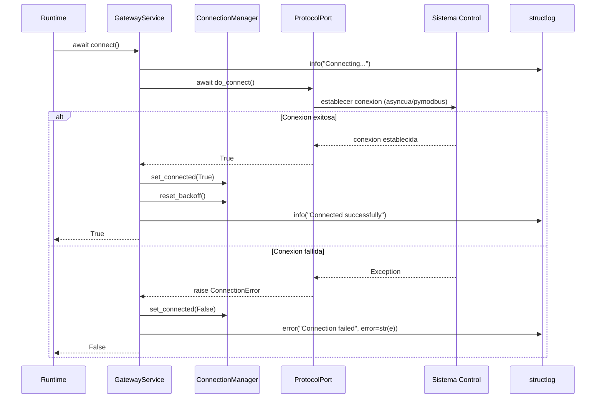
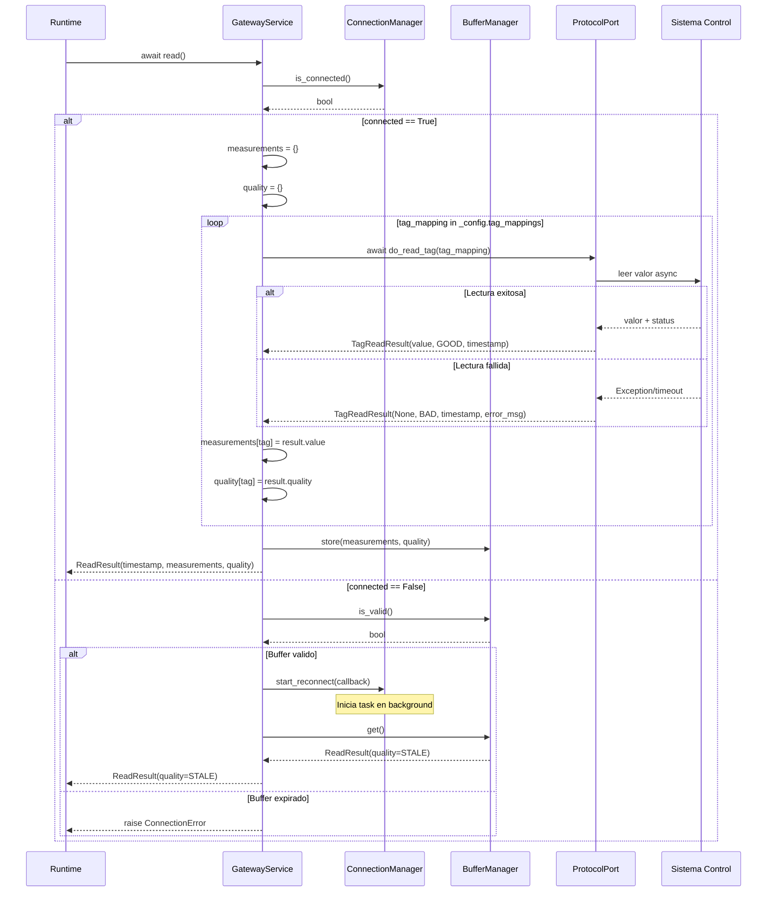
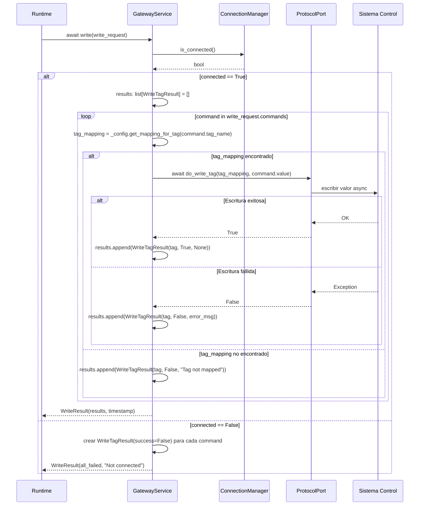
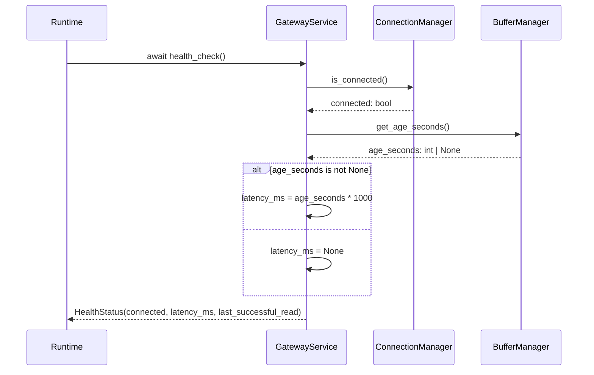
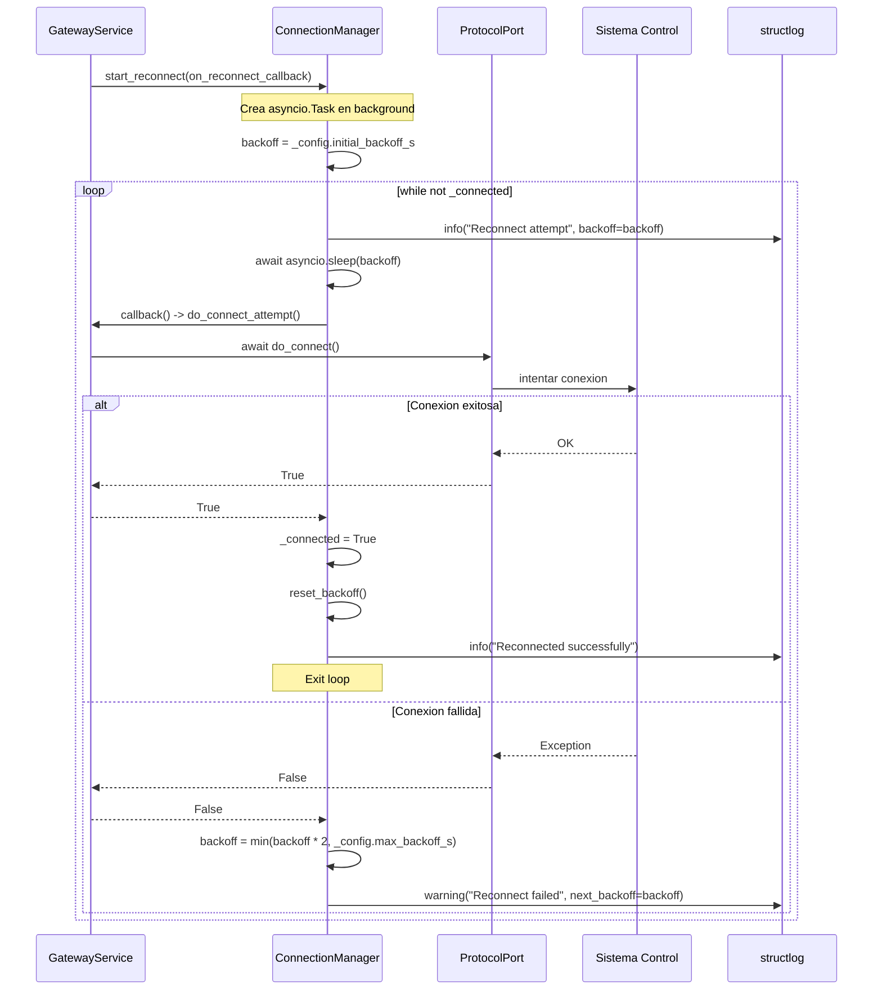
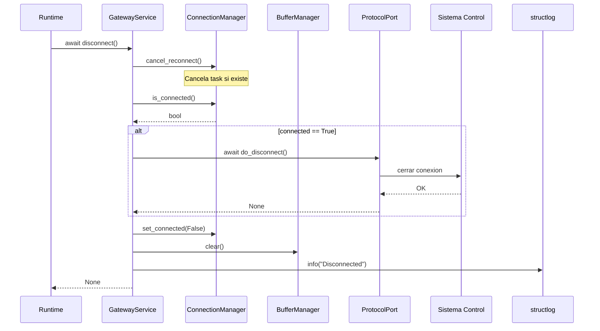
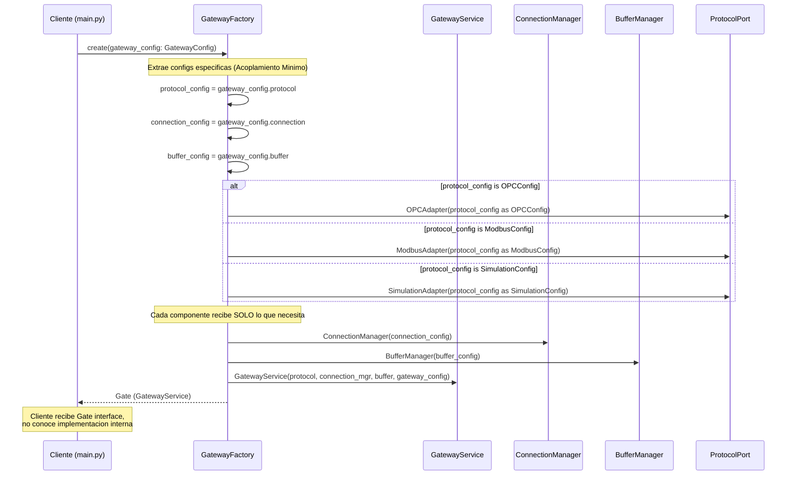

# Plan: Gateway - Refactor tipos de dominio a tipos genericos de libreria

## Metadata
- **Type:** Refactor
- **Complexity:** Low - renombrar tipos y actualizar diagramas, sin cambios de logica
- **Estimation:** 2 horas
- **Files:** 1 archivo (`Modulos/Gateway/Tecnico.md` modificado)
- **Risk:** Low - cambio de documentacion unicamente, no existe codigo aun

## 1. Context

**Problem:** El diagrama tecnico del Gateway (`Tecnico.md`) usa tipos con nombres de dominio como `PlantState` y `ValidatedSetpoints`. El Gateway se esta desarrollando como una **libreria interna** cuya responsabilidad es comunicacion por protocolo (leer/escribir tags), no control de planta. Los nombres actuales acoplan semanticamente la libreria al dominio del Runtime, violando Information Expert y Cohesion por Razon de Cambio.

Ademas, existen tipos referenciados en el diagrama pero nunca definidos: `TagReadResult`, `WriteTagResult` (en el diagrama de clases), `WriteCommand`, y `WriteRequest`.

**Current State:**
- `Gate.read_state()` retorna `PlantState` - nombre de dominio
- `Gate.write_setpoints(ValidatedSetpoints)` - nombre de dominio, tipo nunca definido con campos correctos para libreria
- `TagReadResult` referenciado como retorno de `ProtocolPort.do_read_tag()` pero nunca definido como clase
- `WriteTagResult` referenciado en `WriteResult.results` pero nunca definido como clase en el diagrama tecnico
- Los DSS usan nombres de dominio (`read_state`, `write_setpoints`, `PlantState`)

**Desired State:**
- Gateway usa tipos genericos: `ReadResult`, `WriteRequest`, `WriteCommand`
- Metodos renombrados: `read()`, `write()`
- Todos los tipos referenciados estan definidos como clases en el diagrama
- Los DSS reflejan los nombres genericos
- Gateway no sabe nada de "plantas", "setpoints", ni ningun concepto de dominio

**Success Criteria:**
- [ ] Ningun tipo ni metodo en el diagrama de clases contiene terminologia de dominio (plant, setpoint, state)
- [ ] Todos los tipos referenciados en firmas de metodos estan definidos como clases
- [ ] Los 7 DSS usan los nombres genericos consistentemente
- [ ] Las relaciones del diagrama de clases son consistentes con los tipos renombrados

## 2. Affected Files

| File | Action | Reason |
|------|--------|--------|
| `Modulos/Gateway/Tecnico.md` | Modify | Renombrar tipos, agregar clases faltantes, actualizar DSS |

**NO modificar:**
- `Modulos/Gateway/Gateway.md` (spec conceptual - puede mantener terminologia de dominio)
- `Modulos/Gateway/Conceptual.md` (diagrama conceptual original)

## 3. Risks

| Risk | Probability | Impact | Mitigation |
|------|-------------|--------|------------|
| Inconsistencia entre Tecnico.md y Gateway.md | Low | Low | Gateway.md es la spec del problema (dominio), Tecnico.md es la spec de la solucion (libreria). Es correcto que usen vocabularios distintos |
| Olvidar alguna referencia a PlantState/setpoints en los DSS | Low | Low | Revision exhaustiva de los 7 DSS en este plan |

## 4. Design

### 4.1 Updated Class Diagram

```mermaid
classDiagram
    direction TB

    %% ========== INTERFACES ESTABLES (Protected Variations) ==========

    class Gate {
        <<Protocol>>
        +connect()* async bool
        +disconnect()* async None
        +read()* async ReadResult
        +write(WriteRequest)* async WriteResult
        +health_check()* async HealthStatus
    }

    class ProtocolPort {
        <<Protocol>>
        +do_connect()* async bool
        +do_disconnect()* async None
        +do_read_tag(TagMapping)* async TagReadResult
        +do_write_tag(TagMapping, float)* async bool
    }

    %% ========== FACADE (Orquestador) ==========

    class GatewayService {
        <<Facade>>
        -_protocol: ProtocolPort
        -_connection_mgr: ConnectionManager
        -_buffer: BufferManager
        -_config: GatewayConfig
        -_logger: BoundLogger
        +__init__(protocol, connection_mgr, buffer, config)
        +connect() async bool
        +disconnect() async None
        +read() async ReadResult
        +write(WriteRequest) async WriteResult
        +health_check() async HealthStatus
    }

    %% ========== INFORMATION EXPERTS ==========

    class ConnectionManager {
        <<Information Expert>>
        -_connected: bool
        -_current_backoff_s: int
        -_reconnect_task: Task | None
        -_config: ConnectionConfig
        -_logger: BoundLogger
        +is_connected() bool
        +set_connected(bool) None
        +start_reconnect(callback) None
        +cancel_reconnect() None
        +reset_backoff() None
        +get_current_backoff() int
    }

    class BufferManager {
        <<Information Expert>>
        -_values: dict~str, float~
        -_quality: dict~str, QualityCode~
        -_last_timestamp: datetime | None
        -_config: BufferConfig
        +store(values, quality) None
        +get() ReadResult
        +is_valid() bool
        +clear() None
        +get_age_seconds() int | None
    }

    %% ========== PROTOCOL ADAPTERS ==========

    class OPCAdapter {
        -_client: Client
        -_node_cache: dict~str, Node~
        -_config: OPCConfig
        +do_connect() async bool
        +do_disconnect() async None
        +do_read_tag(TagMapping) async TagReadResult
        +do_write_tag(TagMapping, float) async bool
    }

    class ModbusAdapter {
        -_client: AsyncModbusTcpClient
        -_config: ModbusConfig
        +do_connect() async bool
        +do_disconnect() async None
        +do_read_tag(TagMapping) async TagReadResult
        +do_write_tag(TagMapping, float) async bool
    }

    class SimulationAdapter {
        -_simulated_values: dict~str, float~
        -_random: Random
        -_config: SimulationConfig
        +do_connect() async bool
        +do_disconnect() async None
        +do_read_tag(TagMapping) async TagReadResult
        +do_write_tag(TagMapping, float) async bool
    }

    %% ========== FACTORY ==========

    class GatewayFactory {
        <<Pure Fabrication>>
        +create(config: GatewayConfig) Gate
        -_create_protocol(config: ProtocolConfig) ProtocolPort
        -_create_connection_manager(config: ConnectionConfig) ConnectionManager
        -_create_buffer_manager(config: BufferConfig) BufferManager
    }

    %% ========== CONFIGURATION (Acoplamiento Minimo) ==========

    class GatewayConfig {
        <<BaseModel>>
        +connection: ConnectionConfig
        +buffer: BufferConfig
        +protocol: ProtocolConfig
        +tag_mappings: list~TagMapping~
    }

    class ConnectionConfig {
        <<BaseModel>>
        +timeout_ms: int
        +retry_count: int
        +initial_backoff_s: int
        +max_backoff_s: int
    }

    class BufferConfig {
        <<BaseModel>>
        +max_age_s: int
        +enabled: bool
    }

    class ProtocolConfig {
        <<BaseModel - Union>>
        +protocol_type: ProtocolType
    }

    class OPCConfig {
        <<BaseModel>>
        +endpoint: str
        +security_policy: SecurityPolicy
        +credentials: Credentials | None
        +namespace_index: int
    }

    class ModbusConfig {
        <<BaseModel>>
        +host: str
        +port: int
        +unit_id: int
        +byte_order: ByteOrder
    }

    class SimulationConfig {
        <<BaseModel>>
        +noise_factor: float
        +drift_rate: float
        +initial_values: dict~str, float~
    }

    %% ========== VALUE OBJECTS ==========

    class TagMapping {
        <<BaseModel>>
        +internal_name: str
        +protocol_address: str
        +data_type: DataType
        +description: str | None
    }

    class Credentials {
        <<BaseModel>>
        +username: str
        +password: SecretStr
    }

    class TagReadResult {
        <<BaseModel>>
        +value: float | None
        +quality: QualityCode
        +timestamp: datetime
        +error: str | None
    }

    class ReadResult {
        <<BaseModel>>
        +timestamp: datetime
        +measurements: dict~str, float~
        +quality: dict~str, QualityCode~
        +is_all_good() bool
        +get_bad_tags() list~str~
    }

    class WriteCommand {
        <<BaseModel>>
        +tag_name: str
        +value: float
    }

    class WriteRequest {
        <<BaseModel>>
        +commands: list~WriteCommand~
    }

    class WriteTagResult {
        <<BaseModel>>
        +tag: str
        +success: bool
        +error_message: str | None
    }

    class WriteResult {
        <<BaseModel>>
        +results: list~WriteTagResult~
        +timestamp: datetime
        +is_all_success() bool
        +get_failed_tags() list~str~
    }

    class HealthStatus {
        <<BaseModel>>
        +connected: bool
        +latency_ms: int | None
        +last_successful_read: datetime | None
        +is_healthy() bool
    }

    %% ========== ENUMS ==========

    class ProtocolType {
        <<Enum>>
        OPC_UA
        MODBUS_TCP
        MODBUS_RTU
        MQTT
        SIMULATOR
    }

    class QualityCode {
        <<Enum>>
        GOOD
        BAD
        UNCERTAIN
        STALE
    }

    class DataType {
        <<Enum>>
        FLOAT
        INT
        BOOL
    }

    class SecurityPolicy {
        <<Enum>>
        NONE
        BASIC256
        BASIC256SHA256
    }

    class ByteOrder {
        <<Enum>>
        BIG_ENDIAN
        LITTLE_ENDIAN
    }

    %% ========== RELACIONES: Implementacion ==========

    Gate <|.. GatewayService : implements
    ProtocolPort <|.. OPCAdapter : implements
    ProtocolPort <|.. ModbusAdapter : implements
    ProtocolPort <|.. SimulationAdapter : implements

    %% ========== RELACIONES: Configuracion (Herencia) ==========

    ProtocolConfig <|-- OPCConfig : extends
    ProtocolConfig <|-- ModbusConfig : extends
    ProtocolConfig <|-- SimulationConfig : extends

    %% ========== RELACIONES: Composicion de Config ==========

    GatewayConfig *-- ConnectionConfig
    GatewayConfig *-- BufferConfig
    GatewayConfig *-- ProtocolConfig
    GatewayConfig *-- TagMapping

    %% ========== RELACIONES: Uso (Acoplamiento Minimo) ==========

    GatewayService --> GatewayConfig : uses
    ConnectionManager --> ConnectionConfig : uses
    BufferManager --> BufferConfig : uses
    OPCAdapter --> OPCConfig : uses
    ModbusAdapter --> ModbusConfig : uses
    SimulationAdapter --> SimulationConfig : uses
    OPCConfig --> Credentials : optional

    %% ========== RELACIONES: Factory ==========

    GatewayFactory ..> GatewayService : creates
    GatewayFactory ..> OPCAdapter : creates
    GatewayFactory ..> ModbusAdapter : creates
    GatewayFactory ..> SimulationAdapter : creates
    GatewayFactory ..> ConnectionManager : creates
    GatewayFactory ..> BufferManager : creates

    %% ========== RELACIONES: Orquestacion ==========

    GatewayService --> ProtocolPort : uses
    GatewayService --> ConnectionManager : uses
    GatewayService --> BufferManager : uses

    %% ========== RELACIONES: Retornos ==========

    Gate ..> ReadResult : returns
    Gate ..> WriteRequest : receives
    Gate ..> WriteResult : returns
    Gate ..> HealthStatus : returns
    ProtocolPort ..> TagReadResult : returns
    ReadResult --> QualityCode
    TagReadResult --> QualityCode
    WriteRequest *-- WriteCommand
    WriteResult *-- WriteTagResult
```

### 4.2 Updated Sequence Diagrams

#### DSS 1: connect()

#### DSS 2: read()

#### DSS 3: write()

#### DSS 4: health_check()

#### DSS 5: ConnectionManager.start_reconnect() - Backoff exponencial

#### DSS 6: disconnect()

#### DSS 7: GatewayFactory.create() - Creacion del Gateway

### 4.3 Design Decisions

| Decision | Alternatives | Rationale |
|----------|--------------|-----------|
| `ReadResult` instead of `PlantState` | `TagSnapshot`, `ReadSnapshot`, `ReadResponse` | `ReadResult` es simetrico con `WriteResult` y describe exactamente lo que el Gateway produce: el resultado de una operacion de lectura |
| `WriteRequest` instead of `ValidatedSetpoints` | `WritePayload`, `WriteBundle`, `WriteCommands` | `WriteRequest` es el par natural de `WriteResult`. El Gateway recibe un pedido de escritura, no sabe si son setpoints validados o cualquier otra cosa |
| `WriteCommand` instead of `Setpoint` | `WriteItem`, `WriteEntry`, `TagWrite` | `WriteCommand` es un Command pattern - cada item es una instruccion de escritura con tag + valor. Evita terminologia de dominio |
| `read()` instead of `read_state()` | `read_tags()`, `read_all()` | `read()` es el nombre mas simple y generico. El Gateway lee, punto. No sabe que esta leyendo "estado" |
| `write()` instead of `write_setpoints()` | `write_tags()`, `write_all()` | `write()` es simetrico con `read()`. El Gateway escribe, no sabe que esta escribiendo "setpoints" |
| Definir `TagReadResult` como clase explicita | Dejarlo implicito | Ya esta referenciado en `ProtocolPort.do_read_tag()` como tipo de retorno. Definirlo hace el diagrama self-contained y elimina ambiguedad |
| Definir `WriteTagResult` como clase explicita | Ya existia en relaciones pero no en el diagrama de clases del Tecnico.md | Consistencia: todo tipo referenciado debe estar definido |
| `WriteRequest` contiene `commands: list[WriteCommand]` | Pasar `list[WriteCommand]` directamente | Un wrapper explicito permite agregar metadata futura (e.g., `timeout`, `priority`) sin cambiar la firma de `write()`. Sigue OCP |

## 5. Implementation

### Step 1: Replace class diagram in Tecnico.md

**Objective:** Sustituir el diagrama de clases Mermaid completo
**File:** `Modulos/Gateway/Tecnico.md`

Changes:
- [ ] Reemplazar el bloque `classDiagram` completo (lineas 28-322) con el diagrama de la seccion 4.1 de este plan

**Verification:** El diagrama Mermaid renderiza correctamente. No aparece ninguna referencia a `PlantState`, `ValidatedSetpoints`, `read_state`, ni `write_setpoints`.

### Step 2: Replace all 7 DSS in Tecnico.md

**Objective:** Sustituir los 7 diagramas de secuencia con las versiones actualizadas
**File:** `Modulos/Gateway/Tecnico.md`

Changes:
- [ ] DSS 1 (connect) - sin cambios sustanciales, copiar de seccion 4.2
- [ ] DSS 2 - renombrar titulo de `read_state()` a `read()`, reemplazar con version de seccion 4.2
- [ ] DSS 3 - renombrar titulo de `write_setpoints()` a `write()`, reemplazar con version de seccion 4.2
- [ ] DSS 4 (health_check) - sin cambios, copiar de seccion 4.2
- [ ] DSS 5 (reconnect) - sin cambios, copiar de seccion 4.2
- [ ] DSS 6 (disconnect) - sin cambios, copiar de seccion 4.2
- [ ] DSS 7 (factory) - sin cambios, copiar de seccion 4.2

**Verification:** Todos los DSS renderizan. Buscar texto "PlantState", "ValidatedSetpoints", "read_state", "write_setpoints" en todo el archivo - debe dar 0 resultados.

### Step 3: Verify consistency

**Objective:** Asegurar que no quedan referencias a tipos de dominio
**File:** `Modulos/Gateway/Tecnico.md`

Changes:
- [ ] Buscar "PlantState" en todo el archivo - 0 ocurrencias
- [ ] Buscar "ValidatedSetpoints" en todo el archivo - 0 ocurrencias
- [ ] Buscar "read_state" en todo el archivo - 0 ocurrencias
- [ ] Buscar "write_setpoints" en todo el archivo - 0 ocurrencias
- [ ] Buscar "setpoint" (case insensitive) en todo el archivo - 0 ocurrencias en diagramas (puede aparecer en texto explicativo de la seccion de Justificacion)

## 6. Change Summary

### Types renamed

| Before (domain) | After (library) | Location |
|---|---|---|
| `PlantState` | `ReadResult` | Class definition, Gate returns, BufferManager.get() return, DSS 2 |
| `ValidatedSetpoints` | `WriteRequest` | Gate parameter, GatewayService parameter, DSS 3 |
| n/a (implicit) | `WriteCommand` | New class - items inside WriteRequest |

### Methods renamed

| Before | After | Classes affected |
|---|---|---|
| `read_state()` | `read()` | `Gate`, `GatewayService` |
| `write_setpoints(ValidatedSetpoints)` | `write(WriteRequest)` | `Gate`, `GatewayService` |

### Types added (previously referenced but undefined)

| Type | Fields | Referenced by |
|---|---|---|
| `TagReadResult` | `value: float \| None`, `quality: QualityCode`, `timestamp: datetime`, `error: str \| None` | `ProtocolPort.do_read_tag()` return type |
| `WriteTagResult` | `tag: str`, `success: bool`, `error_message: str \| None` | `WriteResult.results` |
| `WriteCommand` | `tag_name: str`, `value: float` | `WriteRequest.commands` |
| `WriteRequest` | `commands: list[WriteCommand]` | `Gate.write()` parameter |

### Relationships updated

| Before | After |
|---|---|
| `Gate ..> PlantState : returns` | `Gate ..> ReadResult : returns` |
| (implicit ValidatedSetpoints) | `Gate ..> WriteRequest : receives` |
| `PlantState --> QualityCode` | `ReadResult --> QualityCode` |
| n/a | `ProtocolPort ..> TagReadResult : returns` |
| n/a | `TagReadResult --> QualityCode` |
| n/a | `WriteRequest *-- WriteCommand` |
| n/a | `WriteResult *-- WriteTagResult` |

### DSS changes

| DSS | Changes |
|---|---|
| DSS 1 (connect) | No changes |
| DSS 2 (read) | Title: `read_state()` -> `read()`. All `PlantState` -> `ReadResult`. Message: `await read_state()` -> `await read()` |
| DSS 3 (write) | Title: `write_setpoints()` -> `write()`. `validated_setpoints` -> `write_request`. Iterate `command in write_request.commands` instead of `setpoint in validated_setpoints.setpoints`. `setpoint.tag` -> `command.tag_name`, `setpoint.value` -> `command.value`. Disconnected case: "para cada command" instead of "para cada setpoint" |
| DSS 4 (health_check) | No changes |
| DSS 5 (reconnect) | No changes |
| DSS 6 (disconnect) | No changes |
| DSS 7 (factory) | No changes |

---

**Plan Version:** 1.0
**Created:** 2026-02-06
**Updated:** 2026-02-06
**Author:** Plan Agent
