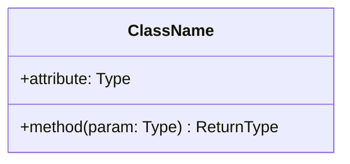
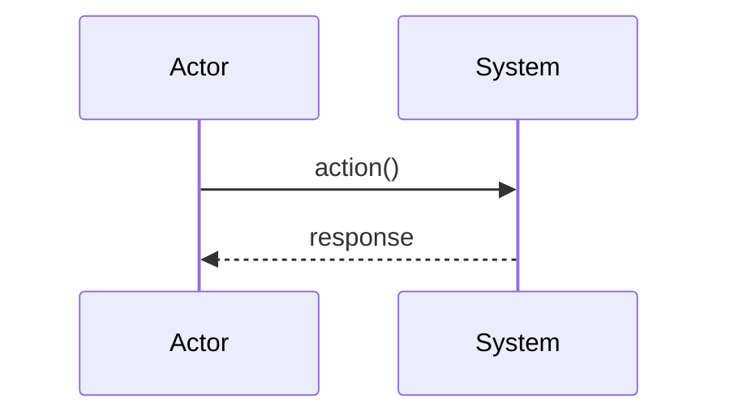
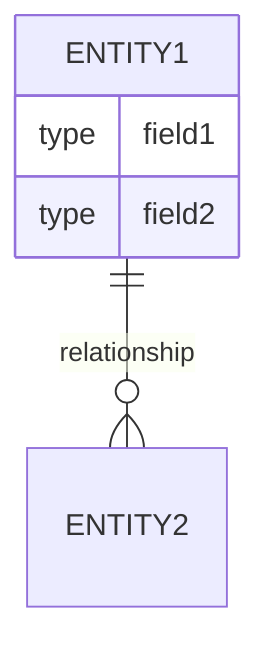

# Plan: [Descriptive Title]

## Metadata
- **Type:** [Feature | Fix | Refactor | Architecture | Integration]
- **Complexity:** [Low | Medium | High] - [brief justification]
- **Estimation:** [X hours | X days]
- **Files:** [N] files ([X] new, [Y] modified, [Z] deleted)
- **Risk:** [Low | Medium | High] - [brief reason]

## 1. Context

**Problem:** [Clear description of the problem to solve]

**Current State:**
- [How it works currently]
- [Existing limitations]

**Desired State:**
- [How it should work]
- [Expected benefits]

**Success Criteria:**
- [ ] [Verifiable criterion 1]
- [ ] [Verifiable criterion 2]
- [ ] [Verifiable criterion 3]
- [ ] Tests pass
- [ ] Lint passes

## 2. Affected Files

| File | Action | Reason |
|------|--------|--------|
| `path/to/file.py` | **Create** | [Reason] |
| `path/to/existing.py` | Modify | [Reason] |
| `path/to/delete.py` | Delete | [Reason] |

## 3. Risks

| Risk | Probability | Impact | Mitigation |
|------|-------------|--------|------------|
| [Risk 1] | Low/Medium/High | Low/Medium/High | [Strategy] |
| [Risk 2] | Low/Medium/High | Low/Medium/High | [Strategy] |

## 4. Design

### 4.1 Conceptual Model

[Technology-agnostic description of the domain model]

### 4.2 Class/Component Diagram

### 4.3 Sequence Diagram (if applicable)

### 4.4 Data Model (if applicable)

### 4.5 Design Decisions

| Decision | Alternatives | Rationale |
|----------|--------------|-----------|
| [What I chose] | [What I discarded] | [Why] |

## 5. Implementation

### Step 1: [Step Name]

**Objective:** [What this step achieves]
**File:** `path/to/file.py`

Changes:
- [ ] [Specific change 1]
- [ ] [Specific change 2]

**Verification:** [How to verify this step worked]

### Step 2: [Step Name]

**Objective:** [What this step achieves]
**File:** `path/to/file.py`

Changes:
- [ ] [Specific change 1]
- [ ] [Specific change 2]

**Verification:** [How to verify this step worked]

## 6. Tests

### Unit Tests

| Test | File | Description |
|------|------|-------------|
| `test_x` | `tests/unit/test_x.py` | [What it verifies] |

### Integration Tests

- [ ] [Integration test scenario 1]
- [ ] [Integration test scenario 2]

## 7. Final Checklist

- [ ] Code implemented per design
- [ ] Unit tests added and pass
- [ ] Integration tests pass
- [ ] Linting passes
- [ ] Type checking passes
- [ ] Documentation updated (if applicable)
- [ ] INDEX.md updated with new state

## 8. Rollback Plan

In case of problems:
1. [Rollback step 1]
2. [Rollback step 2]

---

**Plan Version:** 1.0
**Created:** YYYY-MM-DD
**Updated:** YYYY-MM-DD
**Author:** [Name/Role]
